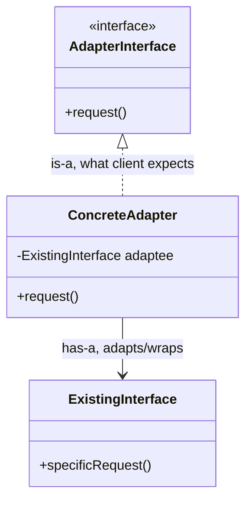
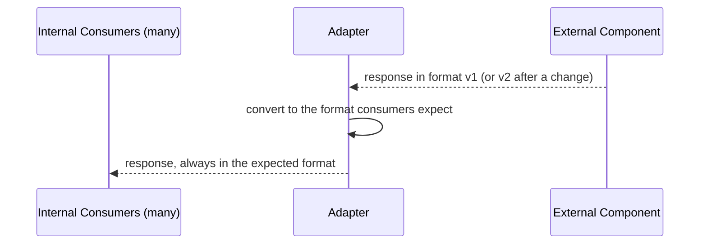
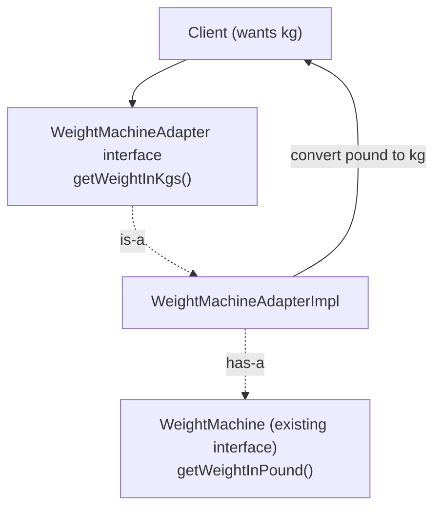

# Adapter Design Pattern

## Overview
- Structural pattern — a bridge between an **existing interface** (what an
  object already exposes) and an **expected interface** (what the client
  actually wants to call), when the two are incompatible.
- Reach for it whenever a client needs to talk to something whose
  input/output shape doesn't match what the client understands.
- Extremely common in real systems, not just interview toy problems —
  format conversion, protocol mismatches, and version-shielding around
  external dependencies all use this shape.
- Uses both is-a and has-a relationships together, same shape as
  [13. Proxy Design Pattern](13-proxy-design-pattern.md) and [04. Decorator Design Pattern](04-decorator-design-pattern.md).

## Key Concepts
### The problem shape
- Client wants to call a method it understands — the **expected
  interface**.
- Some existing object already does the real work but exposes an
  incompatible method/format — the **existing interface** (a.k.a.
  adaptee).
- Adapter sits in between: it **is-a** implementer of the expected
  interface (so the client can call it directly), and it **has-a**
  reference to the existing interface (so it knows how to actually get the
  work done and convert the result).



### Real-world examples
- **Power adapter & socket** — an oval-pin power adapter can't plug into a
  square socket; a travel adapter has an oval slot on one side and square
  pins on the other, bridging the two.
- **Mobile charging cable** — the phone's charging port needs a specific
  connector (e.g. C-type); the cable is the adapter between that port and
  a plain wall socket.
- **XML → JSON conversion** — a server returns XML but the client only
  understands JSON; an adapter parses the XML and returns JSON.
- **Shielding against an external dependency's format changes** — instead
  of every internal consumer calling an external component directly, put
  one adapter layer between the company and the external component. If the
  external side changes its response format, only the adapter's conversion
  logic changes — none of the internal consumers do.



### Weight machine worked example
- Existing interface (adaptee): `WeightMachine` — returns weight in
  pounds via `getWeightInPound()`. A baby/infant-specific weight machine
  is a second existing implementation, also returning pounds.
- Expected interface: the client only understands **kilograms** — it
  cannot use `WeightMachine` directly.
- `WeightMachineAdapter` interface declares `getWeightInKgs()` — the
  method the client actually wants.
- `WeightMachineAdapterImpl` implements `WeightMachineAdapter` (is-a) and
  holds a `WeightMachine` reference (has-a); `getWeightInKgs()` calls the
  wrapped machine's `getWeightInPound()`, converts pound → kg, and returns
  it.
- Client only ever talks to the adapter — never to `WeightMachine`
  directly.

```java
interface WeightMachine {
    double getWeightInPound();
}
class WeightMachineImpl implements WeightMachine { // existing interface / adaptee
    public double getWeightInPound() { return 100.0; }
}

interface WeightMachineAdapter { // expected interface, what the client wants
    double getWeightInKgs();
}
class WeightMachineAdapterImpl implements WeightMachineAdapter { // is-a WeightMachineAdapter
    private final WeightMachine weightMachine; // has-a WeightMachine, the adaptee

    WeightMachineAdapterImpl(WeightMachine weightMachine) {
        this.weightMachine = weightMachine;
    }

    public double getWeightInKgs() {
        double pounds = weightMachine.getWeightInPound(); // talk to the adaptee
        return pounds * 0.453592; // conversion logic client doesn't need to know about
    }
}

class Client {
    void printWeight(WeightMachineAdapter adapter) {
        System.out.println(adapter.getWeightInKgs()); // client only knows the adapter
    }
}
```

## Trade-offs / Comparisons
- **Without an adapter** — every consumer calling an existing/external
  component directly breaks the moment that component's format changes;
  N consumers need N separate updates.
- **With an adapter** — only the adapter's conversion logic changes when
  the underlying format changes; every consumer keeps calling the same
  expected interface, unaffected.
- Falls under **structural** patterns (not creational/behavioral) —
  structural patterns combine two or more objects/interfaces together to
  solve a bigger problem than either could alone.

## Example / Walkthrough
- `WeightMachine`/`WeightMachineImpl` already exists and returns weight in
  pounds (e.g. 28 pounds for an infant weight machine).
- Client wants weight in kilograms and cannot understand pounds.
- `WeightMachineAdapter` interface exposes `getWeightInKgs()` — exactly
  what the client wants.
- `WeightMachineAdapterImpl` implements that interface, wraps a
  `WeightMachine` instance, calls `getWeightInPound()` internally, converts
  to kg, and returns the converted value.
- Client calls `adapter.getWeightInKgs()` — the adapter transparently
  handles talking to the existing machine and doing the conversion.

## Diagram


## Interview Q&A
<details>
<summary>What problem does the Adapter pattern solve?</summary>

It bridges an existing interface and an expected interface when the two
are incompatible — the client wants to call a certain method/format, but
the object that does the real work exposes a different one.

</details>

<details>
<summary>Does Adapter use inheritance, composition, or both?</summary>

Both — is-a (the adapter implements the interface the client expects, so
it's substitutable wherever that interface is used) and has-a (the adapter
holds a reference to the existing/adaptee interface it wraps and delegates
the real work to).

</details>

<details>
<summary>Which category of design pattern is Adapter, and why?</summary>

Structural — structural patterns combine two or more objects/interfaces
together to solve a bigger problem than either could solve alone, which is
exactly what an adapter does by joining the expected and existing
interfaces.

</details>

<details>
<summary>Give a real-world, non-software example of the Adapter pattern.</summary>

A travel power adapter — it has one side shaped to fit a socket (e.g.
square pins) and another side shaped to fit a plug (e.g. oval pins),
bridging two physically incompatible connectors. A phone charging cable
between a C-type port and a wall socket is the same shape.

</details>

<details>
<summary>How would you use Adapter to handle an external API changing its response format?</summary>

Put one adapter layer between your company's internal consumers and the
external component. Internal code always calls the adapter's expected
method; when the external format changes, only the adapter's conversion
logic is updated — none of the internal consumers need to change.

</details>

<details>
<summary>In the weight-machine example, which class is the "existing interface" and which is "expected"?</summary>

`WeightMachine` (returns pounds) is the existing interface/adaptee. The
client wants kilograms, so `WeightMachineAdapter`'s `getWeightInKgs()` is
the expected interface — the adapter implementation bridges the two.

</details>

<details>
<summary>Why doesn't the client ever call the existing interface (e.g. WeightMachine) directly?</summary>

Because the client doesn't understand the existing interface's output
format (pounds) — it only understands the expected format (kg). Calling
the adapter instead means the client never needs to know the conversion
logic or that a different underlying object exists at all.

</details>

## Related Topics
- [13. Proxy Design Pattern](13-proxy-design-pattern.md) — same both-is-a-and-has-a shape; Proxy
  controls/intercepts access to the same interface, Adapter converts
  between two different interfaces.
- [04. Decorator Design Pattern](04-decorator-design-pattern.md) — also wraps an object via has-a while
  matching its type via is-a, but adds behavior rather than converting
  interfaces.
- [25. Facade Design Pattern](25-facade-design-pattern.md) — contrasted directly: Adapter solves an
  incompatibility between interfaces, Facade solves complexity in an
  already-compatible system.
- [01.2. is-a vs has-a: How Each Looks in Code](01.2-is-a-vs-has-a.md) — generic code comparison of is-a and has-a,
  including this pattern's both-at-once shape.
