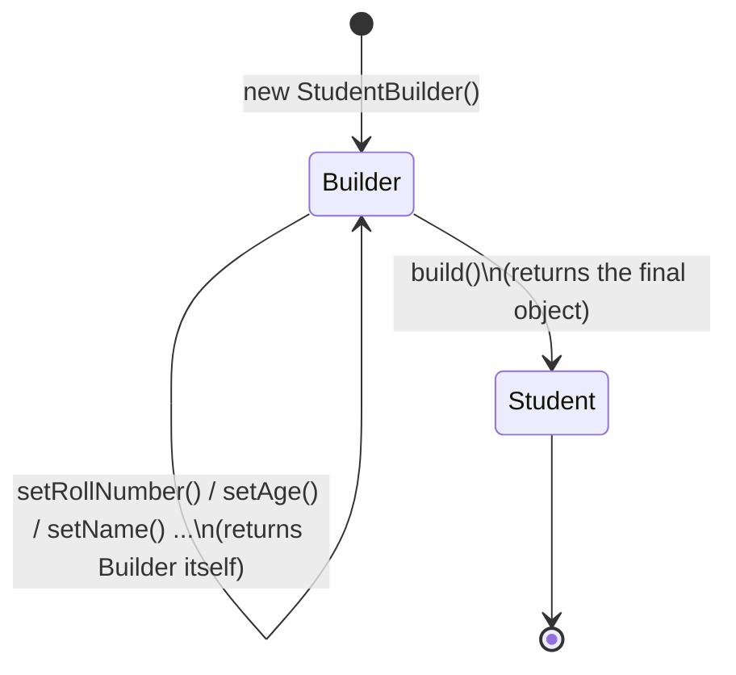
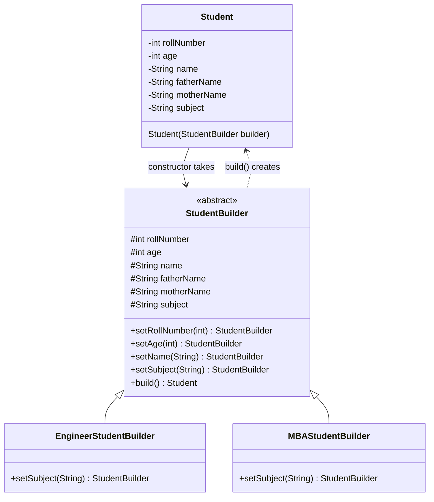
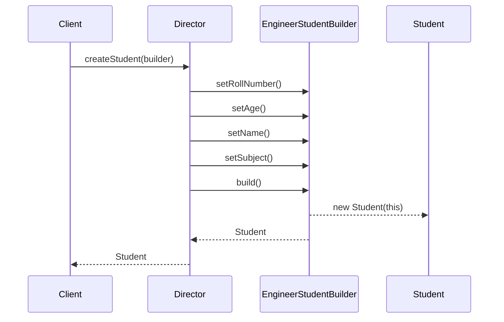
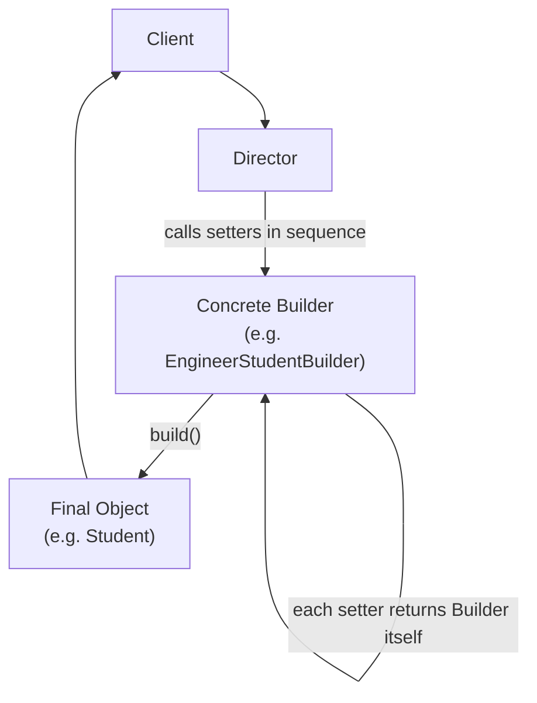

# Builder Design Pattern

## Overview
- Creational design pattern — helps in the **creation** of an object, step
  by step, instead of one giant constructor call.
- Solves the "telescoping constructor" problem: an object with one
  mandatory field and many optional ones (a Student with 50 possible
  properties, only roll number required).
- Real-world example already in daily use: Java's `StringBuilder` is
  built entirely on this pattern.
- Frequently confused with Decorator (both "wrap and build up an object"),
  but they solve different problems — see Trade-offs below.

## Key Concepts
### The problem — telescoping constructors
- An object with many optional fields (Student: roll number mandatory,
  age/name/father name/mother name/subject all optional) breaks a plain
  constructor approach in three ways.
- One huge constructor — a single constructor listing every field, most of
  which callers don't need, becomes unreadable at scale (imagine 50
  fields, not 6-7).
- Many small constructors — one overload per common combination of fields
  quickly explodes into a large, unmanageable number of overloads.
- Constructor overloads can silently collide — two constructors with the
  same parameter *type* signature (e.g. both take `(int, String)`, one
  meaning father's name, the other meaning student's name) fail to compile
  even though their intent is different, because Java only sees the types.

```java
// bad: telescoping constructors
class Student {
    Student(int rollNumber, int age) { /* ... */ }
    Student(int rollNumber, int age, String name) { /* ... */ }
    Student(int rollNumber, String fatherName, String motherName) { /* ... */ }
    Student(int rollNumber, String studentName) { /* ... */ } // compile error:
    // same erasure as another (int, String) constructor above
}
```

### The fix — step-by-step object construction
- Instead of one big constructor, construction happens through a series of
  small steps (methods) — each step returns an intermediate **Builder**
  object, not the final object.
- Analogy: building a house — `addWall()` → `addRoof()` → `addDoor()` →
  `addWindow()` → finally `build()` — every step before `build()` leaves
  you with a builder, not a house; only `build()` returns the actual
  house.
- `StringBuilder` follows the exact same shape: `append()`, `delete()`,
  etc. all return the `StringBuilder` itself (the mediator/builder form);
  only `toString()` (the "build" step) returns the actual final `String`.



### Structure — Student, Builder, and code duplication
- `Student` constructor takes a single `StudentBuilder` object instead of
  a long parameter list or multiple overloads — every field is copied
  from the builder (`this.rollNumber = builder.rollNumber`, etc.).
- Trade-off: `StudentBuilder` must declare the same fields as `Student`
  itself, since it's the thing populating them — this is the pattern's
  acknowledged downside: some duplicated fields and extra lines of code.
- The builder type can be an interface/abstract class, allowing multiple
  concrete builders for the same target object — e.g. an
  `EngineerStudentBuilder` and an `MBAStudentBuilder`, differing only in
  which optional fields they set (e.g. `setSubject()` fills in DSA/OS/CA
  for engineering vs. Economics/Business Studies/Operations Management for
  MBA).
- Each setter method on the builder returns the builder itself (the
  mediator form), enabling method chaining; a final `build()` method
  returns the actual `Student`.



```java
class Student {
    int rollNumber, age;
    String name, fatherName, motherName, subject;

    Student(StudentBuilder builder) { // fields copied from the builder, not from a huge parameter list
        this.rollNumber = builder.rollNumber;
        this.age = builder.age;
        this.name = builder.name;
        this.fatherName = builder.fatherName;
        this.motherName = builder.motherName;
        this.subject = builder.subject;
    }
}

abstract class StudentBuilder {
    int rollNumber, age;
    String name, fatherName, motherName, subject;

    StudentBuilder setRollNumber(int rollNumber) { this.rollNumber = rollNumber; return this; } // returns builder itself
    StudentBuilder setAge(int age) { this.age = age; return this; }
    StudentBuilder setName(String name) { this.name = name; return this; }
    abstract StudentBuilder setSubject(String subject); // differs per concrete builder

    Student build() { return new Student(this); } // only build() returns the final object
}

class EngineerStudentBuilder extends StudentBuilder {
    StudentBuilder setSubject(String subject) { this.subject = subject; return this; } // e.g. "DSA, OS, Computer Architecture"
}
class MBAStudentBuilder extends StudentBuilder {
    StudentBuilder setSubject(String subject) { this.subject = subject; return this; } // e.g. "Economics, Business Studies, Operations Management"
}
```

### Director — orchestrating the build sequence
- A third layer, the **Director**, knows which builder methods to call and
  in what order, then calls `build()` — the client no longer needs to know
  the construction steps at all.
- Client only calls the director (e.g. `director.createStudent()`); the
  director holds a specific builder (engineering or MBA) and internally
  calls `setRollNumber()` → `setAge()` → `setName()` → `setSubject()` (in
  whatever order/combination that builder needs) → `build()`.
- Useful when construction has real sequencing/business-logic
  requirements ("do step one, then step two, then step three, now build")
  — in the Student example there's no real ordering constraint, but the
  director still hides the construction detail from the client.



```java
class Director {
    Student createStudent(StudentBuilder builder) {
        if (builder instanceof EngineerStudentBuilder) {
            return builder.setRollNumber(1).setAge(20).setName("A")
                          .setSubject("DSA, OS, Computer Architecture").build();
        }
        // MBA builder additionally sets fatherName/motherName before build()
        return builder.setRollNumber(2).setAge(24).setName("B")
                      .setSubject("Economics, Business Studies, Operations Management").build();
    }
}

class Client {
    void demo() {
        Director director = new Director();
        Student engineer = director.createStudent(new EngineerStudentBuilder());
        Student mba = director.createStudent(new MBAStudentBuilder());
    }
}
```

## Trade-offs / Comparisons
- **Builder vs. telescoping constructors** — Builder trades a single messy
  constructor (or many overloads) for a small amount of duplicated field
  declarations between the object and its builder, in exchange for
  readable, chainable, order-independent construction.
- **Builder vs. Decorator** — both are commonly confused via the "pizza
  with toppings" example, but they solve different problems:

| | Builder | Decorator |
|---|---|---|
| Category | Creational | Structural |
| Purpose | Construct one object step by step | Wrap an object to add behavior/features to it |
| Handles dynamic/runtime combinations? | No — each distinct combination (e.g. base+cheese+mushroom) needs its own builder or explicit step sequence | Yes — any combination of wrappers can be composed at runtime |
| Example | `BasePizzaPlusCheeseBuilder`, `BasePizzaPlusMushroomBuilder` — a new combo needs a new builder | Wrap `BasePizza` in a `CheeseDecorator`, then in a `MushroomDecorator` — any combo, freely |

## Example / Walkthrough
- `StringBuilder`: `append()`/`delete()` return the `StringBuilder` itself
  at every step (mediator form); calling `toString()` is the "build" step
  that returns the actual `String` object.
- Student: `StudentBuilder` (abstract) declares the same fields as
  `Student`; `EngineerStudentBuilder` and `MBAStudentBuilder` extend it,
  differing only in how `setSubject()` fills in subjects; `Director`
  drives the call sequence for each and returns the finished `Student`.
- Pizza (used to contrast with Decorator): a `PizzaBuilder` needs one
  concrete builder per fixed topping combination
  (`BasePizzaPlusCheeseBuilder`, `BasePizzaPlusMushroomBuilder`); asking
  for a new combination on the fly (base + cheese + mushroom together)
  requires writing yet another builder class — Builder cannot compose
  toppings dynamically the way Decorator can.

## Diagram


## Interview Q&A
<details>
<summary>What problem does the Builder pattern solve?</summary>

The telescoping constructor problem — an object with one mandatory field
and many optional fields otherwise needs one huge constructor, or many
overloaded constructors that can even collide on type signature.

</details>

<details>
<summary>What does "step-by-step object creation" mean in Builder?</summary>

Each construction step is a method that returns an intermediate builder
object (not the final object); only the final `build()` call returns the
actual target object.

</details>

<details>
<summary>Give a real-world example of Builder already in common use.</summary>

`StringBuilder` — `append()`/`delete()` return the `StringBuilder` itself
at each step, and `toString()` is the "build" step returning the actual
`String`.

</details>

<details>
<summary>What is a known downside of the Builder pattern?</summary>

Code duplication — the builder must declare the same fields as the target
object it constructs, since it's responsible for populating them, which
increases the overall line count.

</details>

<details>
<summary>What role does the Director play, and is it mandatory?</summary>

The Director knows the exact sequence of builder method calls needed to
construct a particular variant, then calls `build()` — it hides
construction detail from the client. It's most valuable when there's real
sequencing/business logic to the construction steps.

</details>

<details>
<summary>Builder vs. Decorator — which category of pattern is each, and what's the key functional difference?</summary>

Builder is creational (constructs one object step by step); Decorator is
structural (wraps an object to add behavior). The key functional
difference: Builder cannot support arbitrary dynamic combinations at
runtime (each fixed combination needs its own builder), while Decorator
can compose any combination of wrappers dynamically.

</details>

<details>
<summary>In the pizza example, why can't Builder handle "base + cheese + mushroom" if only cheese-only and mushroom-only builders exist?</summary>

Because Builder has no mechanism to dynamically combine partial builders
at runtime — a new combination requires writing an entirely new concrete
builder class with its own explicit step sequence.

</details>

## Related Topics
- [04. Decorator Design Pattern](04-decorator-design-pattern.md) — the pattern most often confused with
  Builder; contrasted directly above.
- [00c. Design Patterns Catalog](00c-design-patterns-catalog.md) — full checklist of covered patterns;
  Builder is creational.
- [27. All Creational Design Patterns](27-all-creational-design-patterns.md) — this note's full
  depth on Builder, alongside Prototype and Singleton.
