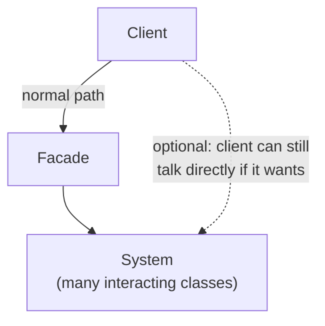
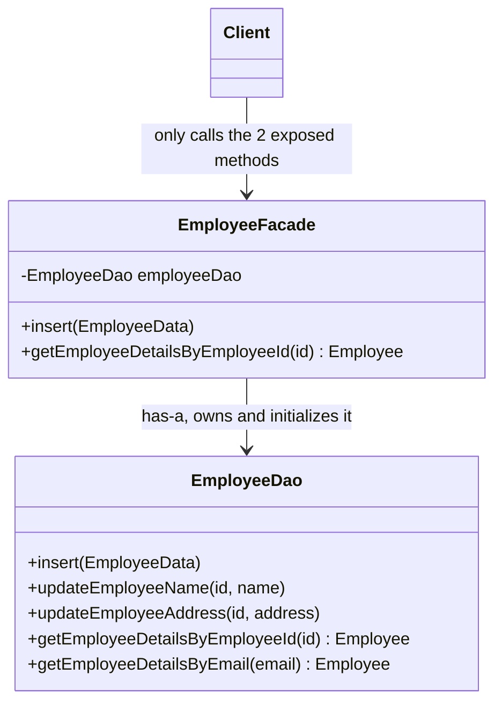
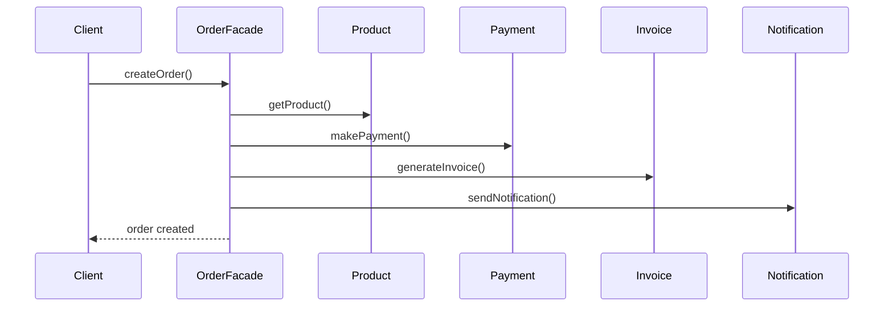
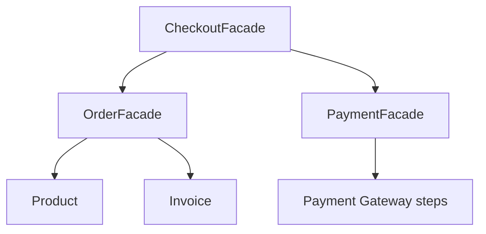
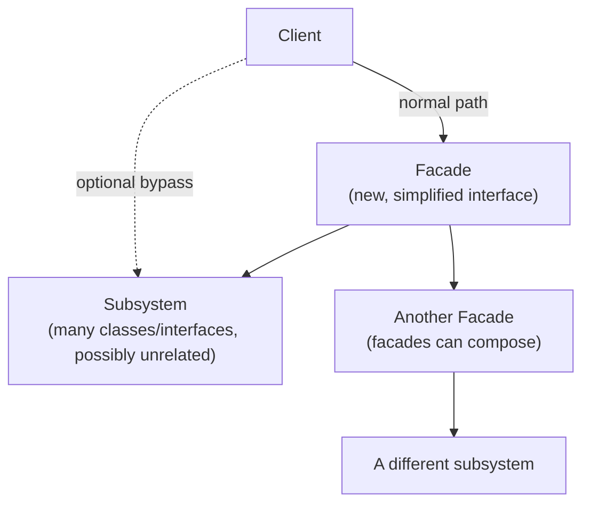

# Facade Design Pattern

## Overview
- Structural design pattern — used whenever a complex system's internal
  detail needs to be **hidden from the client** behind one simplified
  interface.
- Extremely widely used in real code — very likely already used it
  without knowing its name.
- Not mandatory: the facade is a convenience layer, not a barrier — a
  client can still bypass it and talk to the underlying classes directly
  if it wants to.
- Commonly confused with Proxy and Adapter — both contrasted directly
  below, since interviewers probe exactly this distinction.

## Key Concepts
### When to use — hide system complexity
- Car analogy: a driver (client) knows that pressing the accelerator
  increases speed and pressing the brake decreases it — that's the entire
  interface the driver needs.
- The driver has no idea how many internal components (engine, gears,
  etc.) actually interact to make that happen, and doesn't care — that
  internal interaction is the "system complexity" a facade hides.
- General shape: a complex system has many interacting classes; a Facade
  sits between the client and that system, exposing only what the client
  actually needs.
- The facade doesn't lock the client out — if the client wants to bypass
  it and call the underlying classes directly, it's still free to.



### Scenario 1 — narrowing a wide interface
- `EmployeeDao` (a Data Access Object — a class that talks to the DB:
  insert/update/select) can easily accumulate 50-100 methods:
  `insert`, `updateEmployeeName`, `updateEmployeeAddress`,
  `getEmployeeDetailsByEmployeeId`, `getEmployeeDetailsByEmail`, etc.
- A given client might only ever need two of them — say `insert` and
  `getEmployeeDetailsByEmployeeId`.
- `EmployeeFacade` holds (has-a) an `EmployeeDao` instance, takes on the
  responsibility of constructing/initializing it, and exposes only the
  two methods the client actually needs.
- The client depends only on `EmployeeFacade` and never sees the other
  48+ DAO methods at all.



```java
class EmployeeDao { // the wide "system" interface — dozens of methods
    void insert(EmployeeData data) { /* ... */ }
    void updateEmployeeName(String id, String name) { /* ... */ }
    void updateEmployeeAddress(String id, String address) { /* ... */ }
    Employee getEmployeeDetailsByEmployeeId(String id) { /* ... */ return null; }
    Employee getEmployeeDetailsByEmail(String email) { /* ... */ return null; }
    // ... 45+ more methods the client never needs
}

class EmployeeFacade {
    private final EmployeeDao employeeDao = new EmployeeDao(); // facade owns/creates it

    void insert(EmployeeData data) {
        employeeDao.insert(data);
    }
    Employee getEmployeeDetailsByEmployeeId(String id) {
        return employeeDao.getEmployeeDetailsByEmployeeId(id);
    }
}
```

### Scenario 2 — orchestrating a multi-step workflow
- A subsystem of four independent classes: `Product.getProduct()`,
  `Payment.makePayment()`, `Invoice.generateInvoice()`,
  `Notification.sendNotification()`.
- "Creating an order" means calling all four, in sequence: get product →
  make payment → generate invoice → send notification.
- Without a facade, the client itself has to know and call this exact
  sequence — which creates two problems: (1) if a new step is added to
  order creation, every client doing this sequence has to be updated;
  (2) if any class's method signature changes (e.g. `generateInvoice()`
  changes from returning `boolean` to `void`), every client is impacted.
- With `OrderFacade.createOrder()`, that four-step sequence moves inside
  the facade — the client just calls `createOrder()`, and future changes
  to steps or classes only touch the facade, never the client.



```java
class OrderFacade {
    private final Product product = new Product();
    private final Payment payment = new Payment();
    private final Invoice invoice = new Invoice();
    private final Notification notification = new Notification();

    void createOrder() {
        product.getProduct();
        payment.makePayment();
        invoice.generateInvoice();
        notification.sendNotification();
        // adding a new step, or changing any of the above classes,
        // only ever touches this method — never the client
    }
}
```

### A facade can use another facade
- Facades compose: one facade can internally call one or more other
  facades to build a higher-level operation.
- Example: a `CheckoutFacade.checkout()` calls `OrderFacade.createOrder()`
  and then `PaymentFacade.makePayment()` — each of those is itself a
  facade hiding its own multi-step complexity underneath.



### Facade vs Proxy
- Proxy wraps exactly **one** specific object and implements the
  **same interface** as that object — e.g. `EmployeeDaoProxy` implements
  the same interface as `EmployeeDaoImpl` and only ever forwards to that
  one real object. See [13. Proxy Design Pattern](13-proxy-design-pattern.md).
- Facade sits in front of **many** different classes (often with
  unrelated interfaces) and exposes a **new interface of its own** that
  doesn't match any single one of them.
- One-line distinction: Proxy's interface *is* the wrapped object's
  interface, for exactly one object; Facade's interface is brand new, for
  an entire subsystem.

### Facade vs Adapter
- Adapter exists because the client and an existing interface are
  **incompatible** — its job is to bridge that gap so the two can talk at
  all. See [20. Adapter Design Pattern](20-adapter-design-pattern.md).
- Facade exists even when there's **no incompatibility** at all — the
  system is perfectly usable, it's just too complex/verbose for the
  client to deal with directly.
- One-line distinction: Adapter solves "these two shapes don't fit
  together"; Facade solves "this is too much for the client to handle
  directly."

## Trade-offs / Comparisons
| | Facade | Proxy | Adapter |
|---|---|---|---|
| Category | Structural | Structural | Structural |
| Problem solved | Hide complexity of a subsystem | Control/intercept access to one object | Bridge an incompatibility between two interfaces |
| Interface exposed | A brand-new, simplified interface | Same interface as the wrapped object | The interface the client expects |
| Scope | Many classes (a subsystem) | Exactly one wrapped object | One existing interface vs. one expected interface |
| Is it mandatory for the client to use it? | No — client can bypass and call the subsystem directly | Effectively yes, if access control matters | Yes — otherwise the client literally cannot call the incompatible interface |

## Example / Walkthrough
- `EmployeeFacade`: client calls `facade.insert(data)` or
  `facade.getEmployeeDetailsByEmployeeId(id)`; the facade forwards to the
  one `EmployeeDao` instance it owns, hiding the other 48+ DAO methods
  entirely.
- `OrderFacade`: client calls `facade.createOrder()`; internally it
  sequences `getProduct()` → `makePayment()` → `generateInvoice()` →
  `sendNotification()`.
- `CheckoutFacade`: composes `OrderFacade` and `PaymentFacade` to build a
  higher-level "checkout" operation without re-exposing either facade's
  internal steps.

## Diagram


## Interview Q&A
<details>
<summary>When should you reach for the Facade pattern?</summary>

Whenever a system has enough internal complexity (many interacting
classes, or one class with too many methods) that a client shouldn't have
to know about it directly — Facade hides that complexity behind one
simplified interface.

</details>

<details>
<summary>Is using the facade mandatory for the client?</summary>

No — the facade is a convenience layer, not an enforced barrier. A client
that wants to call the underlying subsystem classes directly is still
free to.

</details>

<details>
<summary>Which category of design pattern is Facade, and why?</summary>

Structural — it combines many classes/interfaces of a subsystem to
present one simplified interface, the same "combine to solve a bigger
problem" shape as other structural patterns.

</details>

<details>
<summary>What's the key structural difference between Facade and Proxy?</summary>

Proxy implements the *same interface* as, and wraps, exactly *one* real
object. Facade defines a *brand-new interface* and fronts an entire
subsystem of *many*, often unrelated, classes.

</details>

<details>
<summary>What's the key difference between Facade and Adapter?</summary>

Adapter exists to resolve an *incompatibility* between the client and an
existing interface — without it, the two literally cannot communicate.
Facade exists purely to *simplify* access to an already-compatible but
complex system.

</details>

<details>
<summary>Can a facade call another facade?</summary>

Yes — facades compose. A higher-level facade (e.g. Checkout) can
internally call other facades (Order, Payment) to build a bigger
operation without re-exposing either one's internal steps.

</details>

<details>
<summary>In the EmployeeDao example, what exactly does EmployeeFacade take responsibility for?</summary>

Two things: exposing only the methods the client actually needs, and
owning/initializing the `EmployeeDao` object itself, so the client never
has to construct it.

</details>

<details>
<summary>Give a real-world, non-software example of Facade.</summary>

A car's pedals and controls — pressing the accelerator or brake hides all
the internal engine/gear interactions from the driver, who only cares
about "press this, speed changes."

</details>

## Related Topics
- [13. Proxy Design Pattern](13-proxy-design-pattern.md) — contrasted
  above: proxy wraps one object behind the same interface; facade fronts
  many classes behind a new one.
- [20. Adapter Design Pattern](20-adapter-design-pattern.md) — contrasted
  above: adapter solves incompatibility; facade solves complexity.
- [00c. Design Patterns Catalog](00c-design-patterns-catalog.md) — full
  checklist of covered patterns; Facade is structural.
