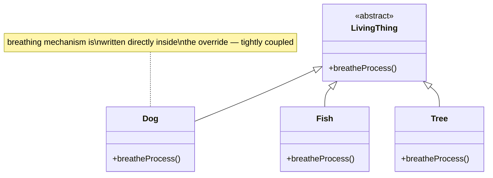
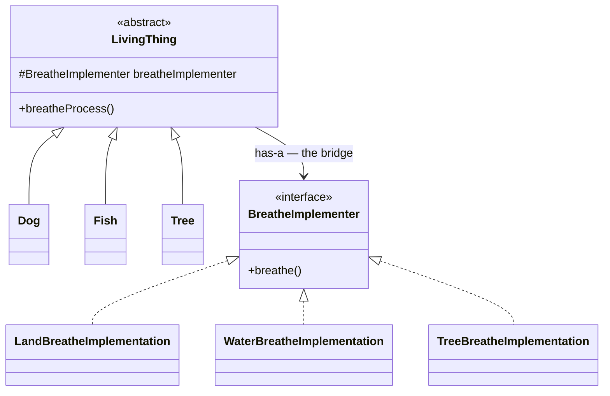
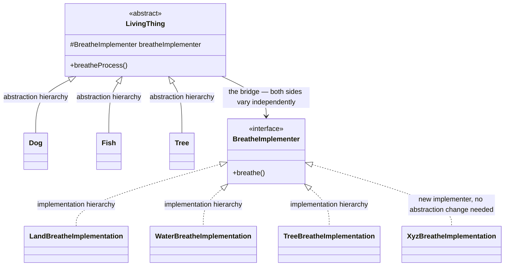

# Bridge Design Pattern

## Overview
- Structural design pattern — decouples an **abstraction** from its
  **implementation** so the two can vary/grow **independently**.
- Solves a tightly-coupled-inheritance problem: adding a new
  implementation shouldn't require also adding a new abstraction subclass
  (and vice versa).
- Structurally near-identical to [02. Strategy Design Pattern](02-strategy-design-pattern.md) — the two
  are frequently confused; the real difference is **intent**, not code
  shape (see Trade-offs below).

## Key Concepts
### The problem — implementation baked directly into inheritance
- `LivingThing` abstract class declares an abstract `breatheProcess()`;
  child classes `Dog`, `Fish`, `Tree` each override it with their own
  breathing mechanism baked directly inside.
- This is plain inheritance and looks fine — until a new breathing
  mechanism needs to be introduced, e.g. a bird's nostril-based breathing.
- The problem: that new mechanism **cannot be added on its own** — it can
  only be introduced by simultaneously creating a brand-new subclass
  (`Bird`) that uses it. The mechanism (implementation) is tightly coupled
  to the `LivingThing` hierarchy (abstraction) — neither can grow without
  touching the other.



```java
// bad: implementation mechanism baked directly into each subclass
abstract class LivingThing {
    abstract void breatheProcess();
}
class Dog extends LivingThing {
    void breatheProcess() { System.out.println("Breathe through nose: inhale oxygen, exhale CO2"); }
}
class Fish extends LivingThing {
    void breatheProcess() { System.out.println("Breathe through gills: absorb oxygen, release CO2"); }
}
class Tree extends LivingThing {
    void breatheProcess() { System.out.println("Breathe through leaves: inhale CO2, release oxygen"); }
}
// adding a bird's breathing mechanism means adding a whole new Bird class too —
// the mechanism can't exist without a subclass that uses it
```

### The fix — extract implementation into its own hierarchy (the "bridge")
- Introduce a `BreatheImplementer` interface with one method `breathe()`;
  concrete implementers `LandBreatheImplementation`,
  `WaterBreatheImplementation`, `TreeBreatheImplementation` each hold the
  actual mechanism.
- `LivingThing` (the abstraction) now **has-a** `BreatheImplementer`
  reference instead of implementing the mechanism itself; its
  `breatheProcess()` just delegates: `breatheImplementer.breathe()`.
- Concrete `LivingThing` subclasses inject the specific implementer they
  want through their constructor — `Dog` passes a
  `LandBreatheImplementation`, `Fish` passes a
  `WaterBreatheImplementation`, and so on.
- Now a brand-new breathing mechanism is just a new class implementing
  `BreatheImplementer` — no existing `LivingThing` subclass has to change,
  and no subclass even has to exist yet for the new implementer to be
  added. The two hierarchies (abstraction: `LivingThing` subclasses;
  implementation: `BreatheImplementer` subclasses) now vary independently
  — that's the "bridge" between them.
- Bonus: because it's just a constructor-injected reference, an existing
  concrete class can be given a *different* implementer at construction
  time — e.g. a `Tree` built with a non-default implementer — without any
  code changes.



```java
interface BreatheImplementer { // implementation hierarchy, extracted out
    void breathe();
}
class LandBreatheImplementation implements BreatheImplementer {
    public void breathe() { System.out.println("Breathe through nose: inhale oxygen, exhale CO2"); }
}
class WaterBreatheImplementation implements BreatheImplementer {
    public void breathe() { System.out.println("Breathe through gills: absorb oxygen, release CO2"); }
}
class TreeBreatheImplementation implements BreatheImplementer {
    public void breathe() { System.out.println("Breathe through leaves: inhale CO2, release oxygen"); }
}

abstract class LivingThing { // abstraction hierarchy — decoupled from the mechanism
    protected BreatheImplementer breatheImplementer;
    LivingThing(BreatheImplementer breatheImplementer) {
        this.breatheImplementer = breatheImplementer; // the bridge — injected, not hardcoded
    }
    void breatheProcess() {
        breatheImplementer.breathe(); // delegates, doesn't know the mechanism itself
    }
}
class Dog extends LivingThing {
    Dog() { super(new LandBreatheImplementation()); }
}
class Fish extends LivingThing {
    Fish() { super(new WaterBreatheImplementation()); }
}
class Tree extends LivingThing {
    Tree() { super(new TreeBreatheImplementation()); }
}

// adding a totally new mechanism needs zero changes to Dog/Fish/Tree/LivingThing:
class XyzBreatheImplementation implements BreatheImplementer {
    public void breathe() { System.out.println("Inhale CO2, exhale CO2"); }
}
```

### Bridge vs Strategy — same shape, different intent
- Structurally these two patterns end up almost identical: an
  abstraction/context class holds a reference to an interface
  (implementer/strategy) and delegates a method call to it.
- **Strategy's intent**: change the behavior of **one object** dynamically
  at runtime — the context class itself stays fixed, and the client swaps
  which strategy object gets injected to change that object's behavior on
  the fly (e.g. constructing the same `LivingThing`-style context with a
  `LandBreatheStrategy` today, a `WaterBreatheStrategy` tomorrow).
- **Bridge's intent**: let **two class hierarchies** — an abstraction
  hierarchy and an implementation hierarchy — **grow independently over
  time**. New abstraction subclasses and new implementer subclasses can
  each be added without touching the other side.
- Same UML, same code shape — the difference is *why* it was reached for:
  runtime behavior-swapping for one object (Strategy) vs. letting two
  hierarchies expand independently (Bridge).

## Trade-offs / Comparisons
| | Bridge | Strategy |
|---|---|---|
| Category | Structural | Behavioral |
| Core mechanism | Abstraction has-a implementer interface, injected via constructor | Context has-a strategy interface, injected via constructor |
| Intent | Let two class hierarchies (abstraction + implementation) evolve independently | Change one object's behavior dynamically at runtime |
| What's growing | Both the abstraction subclasses and the implementer subclasses, independently | Just the set of interchangeable strategies for one fixed context |
| Code/UML shape | Nearly identical to Strategy | Nearly identical to Bridge |

## Example / Walkthrough
- Bad version: `LivingThing`/`Dog`/`Fish`/`Tree` each bake their breathing
  logic directly into `breatheProcess()` — adding a bird's nostril-based
  breathing means creating a `Bird` subclass at the same time as the new
  logic; the two can't be added separately.
- Fixed version: `BreatheImplementer` extracted; `Dog` passes
  `LandBreatheImplementation`, `Fish` passes
  `WaterBreatheImplementation`, `Tree` passes
  `TreeBreatheImplementation` to their `LivingThing` constructor — adding
  a totally new mechanism (`XyzBreatheImplementation`) needs zero changes
  to `Dog`/`Fish`/`Tree`/`LivingThing`.
- Runtime swap: an existing `Tree` instance could be constructed with a
  different `BreatheImplementer` than its default, since it's just a
  constructor parameter, not hardcoded logic.

## Diagram


## Interview Q&A
<details>
<summary>What problem does the Bridge pattern solve?</summary>

It removes the tight coupling between an abstraction hierarchy and one
baked-in implementation — without Bridge, a new implementation can't be
added without also adding a new abstraction subclass (or vice versa).

</details>

<details>
<summary>What's the core mechanism Bridge uses?</summary>

The abstraction holds a reference (has-a) to an implementer interface
instead of implementing the mechanism itself; concrete abstraction
subclasses inject the specific implementer they want via their
constructor.

</details>

<details>
<summary>How is this different from just using plain inheritance?</summary>

Plain inheritance bakes the mechanism directly into each subclass's
override, coupling the two together. Bridge extracts the mechanism into
its own interface/hierarchy, so the abstraction and the implementation can
each be extended without touching the other.

</details>

<details>
<summary>Bridge and Strategy end up with nearly identical code — what's actually different?</summary>

The intent. Strategy changes *one object's* behavior dynamically at
runtime. Bridge lets *two class hierarchies* (an abstraction hierarchy and
an implementation hierarchy) grow independently over time.

</details>

<details>
<summary>Can an existing concrete class swap its implementer at runtime in Bridge?</summary>

Yes — since it's a constructor-injected reference rather than hardcoded
logic, a class can be constructed with a different implementer than its
usual default, the same swappable shape Strategy also relies on.

</details>

<details>
<summary>Which category of design pattern is Bridge?</summary>

Structural — it combines an abstraction and an implementation hierarchy,
connected by a has-a reference, to let both grow independently.

</details>

<details>
<summary>Give the concrete example used to illustrate Bridge.</summary>

A `LivingThing` abstraction (`Dog`/`Fish`/`Tree`) bridged to a
`BreatheImplementer` implementation hierarchy (`LandBreathe`/
`WaterBreathe`/`TreeBreathe`), so new breathing mechanisms and new
living-thing types can each be added independently of each other.

</details>

## Related Topics
- [02. Strategy Design Pattern](02-strategy-design-pattern.md) — nearly
  identical structure, contrasted above by intent (behavior-swapping vs.
  independently-growing hierarchies).
- [01.2. is-a vs has-a: How Each Looks in Code](01.2-is-a-vs-has-a.md) —
  the abstraction is-a `LivingThing` subclass, has-a `BreatheImplementer`
  — the same both-relationship shape used elsewhere.
- [00c. Design Patterns Catalog](00c-design-patterns-catalog.md) — full
  checklist of covered patterns; Bridge is structural.
