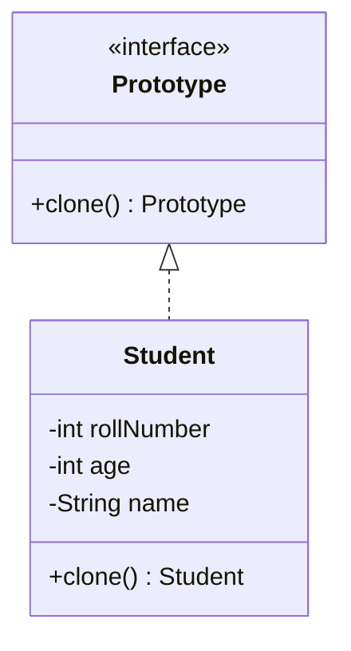
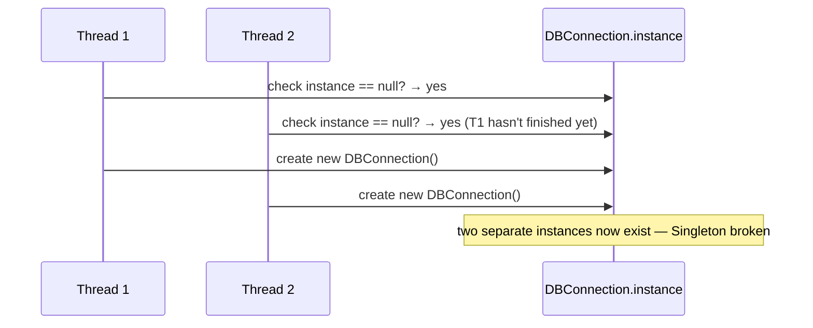
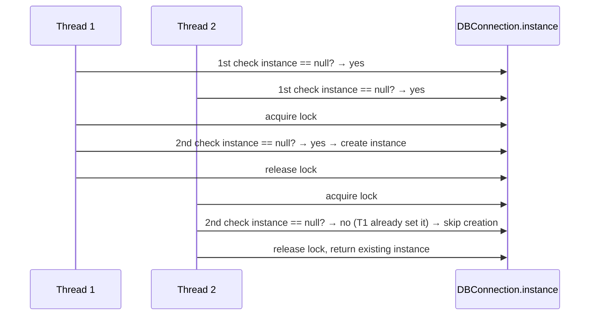
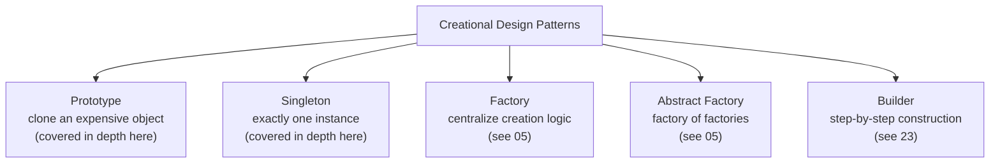

# All Creational Design Patterns (Prototype, Singleton, Factory, Abstract Factory, Builder)

## Overview
- A one-video roundup of all 5 creational design patterns — patterns that
  control **how objects get created**.
- Prototype and Singleton get full depth here — this is their first
  dedicated coverage. Factory, Abstract Factory, and Builder already have
  their own in-depth notes; this note only recaps them briefly with the
  video's fresh examples and links out to the full versions.

## Key Concepts
### Prototype — clone instead of rebuild
- Used when creating an object from scratch is **expensive**, but you
  need many slightly-different variants of it — clone the expensive
  original and tweak the clone instead of rebuilding from zero each time.
- Classic example: a robot that's very expensive to construct. Build one
  base robot once, then clone it repeatedly and make minor per-clone
  modifications, instead of paying the full construction cost 100 times.

### The problem with manual, client-side cloning
- Naive approach: the client creates a new object and manually copies
  each field across — `clone.name = original.name`, `clone.age =
  original.age`, etc.
- Problem 1 — **private fields are inaccessible**: if a field (and any
  getter for it) is private, a client outside the class has no way to
  read it to copy it over at all.
- Problem 2 — **the client has to know the object's exact shape**: which
  of the (possibly 100) fields need copying and which don't — that's
  business logic about the class leaking into every place that clones it.

```java
// bad: client manually copies fields — breaks on private fields,
// and the client has to know exactly which fields matter
class Student {
    private int rollNumber; // private — client can't read this at all
    String name;
    int age;
}
Student clone = new Student();
clone.name = original.name;
clone.age = original.age;
// clone.rollNumber = original.rollNumber; // won't compile — private
```

### The fix — a shared Prototype interface with clone()
- Move the cloning responsibility **inside** the class being cloned —
  expose a `clone()` method on the object itself, since only the class
  itself can freely access its own private fields.
- Define a common `Prototype` interface with one method, `clone()`, that
  every cloneable class implements — this keeps the method name
  consistent across classes (`Student`, `Employee`, ...), instead of each
  class inventing its own name (`getClone()`, `duplicate()`, ...).
- The client now just calls `original.clone()` and gets back a fully
  populated copy — no knowledge of the object's internal shape required.



```java
interface Prototype {
    Prototype clone();
}
class Student implements Prototype {
    private int rollNumber;
    private int age;
    private String name;

    Student(int rollNumber, int age, String name) {
        this.rollNumber = rollNumber;
        this.age = age;
        this.name = name;
    }

    public Student clone() { // lives inside the class — can touch private fields directly
        return new Student(this.rollNumber, this.age, this.name);
    }
}

// client
Student original = new Student(1, 20, "A");
Student clone = original.clone(); // client never touches individual fields
```

### Singleton — exactly one instance
- Used when a class must have **exactly one instance** across the whole
  application — e.g. a single DB connection, a single ATM — and every
  caller reuses that same instance.
- Four ways to implement it: Eager, Lazy, Synchronized method, and
  Double-checked locking (the one actually used in industry).

#### Eager initialization
- The constructor is made `private` so nothing outside the class can call
  `new` directly.
- A `static` instance field is created immediately when the class loads —
  static fields belong to the class itself, not to any object, so every
  caller shares the exact same instance.
- `getInstance()` just returns the already-created instance — it never
  constructs a new one.

```java
class DBConnection {
    private static final DBConnection instance = new DBConnection(); // created at class load
    private DBConnection() { }
    public static DBConnection getInstance() { return instance; }
}
```

#### Lazy initialization
- The static instance field starts as `null`; `getInstance()` creates it
  only the first time it's actually needed, then returns the cached
  instance on every later call.
- **Bug**: not thread-safe. If two threads call `getInstance()` at almost
  the same time, both can see `instance == null` before either finishes
  constructing one — both create their own object, breaking the
  "exactly one instance" guarantee.



```java
class DBConnection {
    private static DBConnection instance; // starts null
    private DBConnection() { }
    public static DBConnection getInstance() {
        if (instance == null) {
            instance = new DBConnection(); // race condition: two threads can both get here
        }
        return instance;
    }
}
```

#### Synchronized method
- Fix: mark `getInstance()` as `synchronized`, so only one thread can
  execute it at a time — the race condition is gone.
- **Downside**: every call pays the locking cost forever, even the
  10,000th call when the instance already exists and no race is possible
  any more — too expensive at scale, so this is never used in practice.

#### Double-checked locking (industry standard)
- Check `instance == null` **before** taking any lock — this is the cheap
  path that the overwhelming majority of calls take once the instance
  already exists, with zero locking overhead.
- Only if it's still `null`, enter a `synchronized` block — and check
  `instance == null` **again**, inside the lock, before constructing.
- The second check matters because two threads can both pass the first,
  un-synchronized null-check before either acquires the lock; once inside
  the lock, only the first thread through still sees `null` and actually
  constructs the object — the second thread now sees it's already set and
  skips creation.



```java
class DBConnection {
    private static volatile DBConnection instance;
    private DBConnection() { }
    public static DBConnection getInstance() {
        if (instance == null) { // 1st check — cheap, no lock, handles the common case
            synchronized (DBConnection.class) {
                if (instance == null) { // 2nd check — only one thread actually creates it
                    instance = new DBConnection();
                }
            }
        }
        return instance;
    }
}
```

### Factory, Abstract Factory, and Builder — recap
- **Factory** centralizes object-creation logic and its business rules in
  one place, so a change to the creation logic touches one class instead
  of every call site across the codebase. Fresh example from this video:
  a `ShapeFactory` returns `Circle`/`Square`/`Rectangle` based on an input
  value — if `Square` later needs to be retired in favor of `Rectangle`,
  only the factory's `if`/`switch` changes. Full depth:
  [05. Factory vs Abstract Factory Pattern](05-factory-vs-abstract-factory-pattern.md).
- **Abstract Factory** is a "factory of factories" — a top-level producer
  (e.g. `AbstractFactoryProducer`) first returns the *right factory*
  (`EconomicCarFactory` or `LuxuryCarFactory`) based on some input, and
  that returned factory then produces the actual object (a specific car).
  Fresh example from this video: economic vs. luxury car factories,
  selected by a "how premium" input value. Full depth:
  [05. Factory vs Abstract Factory Pattern](05-factory-vs-abstract-factory-pattern.md).
- **Builder** constructs a complex object step by step through a mediator
  Builder object (every step returns the builder itself), with an
  optional Director orchestrating which steps run in what order; only the
  final `build()` call returns the real product. Fresh example from this
  video: a `HomeBuilder` (createWall → createRoof → createDoor →
  createWindow → build), abstracted so different home types (flat,
  duplex, villa) can override individual steps. Full depth:
  [23. Builder Design Pattern](23-builder-design-pattern.md).

## Trade-offs / Comparisons
| Singleton approach | Thread-safe? | When instance is created | Performance |
|---|---|---|---|
| Eager | Yes (created before any thread can race) | At class-load time, even if never used | No locking overhead ever, but pays construction cost upfront |
| Lazy | **No** — race condition on first concurrent access | On first call to `getInstance()` | Fast, but broken under concurrency |
| Synchronized method | Yes | On first call to `getInstance()` | Slow — every single call pays the locking cost forever |
| Double-checked locking | Yes | On first call to `getInstance()` | Fast — locking only happens on the (rare) first-creation race window |

## Example / Walkthrough
- **Prototype**: `Student` has a private `rollNumber`; a client trying to
  manually copy `clone.rollNumber = original.rollNumber` from outside the
  class won't even compile. Fixed by having `Student implements
  Prototype` and exposing `clone()`, which copies its own fields
  internally.
- **Singleton**: walked through all 4 variants using a `DBConnection`
  example, including the double-checked-locking race-condition trace with
  two threads (T1, T2) shown above.
- **Factory**: `ShapeFactory` example — input value picks
  Circle/Square/Rectangle.
- **Abstract Factory**: car factory-of-factories — an
  `AbstractFactoryProducer` returns `EconomicCarFactory` or
  `LuxuryCarFactory`, which then returns the actual car.
- **Builder**: `HomeBuilder`/`Director` example — steps for wall, roof,
  door, window, then `build()`.

## Diagram


## Interview Q&A
<details>
<summary>When should you reach for Prototype instead of just calling `new`?</summary>

When constructing an object from scratch is expensive but you need many
slightly-different variants of it — clone the expensive original and
tweak the clone, instead of paying the full construction cost every time.

</details>

<details>
<summary>Why can't a client manually clone an object that has private fields?</summary>

Private fields (and any private getters for them) are only accessible
from inside the class itself — code outside the class has no way to read
their values to copy them over, so field-by-field cloning from a client
simply doesn't compile.

</details>

<details>
<summary>Why does Prototype define a shared clone() method via an interface, rather than each class naming its own copy method?</summary>

Consistency — if every cloneable class independently named its copying
method differently, callers would need to know each class's specific
method name; a shared `Prototype` interface guarantees every cloneable
class exposes the exact same `clone()` method.

</details>

<details>
<summary>What's the thread-safety bug in the lazy Singleton implementation?</summary>

Two threads can both see `instance == null` before either finishes
constructing one, so both end up creating their own separate instance —
breaking the "exactly one instance" guarantee.

</details>

<details>
<summary>Why is a synchronized getInstance() method avoided in practice, even though it's thread-safe?</summary>

Every single call pays the cost of acquiring the lock, forever — even the
10,000th call, when the instance already exists and no race condition is
possible any more. That locking overhead at scale is why it's never used
in production Singletons.

</details>

<details>
<summary>How does double-checked locking get both thread-safety and good performance?</summary>

It checks `instance == null` once before taking any lock (cheap, handles
the common case where the instance already exists with zero locking
cost), and only acquires the lock — with a second null-check inside it —
on the rare first-creation race window.

</details>

<details>
<summary>Why does double-checked locking check for null twice instead of once?</summary>

Two threads can both pass the first, un-synchronized null-check before
either acquires the lock. The second check, taken only after acquiring
the lock, ensures only the first thread through actually constructs the
instance — the second thread sees it's already set and skips creation.

</details>

<details>
<summary>Which creational pattern is described as a "factory of factories," and why is that extra layer needed?</summary>

Abstract Factory. It's needed when products themselves fall into distinct
families (e.g. economic cars vs. luxury cars) — a top-level producer
first picks the right family-specific factory, which then produces the
actual object within that family.

</details>

## Related Topics
- [05. Factory vs Abstract Factory Pattern](05-factory-vs-abstract-factory-pattern.md) — full depth on
  the two patterns recapped here.
- [23. Builder Design Pattern](23-builder-design-pattern.md) — full depth on the pattern recapped here.
- [00a. What is LLD](00a-what-is-lld.md) — creational/structural/behavioral category definitions.
- [00c. Design Patterns Catalog](00c-design-patterns-catalog.md) — full checklist; Prototype and
  Singleton move to covered here.
