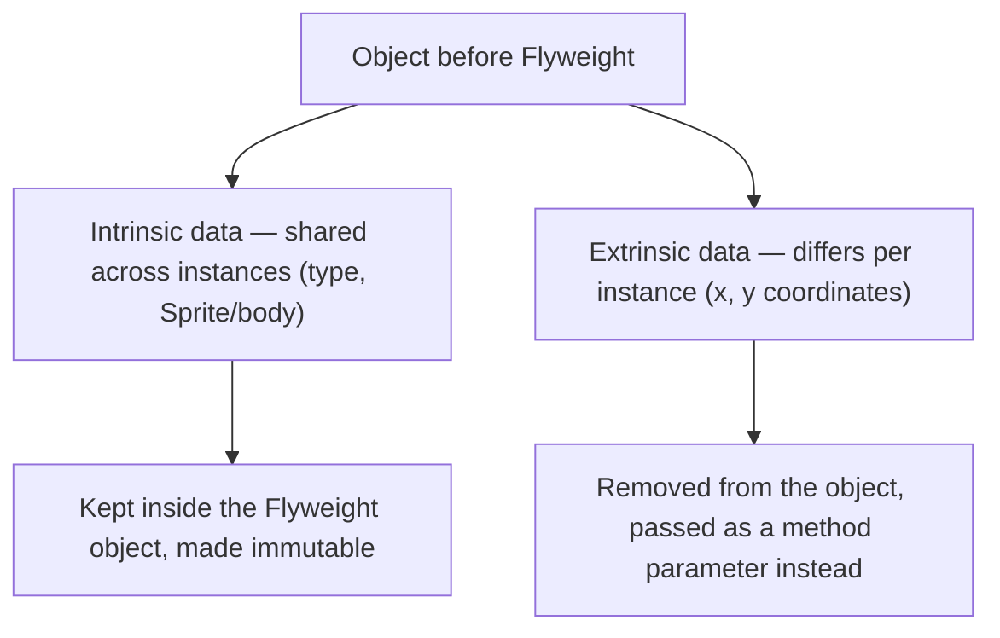
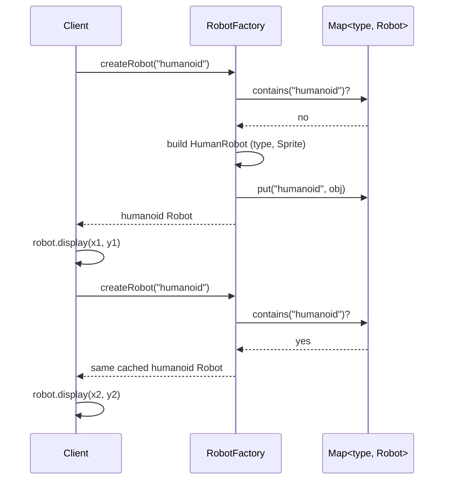
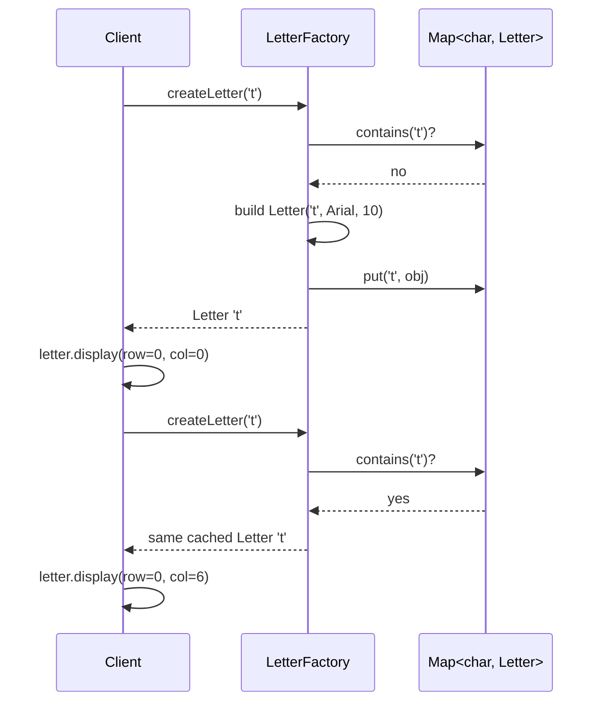
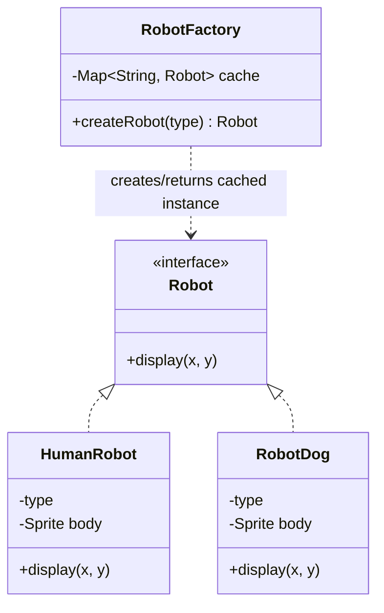

# Flyweight Design Pattern

## Overview
- Structural design pattern — reduces memory usage by sharing data among
  multiple objects instead of storing it redundantly in each one.
- Interview signal: whenever the interviewer says memory is limited, check
  whether Flyweight applies before reaching for anything else.
- Two classic interview prompts built on this pattern: design a word
  processor / text editor, and design a game with a large army of similar
  objects (e.g. robots, particles, tiles).

## Key Concepts
### When to use Flyweight
- Memory is limited — the interviewer explicitly flags memory as a
  constraint; if memory isn't a concern, this pattern is usually unnecessary.
- Objects share data — some fields are identical across many instances; if
  two objects share nothing, Flyweight doesn't apply.
- Object creation is expensive — e.g. constructing a bitmap/Sprite is costly,
  so avoiding repeated construction matters.

### Intrinsic vs extrinsic data
- Intrinsic data — the data shared among objects (e.g. a robot's type and
  body/Sprite for all robots of that type); this is what stays inside the
  Flyweight object.
- Extrinsic data — the data that differs per instance, supplied by the
  client at the point of use (e.g. x/y coordinates where an object is
  rendered); this cannot be shared and is never stored in the Flyweight
  object.
- Two objects can never share extrinsic data — its value always comes from
  the caller, per call.



### Four steps to build a Flyweight
- Remove all extrinsic data from the object, keep only intrinsic data — the
  resulting object is called the Flyweight object.
- Make the Flyweight class immutable — private fields, constructor-only
  assignment, getters only, no setters, so a shared instance can never be
  mutated after creation.
- Pass extrinsic data into the Flyweight's methods as parameters instead of
  storing it on the object.
- Cache and reuse Flyweight objects — a factory looks up an existing object
  by a key built from the intrinsic data before constructing a new one.

## Trade-offs / Comparisons
| Approach | Objects created | Memory |
|---|---|---|
| No Flyweight | One object per instance (e.g. 10 lakh robots → 10 lakh objects) | Each object repeats intrinsic data → memory scales linearly with instance count, can hit GBs |
| Flyweight | One object per distinct intrinsic-data combination (e.g. one per robot type, one per character) | Intrinsic data stored once and shared; only extrinsic data (coordinates) is passed per call |

## Example / Walkthrough — Gaming (robot army)
- Naive version: a `Robot` class holds x, y, type, and a heavy `Sprite`
  (2D bitmap array). Creating 5 lakh humanoid robots + 5 lakh robotic-dog
  robots means 10 lakh objects, each repeating the same type + Sprite data
  → estimated ~31 GB, which can crash a memory-limited system.
- Fix: split `Robot` into an interface with `HumanRobot` and `RobotDog`
  implementations, each holding only intrinsic data (type, body/Sprite),
  made immutable via private fields + constructor + getters only.
- x/y become a parameter on a `display(x, y)` method instead of fields.
- A `RobotFactory` caches one object per type in a `Map<String, Robot>`
  keyed by type; `createRobot(type)` returns the cached instance if present,
  otherwise constructs, caches, and returns a new one.
- Result: only 2 Robot objects ever get constructed (one humanoid, one
  robotic dog) no matter how many are placed on screen — each `display`
  call just reuses the shared object with different coordinates.



```java
interface Robot {
    void display(int x, int y); // extrinsic data passed per call
}

class HumanRobot implements Robot { // intrinsic data only, immutable
    private final String type;
    private final Sprite body;

    HumanRobot(String type, Sprite body) {
        this.type = type;
        this.body = body;
    }

    public void display(int x, int y) {
        // render body at (x, y) using shared Sprite
    }
}

class RobotDog implements Robot {
    private final String type;
    private final Sprite body;

    RobotDog(String type, Sprite body) {
        this.type = type;
        this.body = body;
    }

    public void display(int x, int y) { /* render at (x, y) */ }
}

class RobotFactory {
    private final Map<String, Robot> cache = new HashMap<>();

    Robot createRobot(String type) {
        if (cache.containsKey(type)) {
            return cache.get(type); // reuse shared Flyweight
        }
        Robot robot = type.equals("humanoid")
            ? new HumanRobot(type, new Sprite(/* human bitmap */))
            : new RobotDog(type, new Sprite(/* dog bitmap */));
        cache.put(type, robot);
        return robot;
    }
}
```

## Example / Walkthrough — Word processor (character rendering)
- Naive version: a `Character` class holds the character value, font type,
  size, row, and column. A document with lakhs of characters would need a
  new object per character occurrence — memory blows up even though most
  characters (e.g. every `t`) look identical.
- Fix: `Letter` interface with the character, font type, and size as
  intrinsic data, made immutable; row/column become extrinsic parameters on
  a `display(row, col)` method.
- A `LetterFactory` caches one `Letter` object per distinct character value
  (`t`, `h`, `i`, ...) in a map; `createLetter(char)` returns the cached
  object if it exists, otherwise builds and caches a new one.
- Result: typing `t` a thousand times reuses the same one `Letter` object
  for `t` — only the row/column passed to `display` differ per occurrence.



```java
interface Letter {
    void display(int row, int col); // extrinsic data passed per call
}

class Character implements Letter { // intrinsic data only, immutable
    private final char value;
    private final String fontType;
    private final int size;

    Character(char value, String fontType, int size) {
        this.value = value;
        this.fontType = fontType;
        this.size = size;
    }

    public void display(int row, int col) {
        // render this.value at (row, col) using fontType/size
    }
}

class LetterFactory {
    private final Map<Character, Letter> cache = new HashMap<>();

    Letter createLetter(char value) {
        if (cache.containsKey(value)) {
            return cache.get(value); // reuse shared Flyweight
        }
        Letter letter = new Character(value, "Arial", 10);
        cache.put(value, letter);
        return letter;
    }
}
```

## Diagram


## Interview Q&A
<details>
<summary>What problem does the Flyweight pattern solve?</summary>

It reduces memory usage when many objects would otherwise repeat the same
data, by sharing that shared (intrinsic) data across instances instead of
storing a copy in every object.

</details>

<details>
<summary>What are intrinsic and extrinsic data?</summary>

Intrinsic data is shared across objects and stored inside the Flyweight
(e.g. a robot's type and Sprite). Extrinsic data differs per instance,
comes from the client, and is passed as a method parameter instead of being
stored (e.g. x/y coordinates).

</details>

<details>
<summary>Why must the Flyweight object be immutable?</summary>

Because the same object instance is shared and reused across many logical
"instances" — if it could be mutated, changing it for one use would corrupt
it for every other client sharing that same object.

</details>

<details>
<summary>What role does the factory play in this pattern?</summary>

It caches Flyweight objects keyed by their intrinsic data (e.g. robot type,
or character value) and returns an existing cached object instead of
constructing a new one whenever one already exists for that key.

</details>

<details>
<summary>What signals in an interview question suggest Flyweight fits?</summary>

The interviewer flags memory as limited, the objects being created clearly
share a lot of data, and/or object construction is expensive (e.g.
rendering a bitmap) — any of these is a hint to consider Flyweight.

</details>

<details>
<summary>In the word processor example, how many Character objects get created for a document with a thousand instances of the letter 't'?</summary>

Just one — the factory caches it on first creation and returns the same
shared object on every subsequent request for 't', only the row/column
passed to `display` change per occurrence.

</details>

<details>
<summary>Can two Flyweight objects ever share extrinsic data?</summary>

No — extrinsic data always differs per instance and comes from the client
at call time (e.g. two robots can share the same type/Sprite but never the
same x/y coordinates), so it's never cached or shared inside the Flyweight.

</details>

## Related Topics
- [05. Factory vs Abstract Factory Pattern](05-factory-vs-abstract-factory-pattern.md) — Flyweight's
  factory centralizes creation the same way, but adds a cache lookup keyed by intrinsic data.
- [13. Proxy Design Pattern](13-proxy-design-pattern.md) — another structural pattern that
  introduces an intermediary, though for access control rather than memory sharing.
