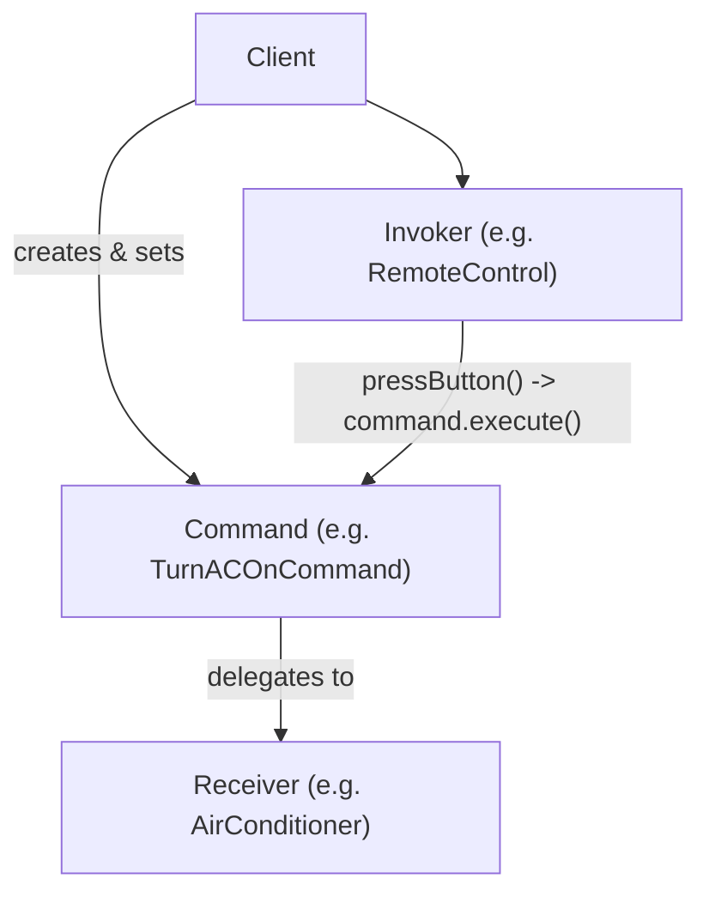
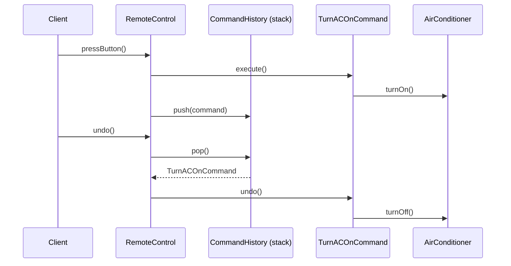
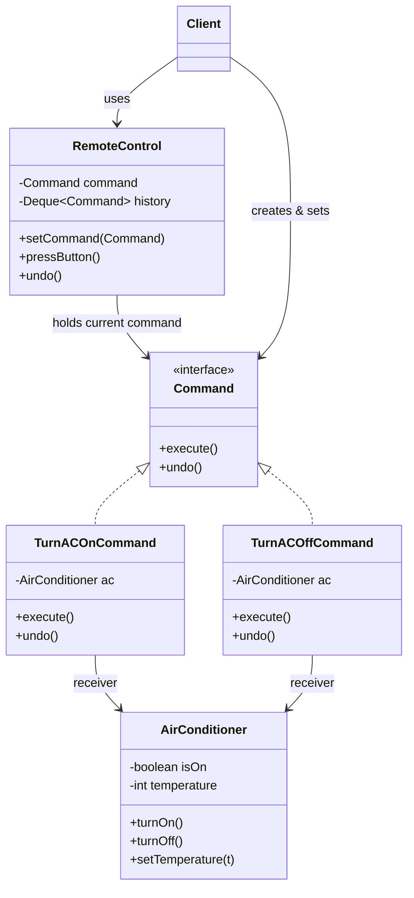

# Command Design Pattern

## Overview
- Behavioral design pattern — encapsulates a request (an action to perform)
  as its own object, instead of the caller invoking methods on the target
  directly.
- Interview signal: any "copy/paste", "remote control turns a device on/off",
  or similarly named "command"-shaped question; it's also the go-to pattern
  whenever undo/redo functionality is asked for.
- Splits the problem into four roles: **receiver** (the object that actually
  does the work), **command** (encapsulates one request to the receiver),
  **invoker** (triggers a command, e.g. a button press), and **client**
  (wires invoker + command + receiver together, then just presses buttons).

## Key Concepts
### The problem without Command
- A naive design has the client call methods directly on the receiver (e.g.
  `ac.turnOn()`, `ac.setTemperature(20)`, `ac.turnOff()`).
- Lack of abstraction — if turning on the AC ever requires a sequence of
  internal steps instead of one method, the client must know and call every
  step itself.
- No undo/redo — nothing records what was done or how to reverse it; the
  receiver is a "dumb" object that just reacts to calls, so undo logic has
  nowhere natural to live.
- Poor maintainability — adding a new device (e.g. a bulb) means the client
  must learn that device's entire API too; the client grows and gets more
  tightly coupled with every new device.

```java
class AirConditioner { // naive version — no Command
    boolean isOn;
    int temperature;

    void turnOn() { isOn = true; }
    void turnOff() { isOn = false; }
    void setTemperature(int t) { temperature = t; }
}

class Client {
    public static void main(String[] args) {
        AirConditioner ac = new AirConditioner();
        ac.turnOn();            // client must know every receiver method
        ac.setTemperature(20);  // and every step, directly
        ac.turnOff();
    }
}
```

### Four roles
- Receiver — the object that does the real work (e.g. `AirConditioner`);
  stays a simple object with no knowledge of commands, undo, or invokers.
- Command — an interface with an `execute()` method; each concrete command
  (e.g. `TurnACOnCommand`, `TurnACOffCommand`) holds a reference to a
  receiver (constructor-injected) and calls the appropriate receiver method
  inside `execute()`.
- Invoker — holds a reference to a command (e.g. `RemoteControl`'s button)
  and calls `command.execute()` when triggered; doesn't know or care what
  the command actually does.
- Client — creates the receiver, creates the invoker, sets a specific
  command onto the invoker, then only ever interacts with the invoker (e.g.
  "press button") from that point on.



```java
interface Command {
    void execute();
}

class TurnACOnCommand implements Command {
    private final AirConditioner ac; // command holds the receiver

    TurnACOnCommand(AirConditioner ac) { this.ac = ac; }
    public void execute() { ac.turnOn(); }
}

class TurnACOffCommand implements Command {
    private final AirConditioner ac;

    TurnACOffCommand(AirConditioner ac) { this.ac = ac; }
    public void execute() { ac.turnOff(); }
}

class RemoteControl { // invoker
    private Command command;

    void setCommand(Command command) { this.command = command; }
    void pressButton() { command.execute(); }
}

class Client {
    public static void main(String[] args) {
        AirConditioner ac = new AirConditioner();
        RemoteControl remote = new RemoteControl();
        remote.setCommand(new TurnACOnCommand(ac)); // wire once
        remote.pressButton(); // client only ever does this from here on
    }
}
```

### How this fixes the three problems
- Abstraction — the client only ever calls `pressButton()`; however many
  internal steps a command's `execute()` needs, that detail lives inside
  the command class, not the client.
- Maintainability — a new device (e.g. a bulb) just needs its own
  receiver + commands (`TurnBulbOnCommand`, ...); the client and invoker
  code shape doesn't change, only which command gets set on the invoker.
- Undo/redo — becomes natural once a request is an object instead of a
  direct method call, see below.

### Undo/redo
- Add an `undo()` method to the `Command` interface alongside `execute()` —
  each concrete command knows both how to do its action and how to reverse
  it (e.g. `TurnACOnCommand.undo()` calls `ac.turnOff()`).
- The invoker keeps a stack of executed commands — every time
  `pressButton()` runs a command, that command is pushed onto the stack.
- Invoker exposes an `undo()` method: pop the last command off the stack and
  call its `undo()` — reverses exactly the last action performed.
- The receiver never needs to know about undo at all — it stays a plain
  reactive object; the reversal logic lives entirely in the command, and
  the history/ordering lives entirely in the invoker.



```java
interface Command {
    void execute();
    void undo();
}

class TurnACOnCommand implements Command {
    private final AirConditioner ac;

    TurnACOnCommand(AirConditioner ac) { this.ac = ac; }
    public void execute() { ac.turnOn(); }
    public void undo() { ac.turnOff(); } // opposite of execute
}

class TurnACOffCommand implements Command {
    private final AirConditioner ac;

    TurnACOffCommand(AirConditioner ac) { this.ac = ac; }
    public void execute() { ac.turnOff(); }
    public void undo() { ac.turnOn(); }
}

class RemoteControl { // invoker
    private Command command;
    private final Deque<Command> history = new ArrayDeque<>(); // command stack

    void setCommand(Command command) { this.command = command; }

    void pressButton() {
        command.execute();
        history.push(command);
    }

    void undo() {
        if (history.isEmpty()) return;
        Command last = history.pop();
        last.undo(); // reversal logic lives in the command, not the invoker
    }
}
```

## Trade-offs / Comparisons
| Approach | Client's knowledge | Undo/redo support | Adding a new device |
|---|---|---|---|
| Direct calls (no Command) | Must know every receiver method and step | Not naturally supported — no record of what happened | Client grows, tightly coupled to every device's API |
| Command pattern | Only knows "set command, press button" | Invoker keeps a command-history stack; each command knows its own `undo()` | New receiver + new command classes; client/invoker shape unchanged |

## Example / Walkthrough
- Setup: create an `AirConditioner` (receiver), create a `RemoteControl`
  (invoker), set `TurnACOnCommand(ac)` as the remote's command.
- `remote.pressButton()` → `command.execute()` → `ac.turnOn()`; the executed
  command is pushed onto the remote's command-history stack.
- `remote.undo()` → pops `TurnACOnCommand` off the stack → calls its
  `undo()` → `ac.turnOff()` — reverses the last action without the client
  or receiver ever knowing how.
- Analogy: a TV's "back" button after channel-surfing works the same way —
  each channel change is effectively a command, and "back" undoes the last
  one.
- Extending to a `Bulb` device only requires a `Bulb` receiver plus
  `TurnBulbOnCommand`/`TurnBulbOffCommand` — the `RemoteControl` and client
  code don't change shape at all.

## Diagram


## Interview Q&A
<details>
<summary>What problem does the Command pattern solve?</summary>

It decouples the object that triggers an action (invoker) from the object
that performs it (receiver) by wrapping the request itself as an object —
this removes the need for the client to know the receiver's internal steps,
and makes each request a self-contained unit that can be queued, logged, or
undone.

</details>

<details>
<summary>What are the four roles in the Command pattern?</summary>

Receiver (does the real work), Command (encapsulates one request to the
receiver, exposes `execute()`), Invoker (triggers a command without knowing
what it does), and Client (wires receiver + command + invoker together).

</details>

<details>
<summary>How does the Command pattern implement undo?</summary>

Each concrete command implements an `undo()` method alongside `execute()`
that reverses exactly what it did; the invoker keeps a stack of executed
commands, and undo pops the most recent one and calls its `undo()`.

</details>

<details>
<summary>Why shouldn't the receiver be responsible for undo itself?</summary>

The receiver is meant to stay a simple, "dumb" reactive object — it just
does what it's told (turn on, set temperature). Making it track its own
history and reversal logic for every operation would overload its
responsibility; that logic belongs in the command, which already knows
exactly what action was taken.

</details>

<details>
<summary>How does Command pattern improve maintainability when adding a new device?</summary>

A new device only needs its own receiver class plus command classes that
wrap it — the invoker and client code keep the same shape (create command,
set it, press button), so they don't need to change or grow with every new
device type.

</details>

<details>
<summary>What's a real-world analogy for the Command pattern's undo stack?</summary>

A TV's channel "back" button — each channel change behaves like an executed
command pushed onto a history; pressing back pops the last one and reverses
it, returning to the previous channel.

</details>

<details>
<summary>What kind of interview questions hint at the Command pattern?</summary>

Anything phrased around "command" directly (remote control turning devices
on/off), copy/paste/cut operations in a text editor, or any explicit ask
for undo/redo functionality — Command is the standard pattern for all of
these.

</details>

## Related Topics
- [10. Chain of Responsibility Design Pattern](10-chain-of-responsibility-pattern.md) — another
  behavioral pattern; Chain forwards a request through candidate handlers,
  Command wraps a request as an object with its own execute/undo.
- [02. Strategy Design Pattern](02-strategy-design-pattern.md) — both encapsulate behavior behind
  an interface, but Strategy swaps *how* one operation is done, while Command
  encapsulates an entire request (including undo) as an object.
