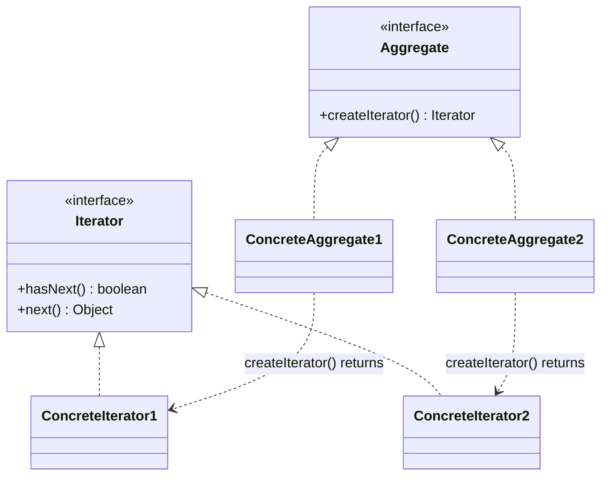
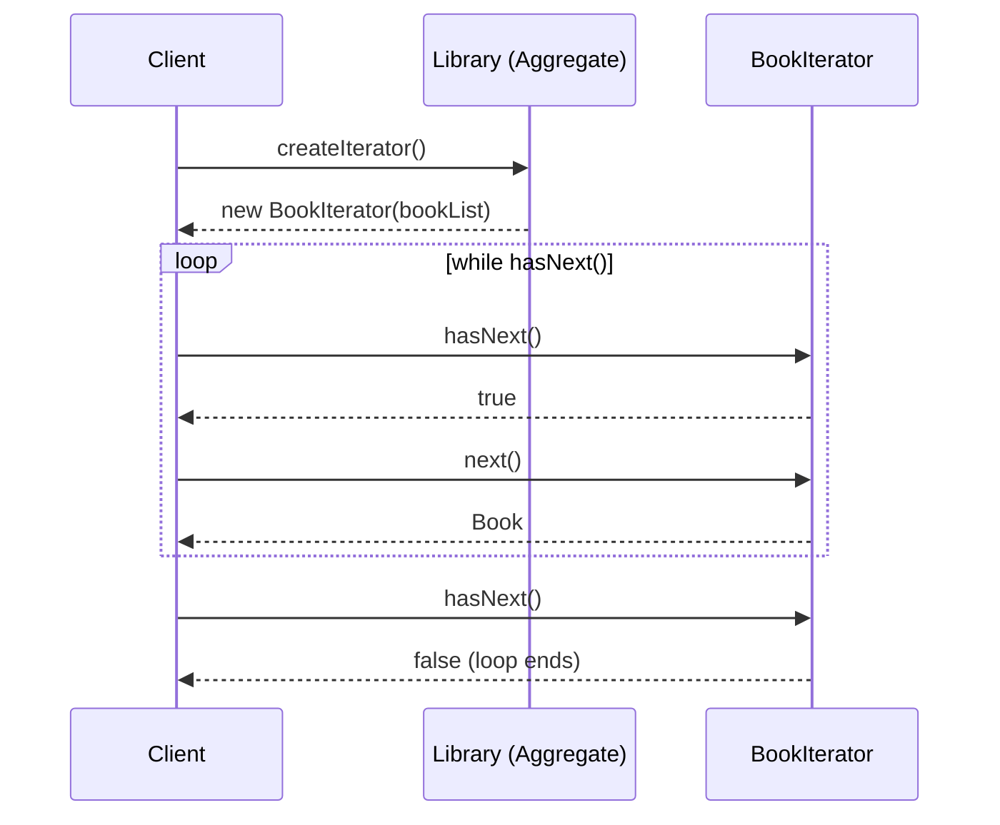
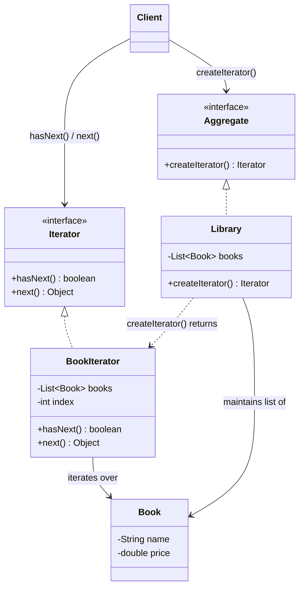

# Iterator Design Pattern

## Overview
- Behavioral design pattern — provides a way to access elements of a
  collection sequentially, without exposing the collection's underlying
  data structure to the client.
- Canonical real-world example: the Java Collections framework itself —
  `ArrayList`, `LinkedList`, `PriorityQueue`, `HashSet`, ... each store data
  differently internally, yet every one of them is iterated the exact same
  way (`hasNext()` / `next()`).
- Client never needs to know or care whether a collection is backed by an
  array, a linked list, a hash table, or anything else — the iterator hides
  that entirely.

## Key Concepts
### Two interfaces: Iterator and Aggregate
- `Iterator` — interface exposing `hasNext()` (is there another element?)
  and `next()` (return the element the cursor currently points to, then
  advance).
- `ConcreteIterator` — one per collection type, implements `hasNext()` /
  `next()` using whatever traversal logic fits that collection's actual
  data structure (e.g. `ArrayList`'s iterator uses a cursor index into an
  array; `LinkedList`'s iterator walks node pointers).
- `Aggregate` — interface for anything that holds a collection of data and
  exposes a `createIterator()` method.
- `ConcreteAggregate` — one per collection type (e.g. `ArrayList`,
  `PriorityQueue`), internally maintains the actual data, and its
  `createIterator()` returns the matching `ConcreteIterator` for that data
  structure.
- Any number of `ConcreteIterator`/`ConcreteAggregate` pairs can exist side
  by side — the client-facing contract (`hasNext()`/`next()`) never changes
  no matter how many are added.



### How Java's own collections use it
- `java.util.Iterator` is the interface — `hasNext()` and `next()`.
- `ArrayList` has its own inner class (`Itr`) implementing `Iterator`: its
  `hasNext()` checks `cursor != size`, and `next()` returns the element at
  `cursor` then increments it — logic specific to array-backed storage.
- Every other collection type (`LinkedList`, `PriorityQueue`, `HashSet`, ...)
  ships its own private iterator implementation with traversal logic suited
  to its own internal structure — the client-facing `hasNext()`/`next()`
  contract is identical across all of them.
- The collection classes themselves (`ArrayList`, `LinkedList`, ...) are the
  `ConcreteAggregate`s — each implements `iterator()` (Java's name for
  `createIterator()`) and returns its own matching iterator instance.

## Trade-offs / Comparisons
| Approach | Client's knowledge | Adding a new collection type |
|---|---|---|
| No Iterator pattern | Client must know each collection's internal structure to traverse it (array indices, linked-list node hopping, ...) | Every client call site touching that collection needs its own traversal logic |
| Iterator pattern | Client only ever calls `hasNext()` / `next()` | New collection just implements its own `ConcreteAggregate` + `ConcreteIterator`; every existing client keeps working unchanged |

## Example / Walkthrough — Library of Books
- `Book` — simple class with `name` and `price`, set via constructor,
  exposed via getters.
- `Aggregate` interface declares `createIterator()`.
- `Library implements Aggregate` — maintains a `List<Book>` (its internal
  storage, analogous to how `ArrayList` maintains an array); its
  `createIterator()` returns a `new BookIterator(bookList)`.
- `BookIterator implements Iterator` — holds the book list plus an `index`
  cursor; `hasNext()` checks `index < books.size()`, `next()` returns
  `books.get(index)` then increments `index`.
- Client: builds a list of 4 books, constructs a `Library` with them, then
  calls `library.createIterator()` and loops `while (hasNext()) { next() }`
  to print every book — with zero knowledge of how `Library` stores its
  books internally.
- Extending the system with a second aggregate (e.g. some other book
  source) requires no change to this client loop — the new aggregate just
  implements `createIterator()` and returns whichever iterator fits its own
  storage.



```java
interface Iterator {
    boolean hasNext();
    Object next();
}

interface Aggregate {
    Iterator createIterator();
}

class Book {
    private final String name;
    private final double price;

    Book(String name, double price) { this.name = name; this.price = price; }
    public String getName() { return name; }
    public double getPrice() { return price; }
}

class BookIterator implements Iterator {
    private final List<Book> books;
    private int index = 0;

    BookIterator(List<Book> books) { this.books = books; }

    public boolean hasNext() { return index < books.size(); }
    public Object next() { return books.get(index++); } // return current, then advance
}

class Library implements Aggregate {
    private final List<Book> books; // internal storage — client never sees this shape

    Library(List<Book> books) { this.books = books; }

    public Iterator createIterator() { return new BookIterator(books); }
}

class Client {
    public static void main(String[] args) {
        List<Book> bookList = List.of(
            new Book("Book1", 100), new Book("Book2", 200),
            new Book("Book3", 150), new Book("Book4", 300)
        );
        Library library = new Library(bookList);

        Iterator iterator = library.createIterator(); // client doesn't care how Library stores books
        while (iterator.hasNext()) {
            Book book = (Book) iterator.next();
            System.out.println(book.getName());
        }
    }
}
```

## Diagram


## Interview Q&A
<details>
<summary>What problem does the Iterator pattern solve?</summary>

It lets a client traverse the elements of a collection sequentially without
knowing or depending on how that collection stores its data internally
(array, linked nodes, hash buckets, etc.) — the traversal contract
(`hasNext()`/`next()`) is the same regardless of the underlying structure.

</details>

<details>
<summary>What are the four roles in the Iterator pattern?</summary>

`Iterator` (interface: `hasNext()`/`next()`), `ConcreteIterator` (per-
collection traversal logic), `Aggregate` (interface: `createIterator()`),
and `ConcreteAggregate` (the actual collection, e.g. `Library`, which
returns the right iterator for its own storage).

</details>

<details>
<summary>How does Java's own Collections framework use this pattern?</summary>

`java.util.Iterator` is the pattern's `Iterator` interface; each collection
class (`ArrayList`, `LinkedList`, `PriorityQueue`, ...) is a
`ConcreteAggregate` implementing `iterator()`, and returns its own private
`ConcreteIterator` implementation suited to its internal data structure
(e.g. `ArrayList`'s cursor-based `Itr` vs. `LinkedList`'s node-walking
iterator).

</details>

<details>
<summary>Why doesn't the client need to know whether a collection is an ArrayList or a LinkedList to iterate it?</summary>

Because both expose the same `Iterator` interface via `createIterator()` —
the client only ever calls `hasNext()` and `next()`, and each collection's
own `ConcreteIterator` hides the actual traversal mechanics (array cursor
vs. node pointers) behind that identical contract.

</details>

<details>
<summary>What happens to existing client code when a new collection type is added?</summary>

Nothing changes — the new type just implements `Aggregate` (its own
`createIterator()`) and a matching `ConcreteIterator`; any client already
looping with `hasNext()`/`next()` keeps working unmodified against the new
type too.

</details>

<details>
<summary>In the Library example, what does BookIterator's index field track, and why isn't it exposed to the client?</summary>

It's the cursor position into the book list, incremented every time
`next()` is called. It stays private inside `BookIterator` because the
client's job is only to ask "is there more?" and "give me the next one" —
not to manage traversal state itself.

</details>

## Related Topics
- [10. Chain of Responsibility Design Pattern](10-chain-of-responsibility-pattern.md) — another
  behavioral pattern; Chain routes a request through handlers, Iterator
  hides how a collection's data is traversed.
- [31. Command Design Pattern](31-command-design-pattern.md) — both patterns decouple a client
  from implementation detail behind a small, consistent interface (execute/
  undo vs. hasNext/next).
