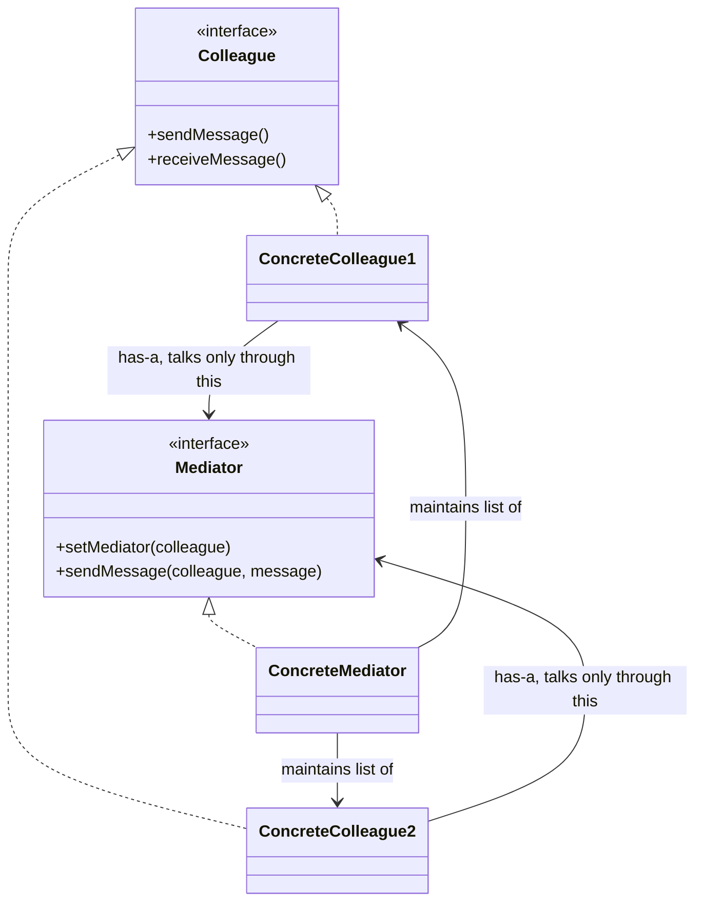
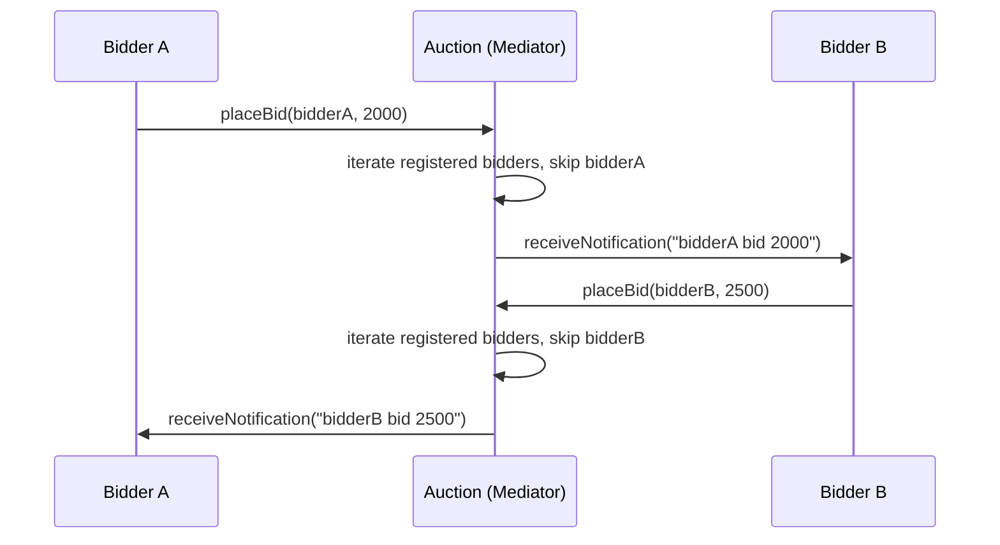
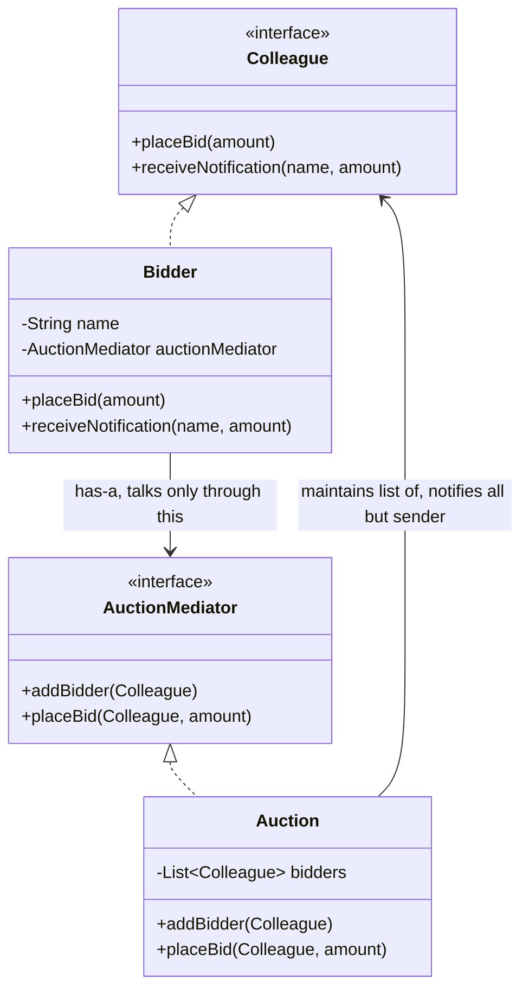

# Mediator Design Pattern

## Overview
- Behavioral design pattern — encourages loose coupling by keeping objects
  from referring to each other directly; they communicate only through a
  shared mediator object instead.
- Core idea: no two participant objects ever call each other explicitly —
  each one only talks to the mediator, and the mediator decides who else
  needs to know.
- Classic interview fits: online auction system (bidders never talk to each
  other directly), airline management system (planes never talk to each
  other directly), chat application design — any scenario where many
  participants need to interact but shouldn't be directly wired together.

## Key Concepts
### Colleague and Mediator interfaces
- `Colleague` — interface for a participant object (e.g. `Bidder`); exposes
  the actions a participant can take (e.g. `placeBid()`) and what it can
  receive (e.g. `receiveNotification()`).
- Concrete colleague (e.g. `Bidder`) holds a name and a reference to the
  mediator it belongs to (**has-a** relationship) — set via the
  constructor, since a system can run many mediators at once (e.g. several
  simultaneous auctions) and each colleague belongs to exactly one.
- `Mediator` — interface for the coordinator (e.g. `AuctionMediator`);
  exposes methods to register participants (e.g. `addBidder()`) and to
  route an action to everyone else (e.g. `placeBid()`).
- Concrete mediator (e.g. `Auction`) maintains a list of all registered
  colleagues, and its action method iterates that list to notify every
  colleague **except** the one who triggered the action.



### Why colleagues never talk directly
- Every colleague only ever calls a method on the mediator it holds — it
  never has a reference to any other colleague.
- The mediator alone decides, for any given action, which other colleagues
  need to be told — colleagues stay completely unaware of each other's
  existence or count.
- Adding a new colleague to the conversation means registering it with the
  mediator — no existing colleague's code needs to change to accommodate
  it.

## Trade-offs / Comparisons
| Approach | Coupling | Adding a new participant |
|---|---|---|
| Direct peer-to-peer calls | Every participant needs a reference to every other participant it talks to | Every existing participant's code may need updating to know about the new one |
| Mediator pattern | Each participant only knows the mediator | Register the new participant with the mediator; nobody else changes |

### Mediator vs. Observer vs. Proxy — different intents behind a similar shape
- All three can look like "one object sits between others and forwards
  something" at a glance, but solve different problems.
- **Mediator** — its whole point is preventing two objects from interacting
  directly; the mediator exists purely to decouple peers from each other.
- **Observer** — its point is notifying every interested party the instant
  one object's state changes (e.g. an observable's state update fans out
  to all subscribed observers); it's a one-to-many state-change broadcast,
  not peer decoupling.
- **Proxy** — its point is controlling/intercepting access to a single real
  object (e.g. lazy loading, authorization checks, logging) before
  forwarding the call — it stands in front of one object, not between many
  peers.

## Example / Walkthrough — Online Auction System
- `Colleague` interface: `placeBid()`, `receiveNotification()`.
- `Bidder implements Colleague` — has a `name` and an `AuctionMediator`
  reference, set via constructor (so it can join a specific auction).
- `AuctionMediator` interface: `addBidder(Bidder)`, `placeBid(Bidder,
  amount)`.
- `Auction implements AuctionMediator` — maintains `List<Colleague>`
  (registered bidders); `addBidder()` appends to this list.
- `placeBid(bidder, amount)`: iterates the registered-bidder list, and for
  every bidder that is **not** the one who called it, invokes
  `receiveNotification()` telling them about the new bid — so all other
  bidders learn of it without ever being told about `bidder` directly.
- Setup: create an `Auction` (mediator); create `Bidder("A", auction)` and
  `Bidder("B", auction)` — both get added to the auction's colleague list
  via the constructor.
- `bidderA.placeBid(2000)` → `Bidder.placeBid()` forwards to
  `auctionMediator.placeBid(this, 2000)` → `Auction` iterates its list,
  skips `bidderA`, calls `bidderB.receiveNotification(...)`.
- `bidderB.placeBid(...)` later works the same way in reverse — `bidderA`
  gets notified, `bidderB` doesn't get notified of its own bid.



```java
interface Colleague {
    void placeBid(double amount);
    void receiveNotification(String bidderName, double amount);
}

interface AuctionMediator {
    void addBidder(Colleague bidder);
    void placeBid(Colleague bidder, double amount);
}

class Bidder implements Colleague {
    private final String name;
    private final AuctionMediator auctionMediator; // has-a, only way to reach others

    Bidder(String name, AuctionMediator auctionMediator) {
        this.name = name;
        this.auctionMediator = auctionMediator;
        this.auctionMediator.addBidder(this); // register with mediator on creation
    }

    public void placeBid(double amount) {
        auctionMediator.placeBid(this, amount); // never calls another Bidder directly
    }

    public void receiveNotification(String bidderName, double amount) {
        System.out.println(name + " notified: " + bidderName + " bid " + amount);
    }

    String getName() { return name; }
}

class Auction implements AuctionMediator {
    private final List<Colleague> bidders = new ArrayList<>();

    public void addBidder(Colleague bidder) {
        bidders.add(bidder);
    }

    public void placeBid(Colleague bidder, double amount) {
        for (Colleague other : bidders) {
            if (other != bidder) { // notify everyone except whoever placed this bid
                other.receiveNotification(((Bidder) bidder).getName(), amount);
            }
        }
    }
}
```

## Diagram


## Interview Q&A
<details>
<summary>What problem does the Mediator pattern solve?</summary>

It removes direct coupling between peer objects that need to interact —
instead of every object holding references to every other object it talks
to, all of them talk only to a shared mediator, which decides who else
needs to be told.

</details>

<details>
<summary>Why is an online auction system a good fit for Mediator?</summary>

Bidders never need to know about each other directly — when one bidder
places a bid, the auction (mediator) is the one that notifies every other
bidder, so no bidder object ever holds a reference to another bidder.

</details>

<details>
<summary>What other classic LLD questions map to the Mediator pattern?</summary>

Airline management system (planes never talk to each other directly, only
to air traffic control) and chat application design (users interact
through a shared mediator/room rather than holding direct references to
each other).

</details>

<details>
<summary>How does a Colleague reach the Mediator, and how does the Mediator reach its Colleagues?</summary>

A Colleague holds a reference to its Mediator (has-a, typically set via
constructor since a system can have multiple mediator instances, e.g.
several simultaneous auctions); the Mediator maintains a list of all
registered Colleagues and iterates it whenever it needs to notify them.

</details>

<details>
<summary>How is Mediator different from Observer, given both seem to "notify multiple objects"?</summary>

The intents differ: Mediator exists specifically to stop two objects from
interacting directly — the mediator is the only channel between peers.
Observer exists to broadcast a state change from one subject to every
interested subscriber — it's not about decoupling peers from each other,
it's about propagating a change in one object's state to many listeners.

</details>

<details>
<summary>How is Mediator different from Proxy, given both sit "in between"?</summary>

Proxy controls or intercepts access to a single real object — for lazy
loading, authorization checks, or logging before forwarding a call to that
one object. Mediator coordinates communication among multiple peer
objects so they never call each other directly. Different problems, even
though both can look like an intermediary at a glance.

</details>

<details>
<summary>In the auction example, why does placeBid() skip the bidder who called it?</summary>

Because the mediator's job is to inform every *other* participant about
the new bid — the bidder who placed it already knows its own bid amount,
so notifying it back would be redundant.

</details>

## Related Topics
- [03. Observer Design Pattern](03-observer-design-pattern.md) — contrasted directly above:
  broadcasts a state change to interested subscribers, a different intent
  from Mediator's peer decoupling.
- [13. Proxy Design Pattern](13-proxy-design-pattern.md) — contrasted directly above: controls
  access to one real object, rather than coordinating many peers.
- [31. Command Design Pattern](31-command-design-pattern.md) — another behavioral pattern that
  routes an action through an intermediary object instead of direct calls.
