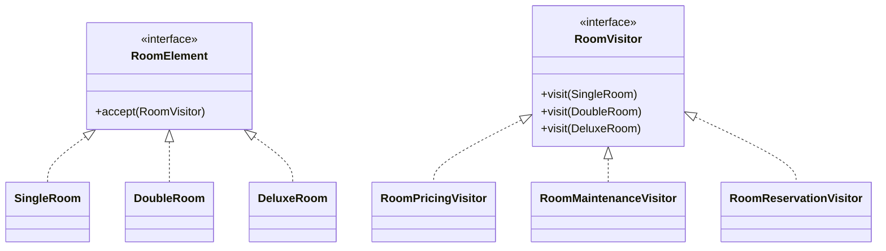
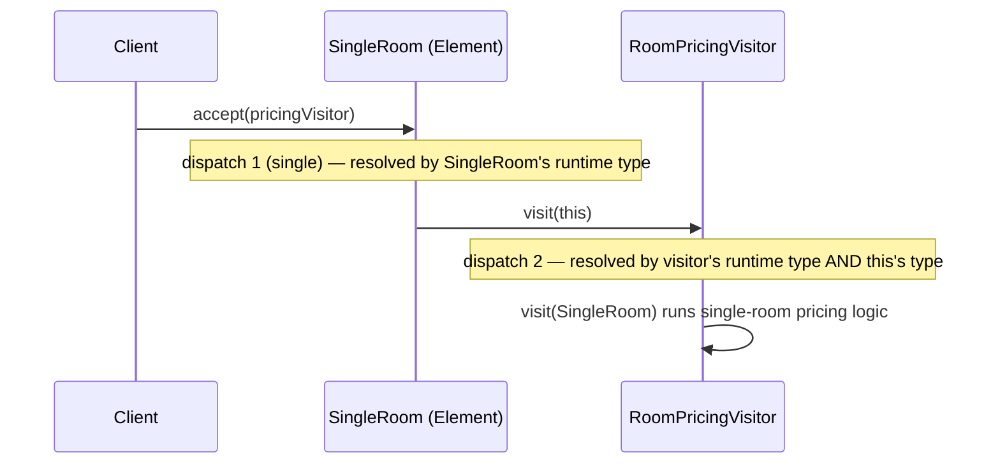
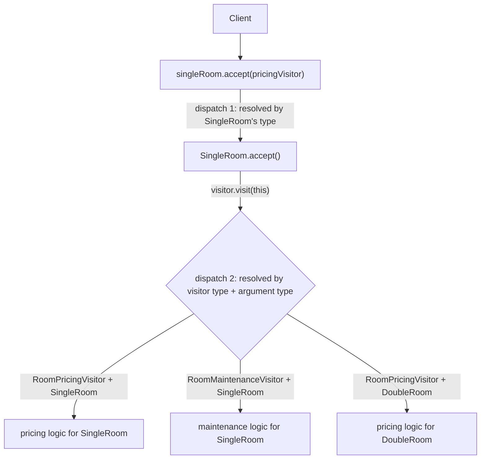

# Visitor Design Pattern

## Overview
- Behavioral design pattern — lets you add new operations to an existing
  class hierarchy without changing the classes themselves, by separating
  the operations from the objects they act on.
- Problem it solves: a class that hosts many operations (e.g. `getPrice()`,
  `initiateMaintenance()`, `reserveRoom()`) has two issues — (1) every time
  a new operation is added, the whole class has to be retested to make sure
  nothing broke, and (2) the class keeps growing vertically as more
  operations pile in, potentially reaching dozens of methods over time.
- Achieved via **double dispatch** — which method actually runs is decided
  by *two* objects (the caller and the argument passed to it), not just one.

## Key Concepts
### The problem without Visitor
- A `HotelRoom` class with `getRoomPrice()`, `initiateRoomMaintenance()`,
  `reserveRoom()`, and growing — every new operation means editing this one
  class and re-testing everything already in it.
- No natural place to add operation-specific logic per room type without
  either bloating one class or scattering `instanceof` checks everywhere.

```java
class HotelRoom { // naive version — no Visitor
    double getRoomPrice() { /* ... */ return 0; }
    void initiateRoomMaintenance() { /* ... */ }
    void reserveRoom() { /* ... */ }
    // every new operation added here grows this class and risks regressions
}
```

### Element and Visitor interfaces
- `Element` (e.g. `RoomElement`) — interface for the objects operations act
  on (e.g. `SingleRoom`, `DoubleRoom`, `DeluxeRoom`); exposes one method,
  `accept(Visitor)`.
- `Visitor` (e.g. `RoomVisitor`) — interface hosting one `visit(...)`
  overload per concrete element type (`visit(SingleRoom)`,
  `visit(DoubleRoom)`, `visit(DeluxeRoom)`).
- Concrete visitors — one per **operation** (`RoomPricingVisitor`,
  `RoomMaintenanceVisitor`, `RoomReservationVisitor`), each implementing
  all the `visit(...)` overloads with that operation's logic for every room
  type.
- A new operation = a brand-new concrete `Visitor` class; existing element
  classes and existing visitors are untouched. A new element type (e.g.
  `PresidentialSuite`) means adding one `visit(...)` overload to every
  existing visitor — the growth moves *horizontally* (more visitor classes)
  instead of piling *vertically* onto one element class.



```java
interface RoomVisitor {
    void visit(SingleRoom room);
    void visit(DoubleRoom room);
    void visit(DeluxeRoom room);
}

interface RoomElement {
    void accept(RoomVisitor visitor);
}

class SingleRoom implements RoomElement {
    public void accept(RoomVisitor visitor) { visitor.visit(this); }
}
class DoubleRoom implements RoomElement {
    public void accept(RoomVisitor visitor) { visitor.visit(this); }
}
class DeluxeRoom implements RoomElement {
    public void accept(RoomVisitor visitor) { visitor.visit(this); }
}

class RoomPricingVisitor implements RoomVisitor {
    public void visit(SingleRoom room) { /* single room pricing logic */ }
    public void visit(DoubleRoom room) { /* double room pricing logic */ }
    public void visit(DeluxeRoom room) { /* deluxe room pricing logic */ }
}
class RoomMaintenanceVisitor implements RoomVisitor {
    public void visit(SingleRoom room) { /* single room maintenance logic */ }
    public void visit(DoubleRoom room) { /* double room maintenance logic */ }
    public void visit(DeluxeRoom room) { /* deluxe room maintenance logic */ }
}
class RoomReservationVisitor implements RoomVisitor {
    public void visit(SingleRoom room) { /* single room reservation logic */ }
    public void visit(DoubleRoom room) { /* double room reservation logic */ }
    public void visit(DeluxeRoom room) { /* deluxe room reservation logic */ }
}
```

### Single dispatch vs. double dispatch
- Single dispatch — ordinary polymorphism: which overridden method runs
  depends on **one** object — the runtime type of the reference the call is
  made on (`element.accept(visitor)` resolves to `SingleRoom.accept` vs.
  `DoubleRoom.accept` based only on what `element` actually is).
- Double dispatch — which method ultimately runs depends on **two**
  objects: the caller (which decides which `accept` runs) *and* the
  argument passed to it (which decides which `visit(...)` overload runs).
- In `element.accept(visitor)` → `visitor.visit(this)`: the first call
  (`accept`) is a single dispatch on `element`'s runtime type; inside it,
  `visitor.visit(this)` is a second single dispatch, this time on
  `visitor`'s runtime type *and* `this`'s compile-time type (which
  `visit(...)` overload matches) — together, the two dispatches make the
  final operation depend on both objects, hence "double dispatch."
- This two-step resolution is exactly what lets the pattern route "which
  operation, for which element type" to the correct code without a single
  `instanceof`/`switch` chain anywhere.



## Trade-offs / Comparisons
### Visitor vs. Strategy — a common point of confusion
| | Strategy | Visitor |
|---|---|---|
| Separates out | An **algorithm** — independent of which object uses it | An **operation** — specific to each element type |
| Reusability across elements | The same strategy object can be reused by different elements (e.g. `SingleRoom` and `DeluxeRoom` could both use the same pricing algorithm) | Each visitor's `visit(...)` overload has element-specific logic per type — not meant to be an interchangeable algorithm |
| Shape | One interface, swappable implementations, chosen per call | One interface per operation-family, with one method per element type inside it |
- The video's explicit warning: it's tempting to model this as
  `SingleRoomPricingStrategy`, `SingleRoomMaintenanceStrategy`, etc., but
  that's a misuse of Strategy — Strategy exists to swap out an algorithm
  that's independent of the object using it, not to encode a full menu of
  per-type operations. If every operation needs its own combination with
  every element type, that's the shape Visitor is built for.

## Example / Walkthrough — Hotel Room Booking
- Elements: `SingleRoom`, `DoubleRoom`, `DeluxeRoom` (each implements
  `RoomElement`).
- Visitors (operations): `RoomPricingVisitor`, `RoomMaintenanceVisitor`,
  `RoomReservationVisitor`.
- To compute a single room's price: `singleRoomObj.accept(new
  RoomPricingVisitor())` → dispatch 1 resolves to `SingleRoom.accept` →
  calls `pricingVisitor.visit(this)` → dispatch 2 resolves to
  `RoomPricingVisitor.visit(SingleRoom)`, which runs the single-room
  pricing logic.
- To run maintenance on a double room: `doubleRoomObj.accept(new
  RoomMaintenanceVisitor())` → dispatch 1 resolves to `DoubleRoom.accept`
  → calls `maintenanceVisitor.visit(this)` → dispatch 2 resolves to
  `RoomMaintenanceVisitor.visit(DoubleRoom)`.
- Once `RoomPricingVisitor`, `RoomMaintenanceVisitor` are fully tested,
  adding `RoomReservationVisitor` later requires touching neither of them —
  each operation lives in its own class.
- Adding a new room type (`PresidentialSuite`) means adding one
  `visit(PresidentialSuite)` overload to every existing visitor interface/
  implementation, and one `accept()` implementation on the new element —
  but no existing visitor's *existing* methods need to change.

## Diagram


## Interview Q&A
<details>
<summary>What problem does the Visitor pattern solve?</summary>

It stops a class from growing without bound as new operations get added to
it, and avoids having to retest that whole class every time — by pulling
operations out into their own visitor classes, one per operation, instead
of piling more methods onto the element class itself.

</details>

<details>
<summary>What are the two interfaces in the Visitor pattern, and what does each represent?</summary>

`Element` — the object type operations act on (e.g. `SingleRoom`), exposing
one `accept(Visitor)` method. `Visitor` — the operation family, exposing
one `visit(...)` overload per concrete element type; each concrete visitor
represents one specific operation (pricing, maintenance, reservation).

</details>

<details>
<summary>What is double dispatch, and where does it happen in this pattern?</summary>

Double dispatch means the method that ultimately runs is chosen based on
two objects, not one: `element.accept(visitor)` is single dispatch on the
element's runtime type, and inside it `visitor.visit(this)` is a second
dispatch resolved by both the visitor's runtime type and the element's
type — together these two steps let the correct operation-for-element-type
run without any instanceof checks.

</details>

<details>
<summary>How is single dispatch different from double dispatch?</summary>

Single dispatch is ordinary polymorphism — which overridden method runs
depends on just one object, the runtime type of the reference the call is
made on. Double dispatch depends on two objects: the caller and the
argument passed to the call.

</details>

<details>
<summary>Why is modeling this with Strategy (e.g. SingleRoomPricingStrategy) the wrong approach?</summary>

Strategy is meant to separate out an algorithm that's independent of the
object using it — the same strategy could be reused across different
element types. Here, each operation is inherently specific to each element
type (single room pricing differs structurally from deluxe room pricing as
part of one coherent operation), which is exactly the "one operation, many
element-specific implementations" shape Visitor is built for, not
Strategy.

</details>

<details>
<summary>What has to change when a new operation is added, versus when a new element type is added?</summary>

New operation: add one new concrete `Visitor` class implementing all
existing `visit(...)` overloads — no existing element or visitor class
changes. New element type: add one `accept()` implementation on the new
element, and one new `visit(...)` overload to every *existing* visitor
class — but none of those visitors' existing methods change.

</details>

<details>
<summary>Does adding a new operation ever require retesting an existing visitor?</summary>

No — that's the core benefit. Once `RoomPricingVisitor` and
`RoomMaintenanceVisitor` are tested, adding a brand-new
`RoomReservationVisitor` touches neither of their code, so neither needs
to be retested.

</details>

## Related Topics
- [02. Strategy Design Pattern](02-strategy-design-pattern.md) — contrasted directly above:
  Strategy swaps an algorithm independent of the object using it, Visitor
  encodes per-element-type operations that aren't interchangeable.
- [10. Chain of Responsibility Design Pattern](10-chain-of-responsibility-pattern.md) — another
  behavioral pattern that routes a call through type-specific handling
  without the caller needing instanceof checks.
