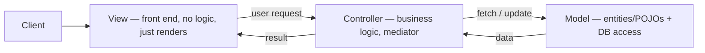
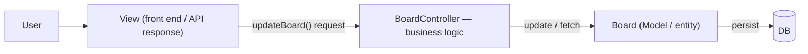
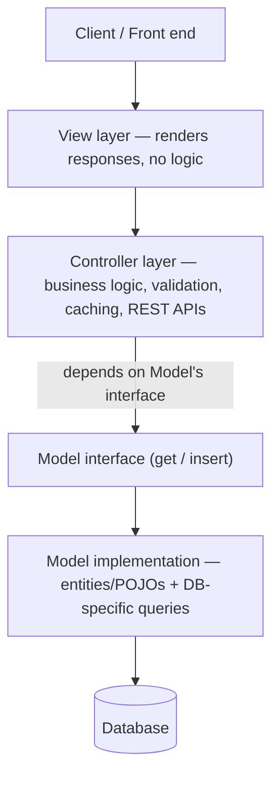

# MVC Design Pattern

## Overview
- MVC = **Model**, **View**, **Controller** — three parts that describe how
  an application's layers connect to each other.
- More accurately an **architecture** than a design pattern — it describes
  the overall shape of an application (how layers talk to each other), not
  a reusable solution to one specific object-design problem the way
  Strategy or Observer are. Still commonly asked as "MVC design pattern" in
  interviews, so recognize both framings.
- Already implicitly used across prior LLD case studies (Parking Lot,
  Snake and Ladder, Splitwise, BookMyShow, ...) — entity/pojo classes are
  the Model, the manager/controller classes holding business logic are the
  Controller; it just wasn't called out by name until now.
- Widely used by mainstream frameworks — Spring Boot (Java), Django
  (Python) — both structure applications around this same split.

## Key Concepts
### The three layers and how they connect
- **View** — the front end: forms, buttons, whatever the client directly
  interacts with. Holds no logic — purely renders whatever it's given.
- **Controller** — the mediator between View and Model. Accepts the
  user's request, interprets it, runs the actual business logic
  (validation, computation, etc.), and issues commands to the Model
  ("fetch this", "update this"). This is the "brain" of the application —
  where nearly all logic lives.
- **Model** — holds the data: entities/POJOs (e.g. `Board`, `Car`,
  `Expense` in prior case studies) plus, in a full-scale system, the logic
  for which DB to connect to and how to persist/query that data. Like
  View, the Model itself is meant to be a "dumb" data holder — the
  Controller is where decisions get made.
- Flow: client → **View** → **Controller** (interprets request, runs
  business logic) → **Model** (fetch/update data, talk to DB) → back up
  through Controller → View renders the result.



### Mapping onto an LLD case study (e.g. Snake and Ladder)
- Model — the entity/POJO classes, e.g. `Board`; in a full system, also
  the logic for which DB to connect to for that entity.
- Controller — exposes the operations available to users (e.g.
  "updateBoard", "fetchBoard"), runs all business logic, and issues
  commands to the Model to actually fetch/insert/update.
- View — in a backend-only LLD answer, this maps loosely to whatever the
  Controller returns to the caller (e.g. a JSON response in Spring Boot) —
  the thing ultimately shown to the user.
- In most LLD interview answers, scope stays at Model (entities) +
  Controller (business logic) — DB persistence and an actual front end are
  typically out of scope unless the interviewer asks for them.



### Real-world separation: Controller depends on Model, not the reverse
- In production systems, Model and Controller are often genuinely separate
  components (even separate repos/services) — Model exposes a narrow
  interface (e.g. `get`, `insert`) that hides which DB it talks to and how;
  Controller depends on that interface and holds everything else
  (validation, caching, configuration, all the REST APIs).
- Controller never needs to know which specific database Model uses under
  the hood — it just calls the exposed interface.

```java
interface BoardRepository { // Model's exposed interface
    Board get(String boardId);
    void insert(Board board);
}

class BoardRepositoryImpl implements BoardRepository { // knows which DB, runs the actual queries
    public Board get(String boardId) { /* DB-specific query */ return null; }
    public void insert(Board board) { /* DB-specific query */ }
}

class BoardController { // depends on the Model's interface, not its implementation
    private final BoardRepository boardRepository;

    BoardController(BoardRepository boardRepository) { this.boardRepository = boardRepository; }

    Board updateBoard(String boardId) {
        // business logic, validation, etc.
        return boardRepository.get(boardId);
    }
}
```

## Trade-offs / Comparisons
| Aspect | Benefit | Cost |
|---|---|---|
| Loose coupling (Model swap) | Switching the underlying DB (e.g. relational → Cassandra) only touches Model's queries — Controller's calls to Model's interface don't change | None — this is the point |
| Independent scaling | View, Controller, and Model can each be tested, deployed, and scaled on their own | Requires managing three separate components instead of one |
| Testing | Model is typically lightweight → fast to unit test; Controller is heavier (REST APIs, business logic, caching, config) → slower to test but isolated from Model's DB-specific concerns | Controller testing/CI time doesn't shrink just because it's decoupled from Model |
| Overall | Clean separation of concerns for systems with genuine independent-scaling needs | Added maintenance/complexity cost — **not recommended for small applications**, where a single unified repo is simpler |

## Example / Walkthrough
- Snake and Ladder via MVC: `Board` (and other game entities) = Model;
  a `BoardController` exposing "update board" / "fetch board" operations
  and holding all game business logic = Controller; whatever renders game
  state back to the player = View.
- In a large company's real backend: Model might live in its own
  repo/service, exposing only a narrow interface like `GET /board/{id}`
  and `POST /board` — Controller in a separate repo depends on that
  interface and owns all the REST APIs, validation, caching, and other
  business logic exposed to the front end.
- If the team migrates the underlying database (e.g. relational →
  Cassandra or Postgres), only the Model component's queries change —
  Controller keeps calling the same `get`/`insert` interface and needs no
  changes or retesting.

## Diagram


## Interview Q&A
<details>
<summary>Is MVC a design pattern or an architecture?</summary>

It's more accurately an architecture — it describes the overall shape of
how an application's layers connect (View → Controller → Model), rather
than a targeted solution to one specific object-design problem the way
patterns like Strategy or Observer are. Interviewers still commonly refer
to it as "the MVC design pattern," so both framings are worth recognizing.

</details>

<details>
<summary>What is each layer responsible for?</summary>

View renders what it's given, with no logic of its own. Controller is the
brain — it accepts requests, runs business logic and validation, and
issues commands to the Model. Model holds the data (entities/POJOs) and,
in a full system, the DB-connection/query logic for persisting it.

</details>

<details>
<summary>If asked to "design X using MVC" in an LLD interview, what actually changes versus a normal LLD answer?</summary>

Very little in practice — entity/POJO classes you'd already create (e.g.
`Board`, `Car`, `Expense`) are the Model, and the manager/controller
classes holding business logic are the Controller; most LLD answers
already follow this shape without naming it explicitly.

</details>

<details>
<summary>Why does Controller depend on Model's interface rather than its implementation?</summary>

So that changes to how Model actually stores or queries data (e.g.
switching from a relational database to Cassandra) stay entirely inside
Model — Controller keeps calling the same exposed interface (`get`,
`insert`) and needs no code changes or retesting.

</details>

<details>
<summary>What's the main downside of using MVC?</summary>

Added maintenance and complexity cost from managing three separate
components instead of one — it's not recommended for small applications,
where keeping everything in one place is simpler; it earns its cost mainly
in mid-to-large applications with genuine independent-scaling needs.

</details>

<details>
<summary>Why is Model described as "dumb," similar to View?</summary>

Neither is meant to hold business logic — View just renders what it's
given, and Model just holds data (plus, at most, DB-connection/query
mechanics); nearly all decision-making logic is concentrated in the
Controller.

</details>

## Related Topics
- [00a. What is LLD](00a-what-is-lld.md) — general LLD vs HLD framing; MVC sits closer to
  architecture-level structuring than to a single object-design pattern.
- [21. LLD of Splitwise](../examples/21-splitwise-lld.md), [24. LLD of Cricbuzz / CricInfo](../examples/24-cricbuzz-lld.md),
  [29. LLD of Order/Inventory Management System](../examples/29-inventory-management-system-lld.md) — prior
  case studies that already follow this Model (entities) / Controller
  (business logic) split without naming it MVC explicitly.
