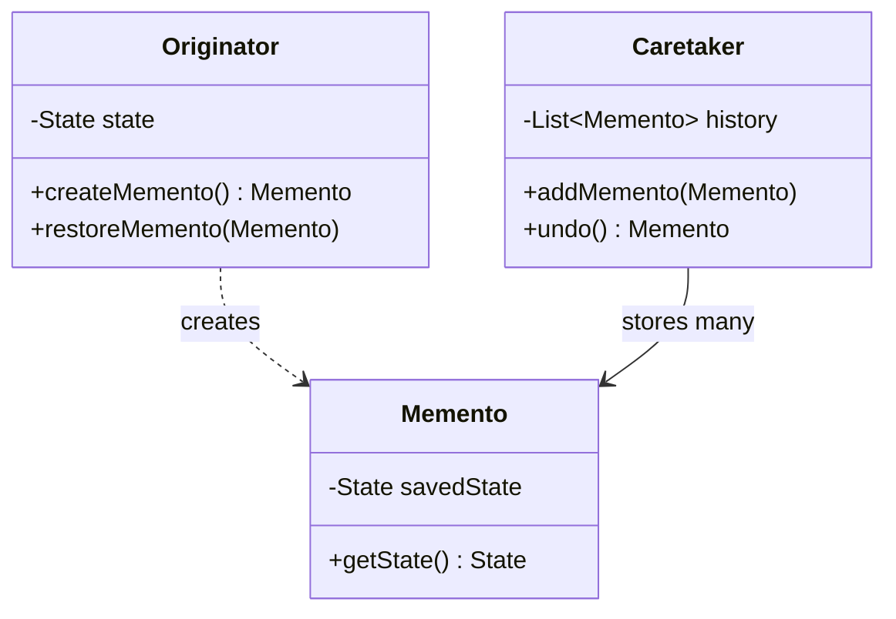
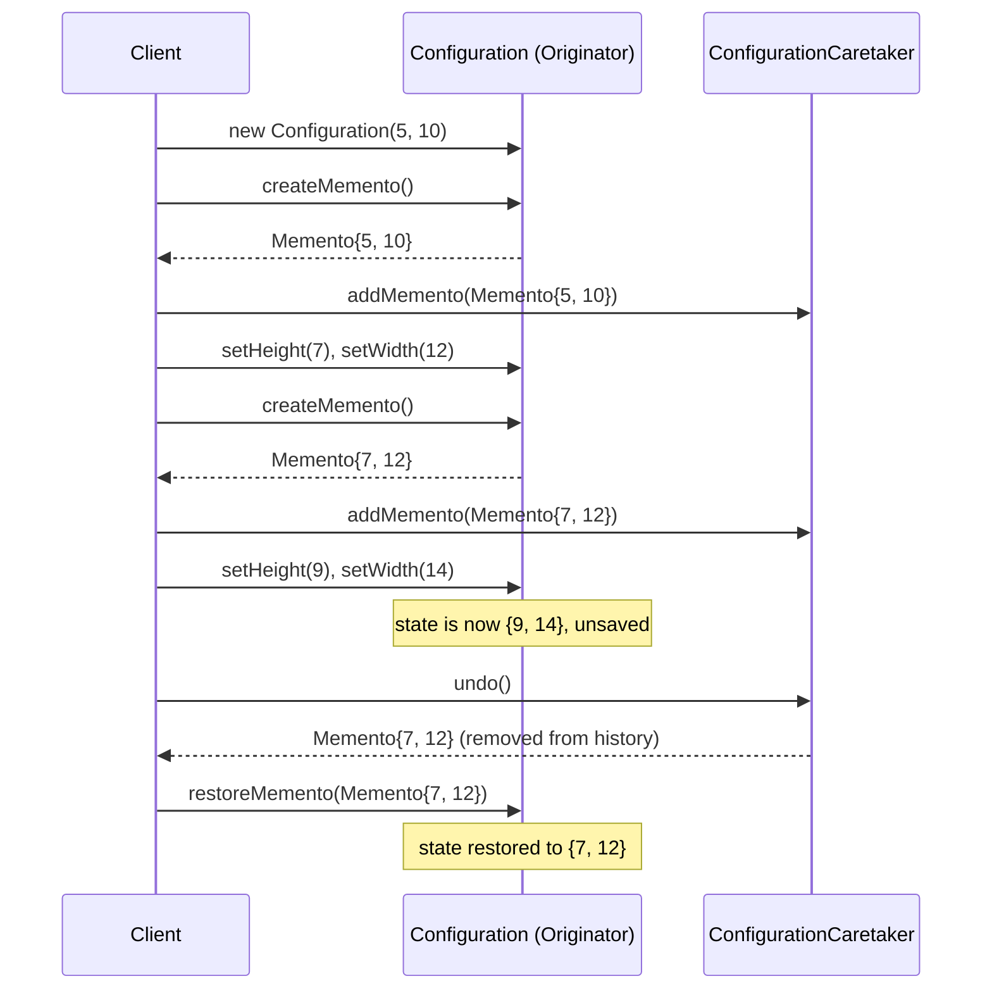
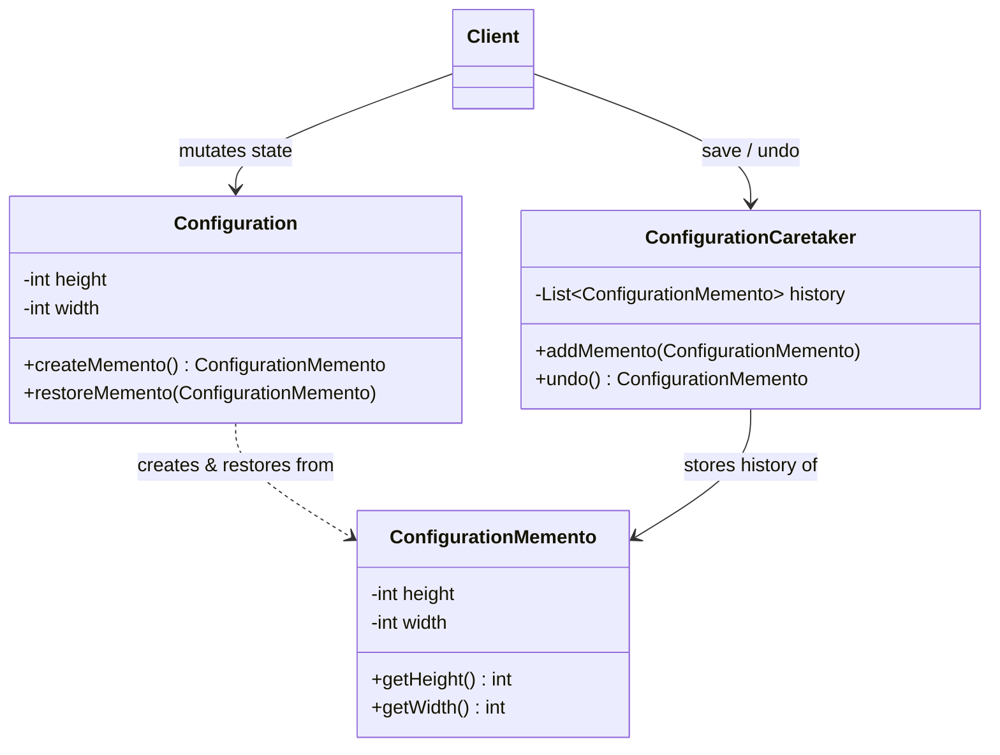

# Memento Design Pattern

## Overview
- Behavioral design pattern — specifically meant to store an object's
  history (snapshots of its past states), so it can later be restored to
  one of those states.
- Whenever undo functionality needs to be built, this is a pattern to
  consider — it exists precisely for saving and restoring state.
- Also known as the **snapshot pattern** — the core operation is literally
  taking a snapshot of an object's current state and being able to revert
  to it later.
- Key benefit beyond undo itself: it does this **without exposing the
  object's internal implementation** to whatever is managing the history —
  the object being saved decides for itself what "its state" means and how
  to capture/restore it.

## Key Concepts
### Three roles: Originator, Memento, Caretaker
- `Originator` — the actual object whose state needs to be saved and
  restored (e.g. a `Configuration` with `height`/`width`). Exposes exactly
  two methods: `createMemento()` and `restoreMemento(memento)`.
- `Memento` — an object that holds a captured snapshot of the
  `Originator`'s state at some point in time. Its fields don't have to
  mirror the originator's fields one-to-one — the originator decides
  exactly what's needed to reconstruct its state later.
- `Caretaker` — manages the history: holds a list of `Memento`s and
  exposes `addMemento(memento)` (save one) and `undo()` (pop the most
  recent one off the list and return it). The caretaker never looks inside
  a memento's fields — it just stores and hands them back.



### Why the internal state stays hidden
- Only `Originator` itself knows how to build a `Memento` from its current
  state (`createMemento()`) and how to apply one back (`restoreMemento()`)
  — it decides exactly what fields matter for "state" (maybe not every
  member variable needs saving).
- `Caretaker` and any calling client never read or interpret a `Memento`'s
  contents — they just pass the whole object around as an opaque handle,
  storing it in history and handing it back on `undo()`.
- This keeps the encapsulation boundary intact: state-capture logic lives
  entirely inside `Originator`, not scattered into whatever manages the
  history.

## Trade-offs / Comparisons
### Memento vs. Command pattern for undo
| | Command | Memento |
|---|---|---|
| What's stored | The action taken, plus explicit reverse logic (`undo()` per command) | A full snapshot of the object's state at a point in time |
| How undo works | Re-run the inverse operation (e.g. `turnOff()` undoes `turnOn()`) | Restore the object directly to a previously captured state |
| Best fit | A small, well-defined set of reversible operations | State that's easier to snapshot wholesale than to reverse step-by-step |
- Both are behavioral patterns commonly reached for when an interview asks
  for undo/redo — see [31. Command Design Pattern](31-command-design-pattern.md)
  for the operation-reversal approach.

## Example / Walkthrough — Configuration snapshots
- `Configuration` (Originator) — `height`, `width`, with getters/setters;
  `createMemento()` builds a new `ConfigurationMemento` from the current
  `height`/`width` and returns it; `restoreMemento(memento)` overwrites its
  own `height`/`width` from the memento's saved values.
- `ConfigurationMemento` (Memento) — holds `height`, `width` (constructor +
  getters only — an immutable snapshot).
- `ConfigurationCaretaker` (Caretaker) — `List<ConfigurationMemento>
  history`; `addMemento(m)` appends; `undo()` removes and returns the last
  element of the list.
- Client flow:
  1. `config = new Configuration(5, 10)` → `caretaker.addMemento(config.createMemento())`
     → history = `[{5, 10}]`.
  2. `config.setHeight(7); config.setWidth(12)` →
     `caretaker.addMemento(config.createMemento())` → history =
     `[{5, 10}, {7, 12}]`.
  3. `config.setHeight(9); config.setWidth(14)` — config is now `{9, 14}`,
     **not yet saved** to history.
  4. Realize something's wrong → `memento = caretaker.undo()` → pops
     `{7, 12}` off history, returns it.
  5. `config.restoreMemento(memento)` → `config` is now back to `{7, 12}`
     — printing height/width confirms `7, 12`, not the unsaved `9, 14`.



```java
class Configuration { // Originator
    private int height;
    private int width;

    Configuration(int height, int width) { this.height = height; this.width = width; }
    void setHeight(int height) { this.height = height; }
    void setWidth(int width) { this.width = width; }

    ConfigurationMemento createMemento() {
        return new ConfigurationMemento(height, width); // Originator decides what "state" means
    }

    void restoreMemento(ConfigurationMemento memento) {
        this.height = memento.getHeight();
        this.width = memento.getWidth();
    }
}

class ConfigurationMemento { // Memento — immutable snapshot
    private final int height;
    private final int width;

    ConfigurationMemento(int height, int width) { this.height = height; this.width = width; }
    int getHeight() { return height; }
    int getWidth() { return width; }
}

class ConfigurationCaretaker { // Caretaker
    private final List<ConfigurationMemento> history = new ArrayList<>();

    void addMemento(ConfigurationMemento memento) { history.add(memento); }

    ConfigurationMemento undo() {
        if (history.isEmpty()) return null;
        return history.remove(history.size() - 1); // pop last snapshot
    }
}

class Client {
    public static void main(String[] args) {
        Configuration config = new Configuration(5, 10);
        ConfigurationCaretaker caretaker = new ConfigurationCaretaker();
        caretaker.addMemento(config.createMemento()); // save {5, 10}

        config.setHeight(7); config.setWidth(12);
        caretaker.addMemento(config.createMemento()); // save {7, 12}

        config.setHeight(9); config.setWidth(14); // unsaved change

        ConfigurationMemento last = caretaker.undo(); // pop {7, 12}
        config.restoreMemento(last);
        System.out.println(config.getHeight() + " " + config.getWidth()); // 7 12
    }
}
```

## Diagram


## Interview Q&A
<details>
<summary>What problem does the Memento pattern solve?</summary>

It lets an object's state be captured and later restored — enabling undo/
snapshot/rollback functionality — without exposing that object's internal
implementation to whatever component is responsible for managing the
history.

</details>

<details>
<summary>What are the three roles in the Memento pattern?</summary>

Originator (the object whose state is saved/restored, via
`createMemento()`/`restoreMemento()`), Memento (an object holding one
captured snapshot of the originator's state), and Caretaker (manages the
list/history of mementos, via `addMemento()`/`undo()`).

</details>

<details>
<summary>Why doesn't the Caretaker need to know what's inside a Memento?</summary>

The Caretaker's job is purely to store and hand back mementos in order —
it never reads or interprets their fields. Only the Originator that
created a memento knows how to interpret it, via `restoreMemento()`.

</details>

<details>
<summary>Does a Memento have to mirror the Originator's fields one-to-one?</summary>

No — the Originator decides exactly what data is necessary to reconstruct
its state later; it might only need a subset of its member variables, not
every field it has.

</details>

<details>
<summary>How is undo() typically implemented in the Caretaker?</summary>

It removes and returns the last (most recently added) memento from the
history list — moving one step back through the saved snapshots each time
it's called.

</details>

<details>
<summary>How does Memento differ from Command for implementing undo?</summary>

Command stores an executed action plus explicit reverse logic per action
(e.g. `turnOff()` undoes `turnOn()`); Memento stores a full snapshot of
the object's state and restores it directly. Memento fits better when
state is easier to capture wholesale than to reverse step-by-step.

</details>

<details>
<summary>In the Configuration example, why does undo() return {7, 12} and not {9, 14}?</summary>

Because {9, 14} was never saved via `createMemento()`/`addMemento()` — it
was just a mutation to the live `Configuration` object. The caretaker's
history only contains the two snapshots that were explicitly saved,
{5, 10} and {7, 12}, so undo pops the most recent of those.

</details>

## Related Topics
- [31. Command Design Pattern](31-command-design-pattern.md) — the other common undo/redo
  pattern, using reverse operations instead of full-state snapshots.
- [23. Builder Design Pattern](23-builder-design-pattern.md) — another pattern that constructs
  objects step by step, though for assembly rather than history/snapshots.
