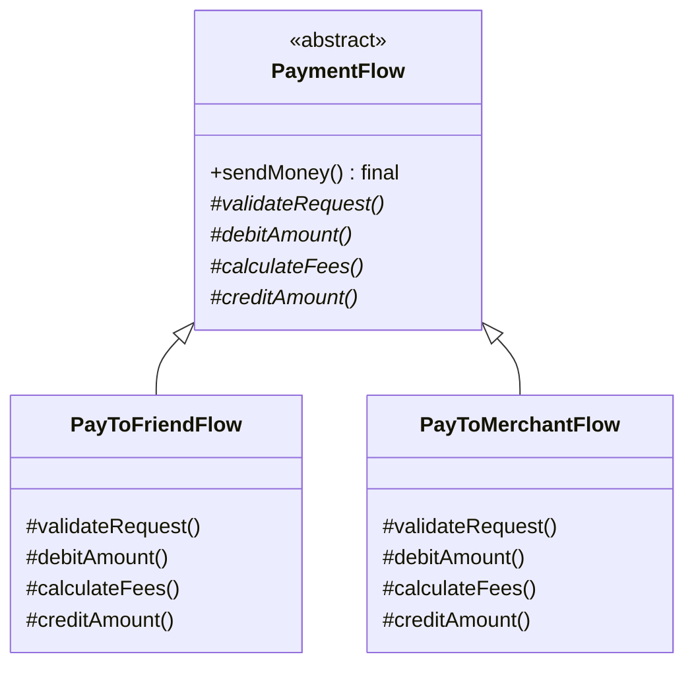
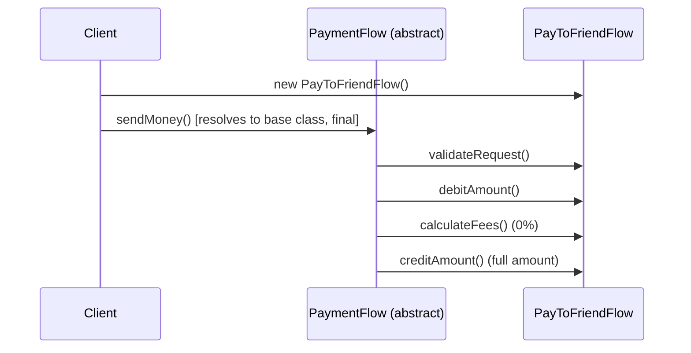
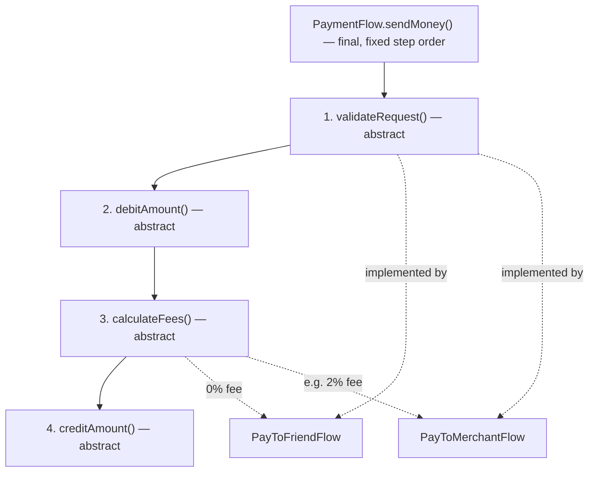

# Template Method Design Pattern

## Overview
- Behavioral design pattern — heavily used in real-world industry code,
  often without engineers realizing they're using a named pattern.
- Fits when two things are both true at once: **all subclasses must follow
  the same fixed sequence of steps** to process a task, **and** each
  subclass needs the flexibility to plug in its own logic for individual
  steps within that sequence.
- Core mechanism: a base (usually abstract) class defines a `final` method
  — the template method — that fixes the order of steps; each step is an
  abstract method that subclasses implement with their own logic. Because
  the template method is `final`, no subclass can reorder or skip the
  steps.

## Key Concepts
### The problem without a guaranteed order
- Without a template method, each subclass just overrides one big method
  (e.g. `sendMoney()`) and calls whatever steps it wants, in whatever order
  it wants — nothing forces `validate → debit → calculateFees → credit` to
  run in that sequence, or even to include every step.
- Two subclasses could silently diverge in step order with no compiler or
  interface-level guarantee catching it.

```java
interface Payment { // naive version — no guaranteed step order
    void sendMoney();
}

class PayToFriendFlow implements Payment {
    public void sendMoney() {
        // this subclass could call these in any order, or skip one entirely
        validateRequest();
        debitAmount();
        calculateFees();
        creditAmount();
    }
    void validateRequest() { /* ... */ }
    void debitAmount() { /* ... */ }
    void calculateFees() { /* ... */ }
    void creditAmount() { /* ... */ }
}
```

### Template method structure
- Base class is abstract (e.g. `PaymentFlow`), and defines the **template
  method** (e.g. `sendMoney()`) as `final` — this is what actually fixes
  the step order and prevents subclasses from ever overriding it.
- Each step the template method calls is its own abstract method (e.g.
  `validateRequest()`, `debitAmount()`, `calculateFees()`,
  `creditAmount()`) — subclasses must implement each one, but can never
  change the order they're called in.
- If a step's logic is common across all subclasses, the base class can
  provide a concrete (non-abstract) implementation for it instead — mixing
  abstract "must implement" steps with concrete "shared" steps in the same
  template method is normal.



```java
abstract class PaymentFlow {
    final void sendMoney() { // template method — final, order can never change
        validateRequest();
        debitAmount();
        calculateFees();
        creditAmount();
    }

    abstract void validateRequest();
    abstract void debitAmount();
    abstract void calculateFees();
    abstract void creditAmount();
}

class PayToFriendFlow extends PaymentFlow {
    void validateRequest() { /* friend-specific validation */ }
    void debitAmount() { /* debit sender */ }
    void calculateFees() { /* 0% — friends aren't charged a platform fee */ }
    void creditAmount() { /* credit full amount to friend */ }
}

class PayToMerchantFlow extends PaymentFlow {
    void validateRequest() { /* merchant-specific validation */ }
    void debitAmount() { /* debit buyer */ }
    void calculateFees() { /* e.g. 2% platform fee */ }
    void creditAmount() { /* credit (amount - fee) to merchant */ }
}
```

### Why the template method is marked final
- Marking `sendMoney()` `final` is what actually guarantees the sequence —
  without it, a subclass could still override the whole method and ignore
  the intended step order, defeating the pattern's purpose.
- Subclasses are left with exactly one job: implement the individual
  abstract steps. They have no way to touch the orchestration itself.

## Trade-offs / Comparisons
| Approach | Step order guarantee | Per-subclass flexibility |
|---|---|---|
| Each subclass overrides one big method | None — nothing stops divergence in order or missing steps | Full — but that's also the risk |
| Template Method | Guaranteed by the base class's `final` method | Each step is still fully customizable per subclass |

## Example / Walkthrough — Payment flows
- Task: `sendMoney()`, required to always run
  `validateRequest → debitAmount → calculateFees → creditAmount`, no
  matter which payment flow is used.
- `PayToFriendFlow`: friend-specific validation, debits the sender,
  charges **0%** fee, credits the **full** amount to the friend.
- `PayToMerchantFlow`: merchant-specific validation, debits the buyer,
  charges (e.g.) **2%** fee, credits the buyer's amount **minus the fee**
  to the merchant.
- Client: `PaymentFlow obj = new PayToFriendFlow(); obj.sendMoney();` —
  since `sendMoney()` isn't overridden by `PayToFriendFlow`, the call
  resolves to the base class's template method, which then calls
  `PayToFriendFlow`'s own `validateRequest()`, `debitAmount()`,
  `calculateFees()`, `creditAmount()` — in that fixed order, every time.



## Diagram


## Interview Q&A
<details>
<summary>What two conditions signal a Template Method problem?</summary>

All subclasses need to follow the exact same sequence of steps to process
a task, **and** each subclass needs its own specific logic within
individual steps of that sequence — when both hold at once, Template
Method fits.

</details>

<details>
<summary>Why must the template method be marked final?</summary>

Without `final`, a subclass could still override the whole orchestrating
method (e.g. `sendMoney()`) and call its steps in any order it wants —
`final` is what actually enforces the guaranteed step sequence, the core
promise of the pattern.

</details>

<details>
<summary>What's the difference between the template method and the steps it calls?</summary>

The template method (e.g. `sendMoney()`) lives once in the base class,
is `final`, and defines the fixed order of steps. Each individual step
(e.g. `validateRequest()`, `calculateFees()`) is abstract and gets its own
implementation per subclass — the template method just calls them in
order, without knowing what each one actually does.

</details>

<details>
<summary>Can a step in the template method have a shared, non-abstract implementation instead of being abstract?</summary>

Yes — if a step's logic is genuinely common across all subclasses, the
base class can implement it directly instead of declaring it abstract;
Template Method doesn't require every step to be abstract, only that the
*order* is fixed.

</details>

<details>
<summary>In the payment example, why does PayToMerchantFlow's calculateFees() charge 2% while PayToFriendFlow's charges 0%?</summary>

Because `calculateFees()` is one of the abstract steps each subclass
implements independently — the fixed template only guarantees fee
calculation happens at the same point in the sequence for every flow, not
that the fee logic itself is identical.

</details>

<details>
<summary>Why is this pattern common in real-world code even when engineers don't realize they're using it?</summary>

Any base class with a non-overridable orchestrating method that calls a
fixed sequence of overridable steps is Template Method in practice, even
if nobody names it that — it's a natural way to enforce a process (like a
payment flow, or a request-handling pipeline) while still letting each
variant customize individual steps.

</details>

## Related Topics
- [02. Strategy Design Pattern](02-strategy-design-pattern.md) — both let subclasses/strategies
  vary behavior, but Strategy swaps an entire algorithm via composition,
  while Template Method fixes the overall sequence via inheritance and
  varies only individual steps within it.
- [36. Visitor Design Pattern](36-visitor-design-pattern.md) — another behavioral pattern for
  organizing per-type/per-subclass logic, though for a different problem
  (adding new operations vs. enforcing a fixed process).
