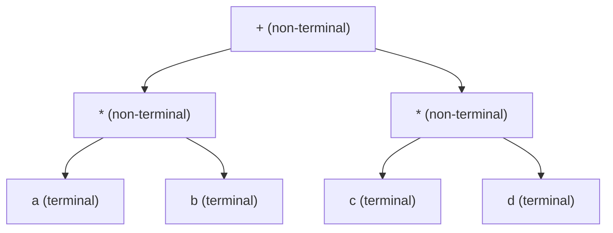
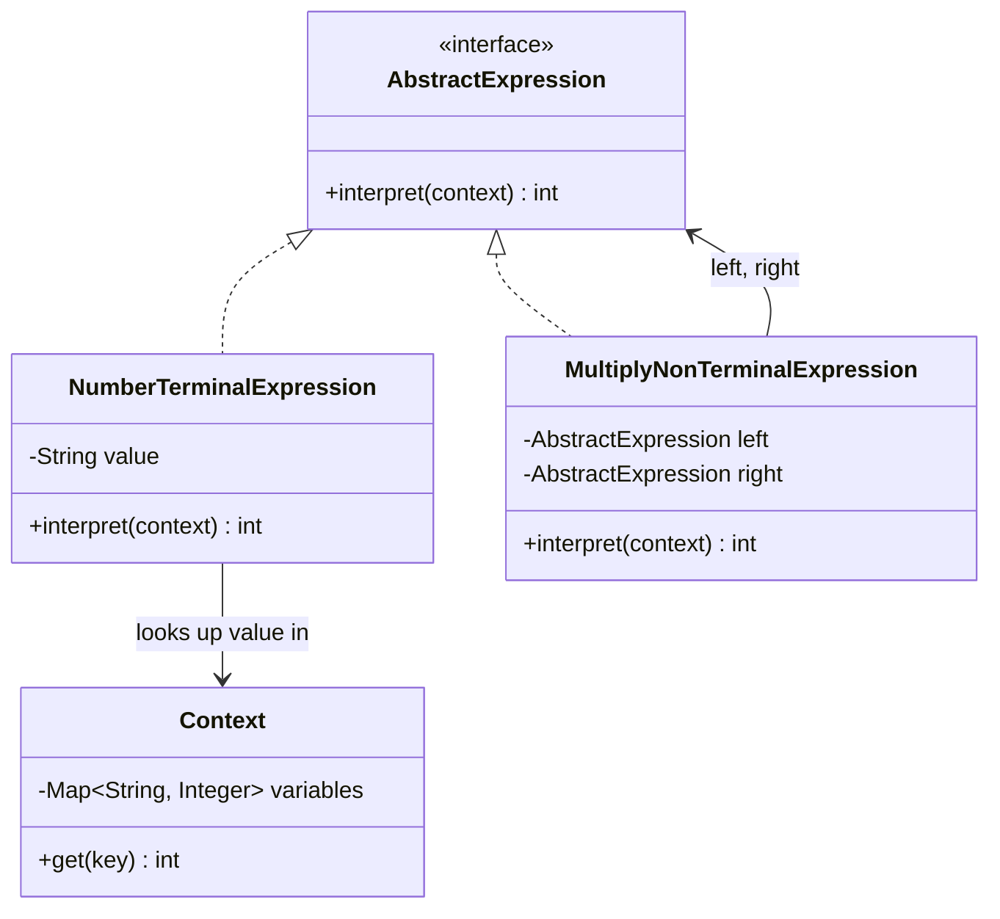
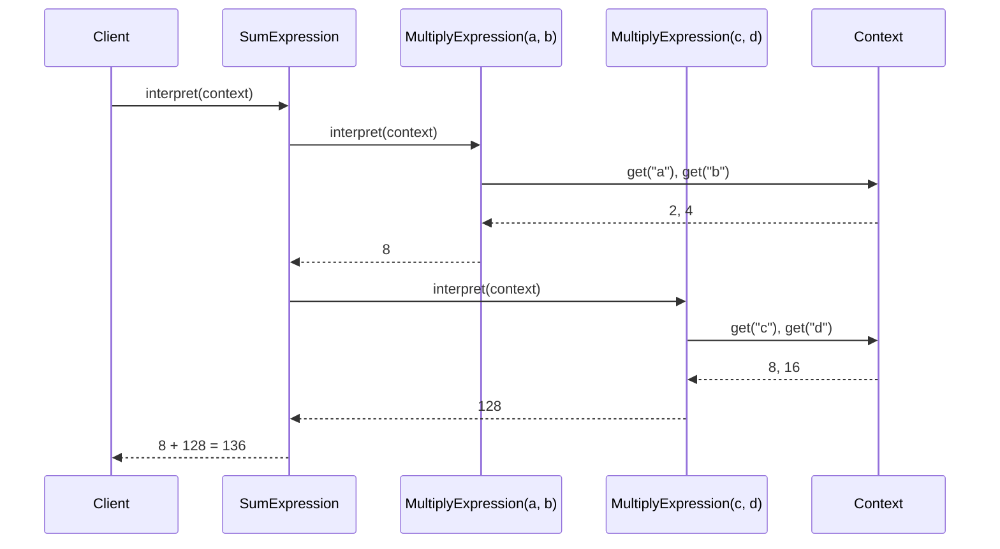
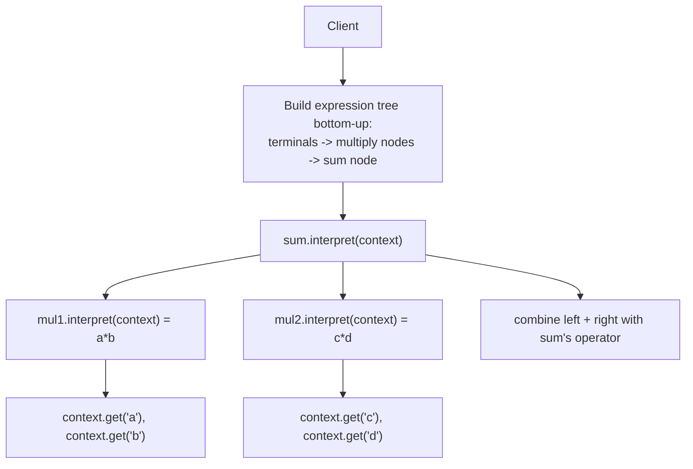

# Interpreter Design Pattern

## Overview
- Behavioral design pattern — the last of the classic GoF patterns covered
  in this series.
- Purpose: given an expression (e.g. `a * b`, `a * b + c * d`), interpret
  or evaluate it based on a supplied **context** — the same expression can
  produce different results depending on what context it's evaluated
  against.
- Analogy from the video: a hand sign alone is ambiguous (stop? hello?
  the number five?) — it only means something specific once you know the
  context it's shown in. Interpreter formalizes exactly this: expression +
  context → meaning.

## Key Concepts
### Terminal vs. non-terminal expressions
- **Terminal expression** — a leaf of the expression tree that can't be
  broken down further (e.g. the variable `a` on its own).
- **Non-terminal expression** — an expression built from other
  expressions combined by an operator (e.g. `a * b` is non-terminal: it
  combines terminal `a` and terminal `b` via `*`; `a * b + c * d` is
  non-terminal at a higher level too, combining two multiplication
  sub-expressions via `+`).
- Non-terminal expressions can nest arbitrarily — evaluating one often
  means recursively evaluating the sub-expressions it holds.



### AbstractExpression and Context
- `AbstractExpression` — interface with one method, `interpret(context)`.
  Both terminal and non-terminal expressions implement it.
- `Context` — holds whatever data is needed to resolve terminal
  expressions to actual values (e.g. a `Map<String, Integer>` mapping
  variable names to numbers).
- Terminal expression's `interpret(context)` — looks itself up in the
  context and returns the resolved value (e.g. a `NumberTerminalExpression`
  holding `"a"` calls `context.get("a")`).
- Non-terminal expression's `interpret(context)` — calls `interpret(context)`
  on its own left and right sub-expressions (recursively resolving them,
  however deep they nest), then combines the two results with its own
  operator.



```java
interface AbstractExpression {
    int interpret(Context context);
}

class Context {
    private final Map<String, Integer> variables = new HashMap<>();

    void set(String key, int value) { variables.put(key, value); }
    int get(String key) { return variables.get(key); }
}

class NumberTerminalExpression implements AbstractExpression {
    private final String value;

    NumberTerminalExpression(String value) { this.value = value; }

    public int interpret(Context context) {
        return context.get(value); // resolve variable name to its value
    }
}

class MultiplyNonTerminalExpression implements AbstractExpression {
    private final AbstractExpression left;
    private final AbstractExpression right;

    MultiplyNonTerminalExpression(AbstractExpression left, AbstractExpression right) {
        this.left = left;
        this.right = right;
    }

    public int interpret(Context context) {
        return left.interpret(context) * right.interpret(context); // recursively resolve both sides
    }
}
```

## Trade-offs / Comparisons
- **One class per operator vs. one generic binary expression class** —
  creating a dedicated `MultiplyNonTerminalExpression`, `SumExpression`,
  `SubtractExpression`, ... per operator is simple but multiplies the
  number of classes as more operators are added.
- An optimized alternative folds them into a single
  `BinaryNonTerminalExpression` holding `left`, `right`, and an
  `operator` field, switching on the operator inside `interpret()` — fewer
  classes, at the cost of a switch statement instead of one class per
  operator (a classic Strategy-vs-switch tradeoff, applied here).

```java
enum Operator { MULTIPLY, PLUS } // extend as needed

class BinaryNonTerminalExpression implements AbstractExpression {
    private final AbstractExpression left;
    private final AbstractExpression right;
    private final Operator operator;

    BinaryNonTerminalExpression(AbstractExpression left, AbstractExpression right, Operator operator) {
        this.left = left;
        this.right = right;
        this.operator = operator;
    }

    public int interpret(Context context) {
        int leftVal = left.interpret(context);
        int rightVal = right.interpret(context);
        switch (operator) {
            case MULTIPLY: return leftVal * rightVal;
            case PLUS: return leftVal + rightVal;
            default: return 0;
        }
    }
}
```

## Example / Walkthrough
### Simple: `a * b`
- Context: `a = 2`, `b = 4`.
- Build: `new MultiplyNonTerminalExpression(new NumberTerminalExpression("a"), new NumberTerminalExpression("b"))`.
- `interpret(context)`: `left.interpret(context)` → `context.get("a")` → `2`;
  `right.interpret(context)` → `context.get("b")` → `4`; result =
  `2 * 4 = 8`.

### Harder: `a * b + c * d`
- Context: `a = 2`, `b = 4`, `c = 8`, `d = 16`.
- Build bottom-up: `mul1 = Multiply(Number("a"), Number("b"))`,
  `mul2 = Multiply(Number("c"), Number("d"))`,
  `sum = Sum(mul1, mul2)`.
- `sum.interpret(context)`: recursively calls `mul1.interpret(context)` →
  `2 * 4 = 8`, and `mul2.interpret(context)` → `8 * 16 = 128`, then
  combines with `+` → `8 + 128 = 136`.
- This shows the recursive nature of non-terminal expressions — `sum`
  doesn't know or care that its children are themselves multiplications;
  it just calls `interpret()` on whatever `AbstractExpression` it holds.



## Diagram


## Interview Q&A
<details>
<summary>What problem does the Interpreter pattern solve?</summary>

It provides a way to represent and evaluate an expression (built from
terminal and non-terminal sub-expressions) against a supplied context,
where the same expression structure can be evaluated differently depending
on what values the context provides.

</details>

<details>
<summary>What's the difference between a terminal and a non-terminal expression?</summary>

A terminal expression is a leaf that can't be broken down further (e.g. a
single variable) and resolves its value directly from the context. A
non-terminal expression is built from other expressions combined by an
operator, and evaluates by recursively calling `interpret()` on its own
sub-expressions before combining their results.

</details>

<details>
<summary>What role does Context play?</summary>

It holds the data needed to resolve terminal expressions to actual values
— e.g. a map from variable names to numbers — so the same expression tree
can be evaluated against different contexts to get different results.

</details>

<details>
<summary>How does a non-terminal expression handle deeply nested expressions, like a*b+c*d?</summary>

By recursion — a non-terminal expression's `interpret()` just calls
`interpret()` on whatever `AbstractExpression` objects it holds as left/
right, without caring whether those are themselves terminal or further
non-terminal expressions; the recursion bottoms out once it reaches actual
terminal expressions.

</details>

<details>
<summary>What's the tradeoff between one class per operator versus a single generic binary expression class?</summary>

One class per operator (`MultiplyExpression`, `SumExpression`, ...) keeps
each operator's logic isolated but means the number of classes grows with
every new operator. A single `BinaryNonTerminalExpression` holding an
`operator` field and switching on it inside `interpret()` needs fewer
classes, at the cost of a switch statement replacing separate classes.

</details>

<details>
<summary>Why is the hand-sign analogy used to introduce this pattern?</summary>

A hand sign alone is ambiguous — it could mean "stop," "hello," or "five,"
depending on context. Interpreter formalizes exactly this idea for
expressions: the same expression structure needs a context supplied to it
before it has one specific, resolved meaning.

</details>

## Related Topics
- [10. Chain of Responsibility Design Pattern](10-chain-of-responsibility-pattern.md) — another
  behavioral pattern involving recursive/sequential delegation, though for
  routing a request rather than evaluating an expression tree.
- [19. Composite Design Pattern](19-composite-design-pattern.md) — shares the recursive
  tree-of-objects shape (terminal "leaf" vs. non-terminal "composite" node
  here mirrors Composite's leaf/composite split), though Composite is
  structural (uniform treatment of parts/wholes) while Interpreter is
  behavioral (evaluating a grammar against a context).
