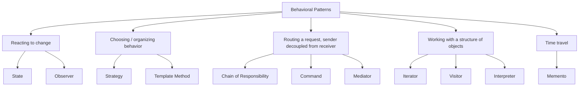

# All Behavioral Design Patterns — Recap

## Overview
- Consolidated recap video covering all 11 behavioral GoF patterns in one
  pass — each one already has its own dedicated note in this repo with the
  full problem statement, UML, code, and trade-offs; this note is a
  compact cross-reference / interview cram sheet, not a replacement for
  those.
- Behavioral patterns as a category: they guide **how different objects
  communicate with each other effectively** — distributing a task across
  objects so a system stays flexible and easy to maintain, rather than one
  object trying to do everything itself.
- Use the table below to quickly recall which pattern fits which shape of
  problem, then jump to the linked note for the full treatment.

## Key Concepts
### Quick-reference table
| Pattern | Core intent (one line) | Canonical example (from the videos) | Full note |
|---|---|---|---|
| State | Object changes its behavior when its internal state changes | Vending machine: idle → working → idle | [16. LLD of Vending Machine](../examples/16-vending-machine-lld.md) |
| Observer | Observable notifies a list of registered observers whenever its state changes | Notify-me: item back in stock → notify all subscribers | [03. Observer Design Pattern](03-observer-design-pattern.md) |
| Strategy | Define multiple algorithms for one task, select one at runtime based on the situation | Payment: credit card / UPI / cash strategies | [02. Strategy Design Pattern](02-strategy-design-pattern.md) |
| Chain of Responsibility | A request travels through a chain of handlers until one processes it, sender doesn't know which | Logging: info → debug → error handler chain | [10. Chain of Responsibility Design Pattern](10-chain-of-responsibility-pattern.md) |
| Template Method | Fix a task's step order in a `final` base method; subclasses implement each step's logic | Payment flow: validate → debit → fee → credit, pay-to-friend vs. pay-to-merchant | [39. Template Method Design Pattern](39-template-method-design-pattern.md) |
| Interpreter | Define a grammar (terminal/non-terminal expressions) and evaluate it against a context | `a * b` evaluated against `{a: 2, b: 5}` | [40. Interpreter Design Pattern](40-interpreter-design-pattern.md) |
| Command | Turn a request into an object, decoupling sender from receiver; enables undo/queueing | Remote control: turn AC on/off commands | [31. Command Design Pattern](31-command-design-pattern.md) |
| Iterator | Access elements of a collection sequentially without exposing its internal structure | Java Collections' `hasNext()`/`next()`; Library/Book example | [33. Iterator Design Pattern](33-iterator-design-pattern.md) |
| Visitor | Add new operations to an existing class hierarchy without modifying it, via double dispatch | Hotel room: pricing/maintenance/reservation visitors | [36. Visitor Design Pattern](36-visitor-design-pattern.md) |
| Mediator | Objects communicate only through a shared mediator, never directly with each other | Auction: bidders never talk to each other, only through the auction | [34. Mediator Design Pattern](34-mediator-design-pattern.md) |
| Memento | Capture and restore an object's past state without exposing its internal implementation | Configuration snapshots: save `{5,10}`, `{7,12}`, undo back to `{7,12}` | [38. Memento Design Pattern](38-memento-design-pattern.md) |

### Grouping by what they actually solve
- **Reacting to change** — State (object's own behavior shifts with its
  state), Observer (dependents get notified when *another* object's state
  shifts).
- **Choosing/organizing behavior** — Strategy (swap a whole algorithm at
  runtime), Template Method (fix the sequence, vary the steps).
- **Routing a request without the sender knowing the receiver** — Chain of
  Responsibility (passed along until handled), Command (wrapped as an
  object first), Mediator (routed through a shared coordinator instead of
  peer-to-peer).
- **Working with a structure of objects** — Iterator (traverse it),
  Visitor (add operations to it without modifying it), Interpreter
  (evaluate a grammar/expression tree built from it).
- **Time travel** — Memento (save/restore an object's own past state).

## Interview Q&A

What single idea unifies all behavioral design patterns?

They all govern how objects communicate — distributing a task across
objects (rather than centralizing it in one) so the system stays flexible
and maintainable; the differences between them are in *how* that
communication or task distribution happens.

An interviewer says "the sender shouldn't know which object handles its request" — which patterns fit?

Chain of Responsibility (the request travels through a chain until
something handles it), Command (the request becomes an object the
receiver's details are hidden behind), or Mediator (the request always
routes through a shared coordinator) — which one fits depends on whether
there's a *sequence* of candidate handlers (Chain), a need to
*queue/undo* the request (Command), or *peers that must never reference
each other* (Mediator).

How do you tell State and Strategy apart, given both swap behavior at runtime?

State changes behavior automatically as a *side effect* of the object's
own internal state transitions (e.g. a vending machine moves from idle to
working after a coin is inserted). Strategy is chosen explicitly by the
client/context based on the situation (e.g. picking a payment method) —
the object itself doesn't drive the switch.

How do you tell Memento and Command apart, given both can implement undo?

Memento snapshots and restores an object's *entire state* wholesale.
Command stores the *action taken* and reverses it via explicit `undo()`
logic per command. Memento fits better when state is easier to capture as
a whole than to reverse step by step; see the fuller comparison in
[38. Memento Design Pattern](38-memento-design-pattern.md).

Which patterns specifically involve a tree/structure of objects rather than a flat set?

Iterator (traverses a collection without exposing its structure), Visitor
(adds operations across an element hierarchy via double dispatch), and
Interpreter (evaluates a tree of terminal/non-terminal expressions) — all
three operate over some structured collection of objects, unlike patterns
like Command or Mediator which deal with individual interacting objects.

## Related Topics
- [00c. Design Patterns Catalog](00c-design-patterns-catalog.md) — full checklist of all GoF
  patterns (creational, structural, behavioral) with coverage status.
- [02. Strategy Design Pattern](02-strategy-design-pattern.md), [03. Observer Design Pattern](03-observer-design-pattern.md),
  [10. Chain of Responsibility Design Pattern](10-chain-of-responsibility-pattern.md), [31. Command Design Pattern](31-command-design-pattern.md),
  [33. Iterator Design Pattern](33-iterator-design-pattern.md), [34. Mediator Design Pattern](34-mediator-design-pattern.md),
  [36. Visitor Design Pattern](36-visitor-design-pattern.md), [38. Memento Design Pattern](38-memento-design-pattern.md),
  [39. Template Method Design Pattern](39-template-method-design-pattern.md), [40. Interpreter Design Pattern](40-interpreter-design-pattern.md) —
  the 10 dedicated notes this recap cross-references.
- [16. LLD of Vending Machine](../examples/16-vending-machine-lld.md) — where State pattern is covered in depth
  (it doesn't have its own standalone concepts note).
