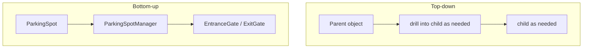
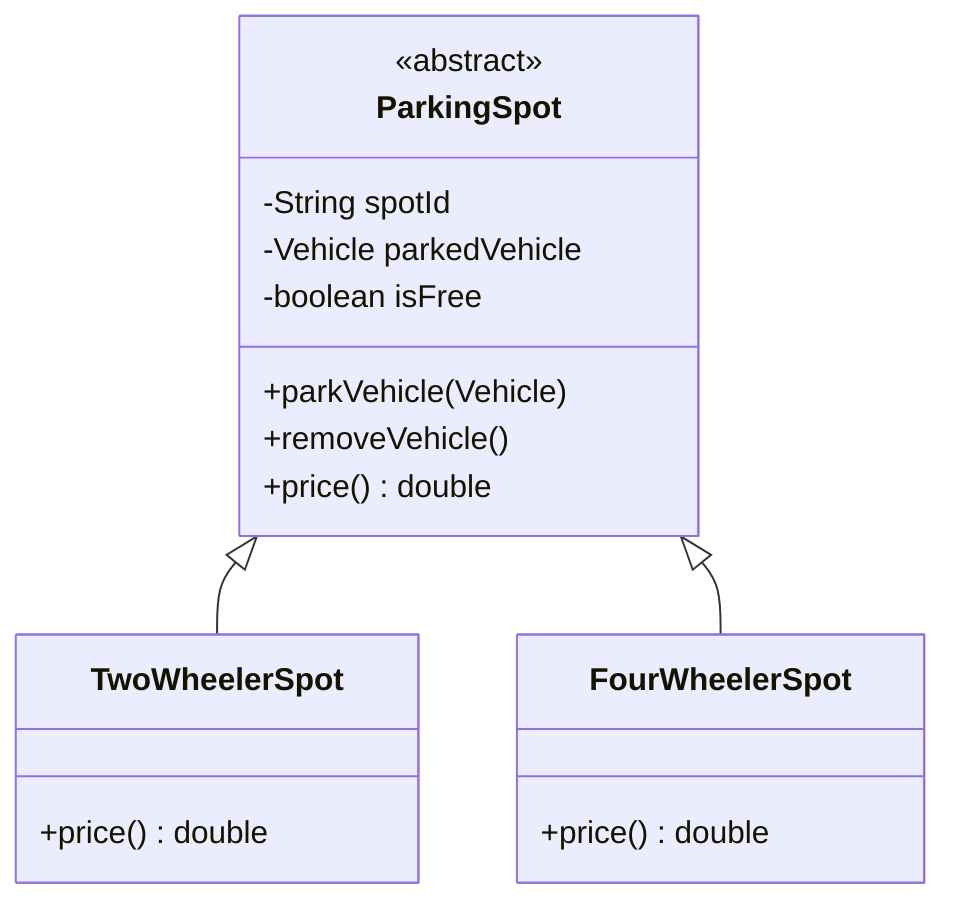
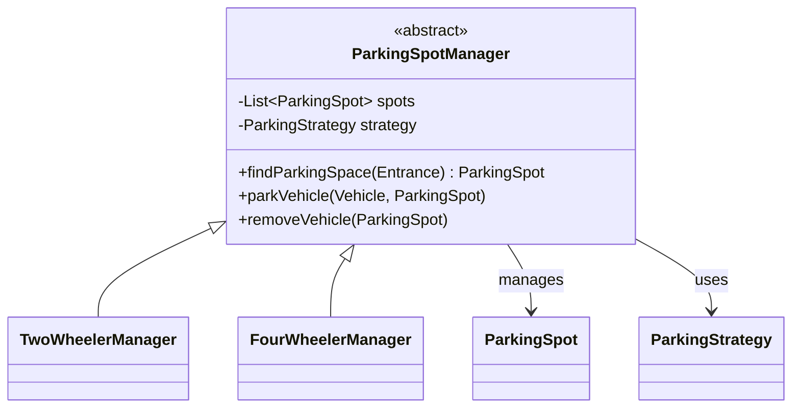
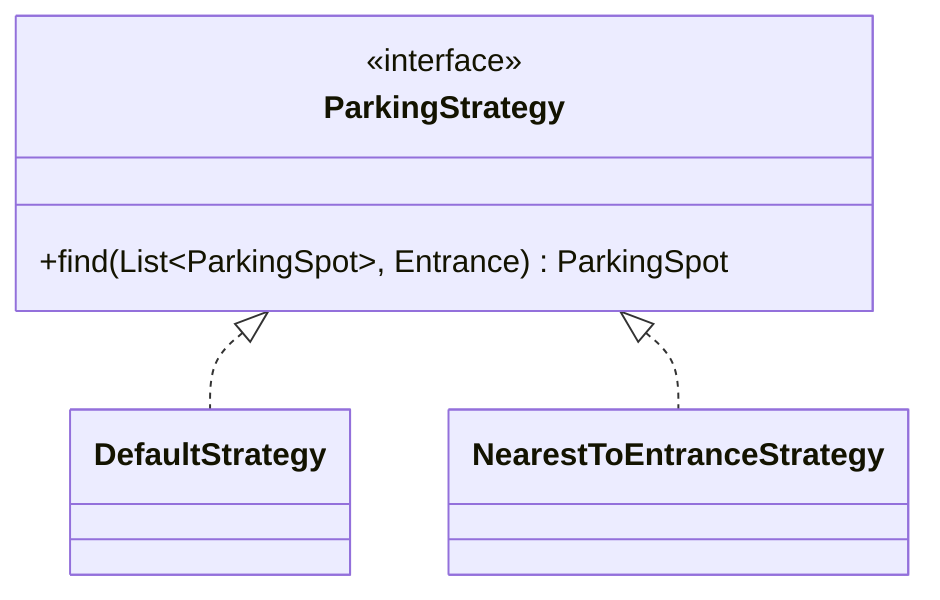
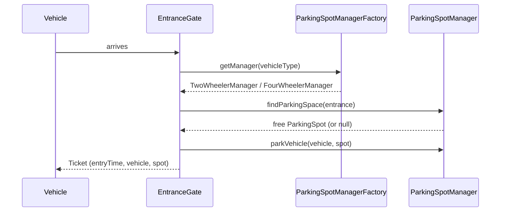
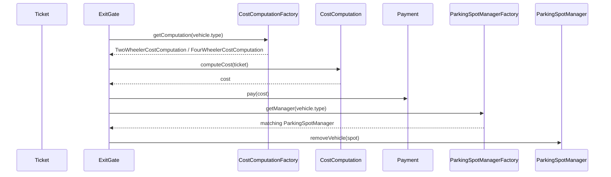
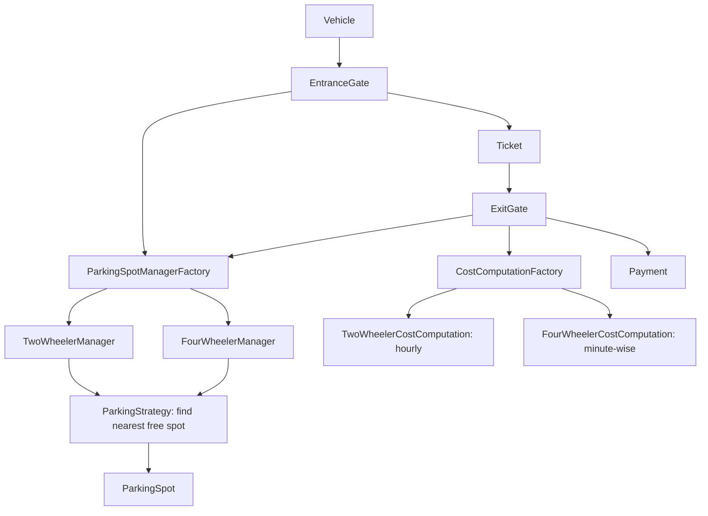

# LLD of Parking Lot

## Overview
- Design a parking lot — a classic SDE2 LLD interview question, and a good
  exercise in requirement-clarification before jumping into design.
- Combines two patterns from earlier notes in one problem: Strategy Pattern
  (finding a free spot, computing cost) and Factory Pattern (picking the
  right manager/cost-computation object by vehicle type).
- Built bottom-up: start from the smallest object (`ParkingSpot`) and
  compose upward to `EntranceGate`/`ExitGate`, instead of designing the
  parent first and drilling down.

## Key Concepts
### Requirements clarification
- Entrances/exits — assume one entrance and one exit for simplicity, but
  keep the code extensible to more.
- Parking spot types — a spot's type is defined by vehicle category, not
  exact vehicle model: an SUV and a sedan are both just "four wheeler", so
  spots are typed two-wheeler / four-wheeler for this scope, extensible to
  three-wheeler, truck, handicap, etc.
- Pricing — clarify hourly-based vs minute-based charging; answer here is
  it can be a mix, different spot types can use different pricing
  strategies.
- Follow-up requirement — parking spot returned should be the nearest one
  to the entrance the vehicle came in from.
- Floors — out of scope for simplicity; a later floor-based extension would
  slot in without disturbing this design.

### Approach: top-down vs bottom-up
- Top-down — start from the parent object, and while designing it, drill
  into whatever child objects it needs, defining them as they come up.
- Bottom-up (used here) — start from the most basic building block
  (`ParkingSpot`), fully define it, then compose it into the next object up
  (`ParkingSpotManager`), and so on until reaching `EntranceGate`/`ExitGate`.



### ParkingSpot — base entity
- Abstract `ParkingSpot` holds the spot's occupied state and a
  `parkedVehicle` reference; exposes `parkVehicle()` / `removeVehicle()`.
- `price()` is overridden per concrete spot type — e.g. two-wheeler spot
  returns ₹10, four-wheeler ₹20 — and is fully extensible: a handicap spot
  could return ₹0, a truck spot ₹100, etc.



```java
abstract class ParkingSpot {
    String spotId;
    Vehicle parkedVehicle;
    boolean isFree = true;

    void parkVehicle(Vehicle vehicle) {
        this.parkedVehicle = vehicle;
        this.isFree = false;
    }
    void removeVehicle() {
        this.parkedVehicle = null;
        this.isFree = true;
    }
    abstract double price(); // overridden per spot type
}
class TwoWheelerSpot extends ParkingSpot {
    double price() { return 10; }
}
class FourWheelerSpot extends ParkingSpot {
    double price() { return 20; }
}
// extensible: HandicapSpot (price() = 0), TruckSpot (price() = 100), ...
```

### ParkingSpotManager — one manager per vehicle-type group
- `ParkingSpotManager` holds its own `List<ParkingSpot>`, built dynamically
  from whatever list is passed into its constructor.
- Separate managers per vehicle type so their spot lists never mix — e.g.
  `TwoWheelerManager` only ever sees the 600 two-wheeler spots,
  `FourWheelerManager` only the 400 four-wheeler spots.
- `TwoWheelerManager extends ParkingSpotManager` / `FourWheelerManager
  extends ParkingSpotManager` — is-a relationship: both are a
  `ParkingSpotManager`, each just scoped to its own list.



```java
abstract class ParkingSpotManager {
    List<ParkingSpot> spots;
    ParkingStrategy strategy;

    ParkingSpotManager(List<ParkingSpot> spots, ParkingStrategy strategy) {
        this.spots = spots; // dynamic — initialized from the list passed in
        this.strategy = strategy;
    }
    ParkingSpot findParkingSpace(Entrance entrance) {
        return strategy.find(spots, entrance);
    }
    void parkVehicle(Vehicle vehicle, ParkingSpot spot) { spot.parkVehicle(vehicle); }
    void removeVehicle(ParkingSpot spot) { spot.removeVehicle(); }
}
class TwoWheelerManager extends ParkingSpotManager { // owns only the 600 two-wheeler spots
    TwoWheelerManager(List<ParkingSpot> spots) { super(spots, new NearestToEntranceStrategy()); }
}
class FourWheelerManager extends ParkingSpotManager { // owns only the 400 four-wheeler spots
    FourWheelerManager(List<ParkingSpot> spots) { super(spots, new NearestToEntranceStrategy()); }
}
```

### Find-spot strategy (Strategy Pattern)
- `ParkingStrategy` interface exposes `find(spots, entrance)`.
- Default implementation returns any free spot.
- `NearestToEntranceStrategy` returns the closest free spot to the given
  entrance — internally can maintain a min-heap of free spots per entrance,
  keyed by distance, so the nearest one always pops off the top.
- Each manager is handed whichever strategy object fits it — e.g.
  `FourWheelerManager` could be given a combined "nearest-to-entrance +
  nearest-to-elevator" strategy instead, without changing the manager class.



```java
interface ParkingStrategy {
    ParkingSpot find(List<ParkingSpot> spots, Entrance entrance);
}
class DefaultStrategy implements ParkingStrategy {
    public ParkingSpot find(List<ParkingSpot> spots, Entrance entrance) {
        for (ParkingSpot s : spots) if (s.isFree) return s;
        return null;
    }
}
class NearestToEntranceStrategy implements ParkingStrategy {
    // per-entrance min-heap of free spots keyed by distance -> O(log n) nearest lookup
    public ParkingSpot find(List<ParkingSpot> spots, Entrance entrance) { /* ... */ return null; }
}
```

### Vehicle & Ticket
- `Vehicle` — vehicle number + a `VehicleType` enum (TWO_WHEELER,
  FOUR_WHEELER, THREE_WHEELER, ...).
- `Ticket` — entry time, the `Vehicle`, and the `ParkingSpot` assigned; no
  separate spot-type field needed since the spot itself already carries that.

```java
enum VehicleType { TWO_WHEELER, FOUR_WHEELER, THREE_WHEELER }
class Vehicle {
    String vehicleNumber;
    VehicleType type;
}
class Ticket {
    Vehicle vehicle;
    ParkingSpot spot;
    LocalDateTime entryTime;
}
```

### EntranceGate (Factory Pattern)
- On vehicle arrival: must find a parking space; if none is free, deny
  entry.
- Which manager (`TwoWheelerManager` vs `FourWheelerManager`) to ask is
  decided by `ParkingSpotManagerFactory.getManager(vehicleType)` — Factory
  Pattern, same shape as [05. Factory vs Abstract Factory Pattern](../concepts/05-factory-vs-abstract-factory-pattern.md).
- Once a spot is found: park the vehicle (updates spot state) and generate
  a `Ticket`.



```java
class ParkingSpotManagerFactory {
    ParkingSpotManager getManager(VehicleType type) {
        if (type == VehicleType.TWO_WHEELER) return twoWheelerManager;
        if (type == VehicleType.FOUR_WHEELER) return fourWheelerManager;
        return null;
    }
}
class EntranceGate {
    ParkingSpotManagerFactory factory;

    Ticket vehicleArrives(Vehicle vehicle) {
        ParkingSpotManager manager = factory.getManager(vehicle.type);
        ParkingSpot spot = manager.findParkingSpace(this);
        if (spot == null) return null; // no free space -> deny entry
        manager.parkVehicle(vehicle, spot);
        return generateTicket(vehicle, spot);
    }
    Ticket generateTicket(Vehicle vehicle, ParkingSpot spot) {
        Ticket t = new Ticket();
        t.vehicle = vehicle;
        t.spot = spot;
        t.entryTime = LocalDateTime.now();
        return t;
    }
}
```

### ExitGate — cost computation & payment
- `CostComputation` defaults to a `FixedPriceStrategy` (flat price
  regardless of duration); concrete subclasses swap in a different pricing
  strategy — `TwoWheelerCostComputation` uses hourly pricing,
  `FourWheelerCostComputation` uses minute-wise pricing.
- `CostComputationFactory` picks the right `CostComputation` object by
  vehicle type — Factory Pattern again, mirroring `ParkingSpotManagerFactory`.
- After cost is computed: `Payment` (abstract) has `CashPayment` /
  `CardPayment` subclasses, each recording the payment differently (e.g.
  card payment writes a credit-card-table entry, cash writes a cash-table
  entry).
- Finally, the same `ParkingSpotManagerFactory` is used again (by vehicle
  type on the ticket) to fetch the manager and free the spot.



```java
interface PricingStrategy {
    double price(Ticket ticket);
}
class FixedPriceStrategy implements PricingStrategy {
    public double price(Ticket ticket) { return 20; } // flat, regardless of duration
}
class HourlyPricingStrategy implements PricingStrategy {
    public double price(Ticket ticket) {
        long hours = Duration.between(ticket.entryTime, LocalDateTime.now()).toHours();
        return hours * ticket.spot.price();
    }
}
class MinutePricingStrategy implements PricingStrategy {
    public double price(Ticket ticket) {
        long minutes = Duration.between(ticket.entryTime, LocalDateTime.now()).toMinutes();
        return minutes * ticket.spot.price();
    }
}

abstract class CostComputation {
    PricingStrategy pricingStrategy = new FixedPriceStrategy(); // default
    double computeCost(Ticket ticket) { return pricingStrategy.price(ticket); }
}
class TwoWheelerCostComputation extends CostComputation {
    TwoWheelerCostComputation() { pricingStrategy = new HourlyPricingStrategy(); }
}
class FourWheelerCostComputation extends CostComputation {
    FourWheelerCostComputation() { pricingStrategy = new MinutePricingStrategy(); }
}
class CostComputationFactory {
    CostComputation getComputation(VehicleType type) {
        if (type == VehicleType.TWO_WHEELER) return new TwoWheelerCostComputation();
        if (type == VehicleType.FOUR_WHEELER) return new FourWheelerCostComputation();
        return null;
    }
}

abstract class Payment {
    abstract void pay(double amount);
}
class CashPayment extends Payment {
    void pay(double amount) { /* record entry in cash table */ }
}
class CardPayment extends Payment {
    void pay(double amount) { /* record entry in credit card table */ }
}

class ExitGate {
    CostComputationFactory costFactory;
    ParkingSpotManagerFactory spotFactory;

    void vehicleExits(Ticket ticket, Payment payment) {
        CostComputation computation = costFactory.getComputation(ticket.vehicle.type);
        double cost = computation.computeCost(ticket);
        payment.pay(cost);
        ParkingSpotManager manager = spotFactory.getManager(ticket.vehicle.type);
        manager.removeVehicle(ticket.spot);
    }
}
```

### Extensibility — multiple entrances, floors
- An `EntranceManager` can hold a dynamic list of `EntranceGate`s, so
  entrances can be added or closed (e.g. 5 → 4 → 6) without touching the
  rest of the design.
- Floors weren't in scope, but the same bottom-up composition means a floor
  layer could be added above `ParkingSpotManager` without disturbing
  `ParkingSpot`, the strategies, or the gates.

## Trade-offs / Comparisons
| Approach | How it works | Trade-off |
|---|---|---|
| Top-down design | Start from the parent object, drill into children as they come up | Easy to lose track of a child's full requirements while mid-design of the parent |
| Bottom-up design | Fully define the smallest building block first, compose upward | Requires knowing the small pieces needed upfront; matches how this problem was solved here |

## Example / Walkthrough
- A vehicle arrives at the entrance → `EntranceGate` asks
  `ParkingSpotManagerFactory` for the matching manager based on vehicle
  type (two-wheeler → `TwoWheelerManager`) → manager's
  `NearestToEntranceStrategy` finds the closest free spot → spot marked
  occupied → `Ticket` generated with entry time, vehicle, and spot.
- Later, the vehicle exits → `ExitGate` asks `CostComputationFactory` for
  the matching cost computation (two-wheeler → hourly pricing) → cost
  computed from `entryTime` to now → payment taken via `CashPayment` or
  `CardPayment` → `ParkingSpotManagerFactory` looked up again to free the
  spot via `removeVehicle()`.

## Diagram


## Interview Q&A
<details>
<summary>Why does the design use separate managers per vehicle type instead of one manager for all spots?</summary>

So each manager's spot list never mixes with another's — a two-wheeler
manager only ever sees two-wheeler spots, keeping find/park/remove
operations scoped and simple, at the cost of one manager class per vehicle
type (an is-a relationship with the base `ParkingSpotManager`).

</details>

<details>
<summary>Where does Strategy Pattern show up in this design, and why two places?</summary>

Twice — once for finding a free spot (default vs nearest-to-entrance), once
for computing cost (fixed vs hourly vs minute-wise). Both let a manager or
cost-computation object swap in different behavior without changing the
class itself.

</details>

<details>
<summary>Where does Factory Pattern show up, and why?</summary>

Twice — `ParkingSpotManagerFactory` picks the right manager by vehicle
type, `CostComputationFactory` picks the right cost-computation object by
vehicle type. Both centralize a condition-based object-creation decision
that would otherwise be duplicated at every call site.

</details>

<details>
<summary>How would you make "nearest parking spot to the entrance" efficient?</summary>

Maintain a min-heap of free spots per entrance, keyed by distance from that
entrance — the nearest free spot is always at the top, giving O(log n)
find/update instead of scanning the full spot list.

</details>

<details>
<summary>What happens if no parking spot is free when a vehicle arrives?</summary>

`findParkingSpace()` returns null, and `EntranceGate` denies entry instead
of generating a ticket — the vehicle is never let in without an assigned
spot.

</details>

<details>
<summary>Why is pricing strategy chosen per vehicle type instead of being global?</summary>

The requirements explicitly allow a mix — some spot types can be
hourly-based, others minute-based — so pricing strategy is injected per
`CostComputation` subclass rather than hardcoded once for the whole lot.

</details>

<details>
<summary>Why design bottom-up here instead of top-down?</summary>

Starting from the smallest concrete piece (`ParkingSpot`) makes its full
shape clear before it's composed into a manager, and the manager's shape
clear before it's used by the gates — avoids designing a parent class
around assumptions about children that haven't been fully thought through
yet.

</details>

## Related Topics
- [02. Strategy Design Pattern](../concepts/02-strategy-design-pattern.md) — same strategy-injection shape used
  here for find-spot and cost-computation logic.
- [05. Factory vs Abstract Factory Pattern](../concepts/05-factory-vs-abstract-factory-pattern.md) — same vehicle-type-based
  factory shape used here for manager and cost-computation selection.
- [14. LLD of BookMyShow](14-bookmyshow-lld.md) — another full "design X" interview walkthrough,
  same requirements-first approach.
