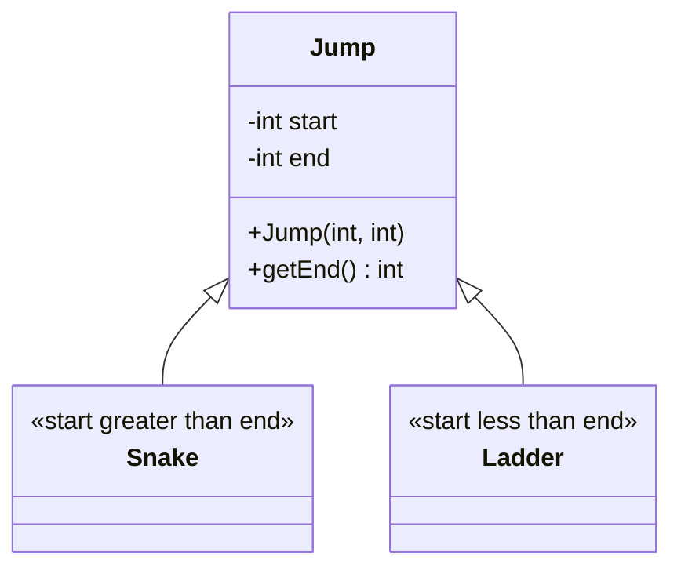
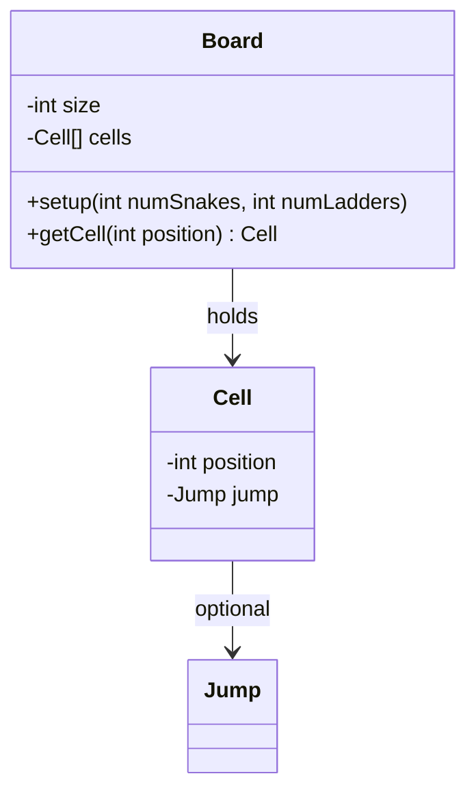
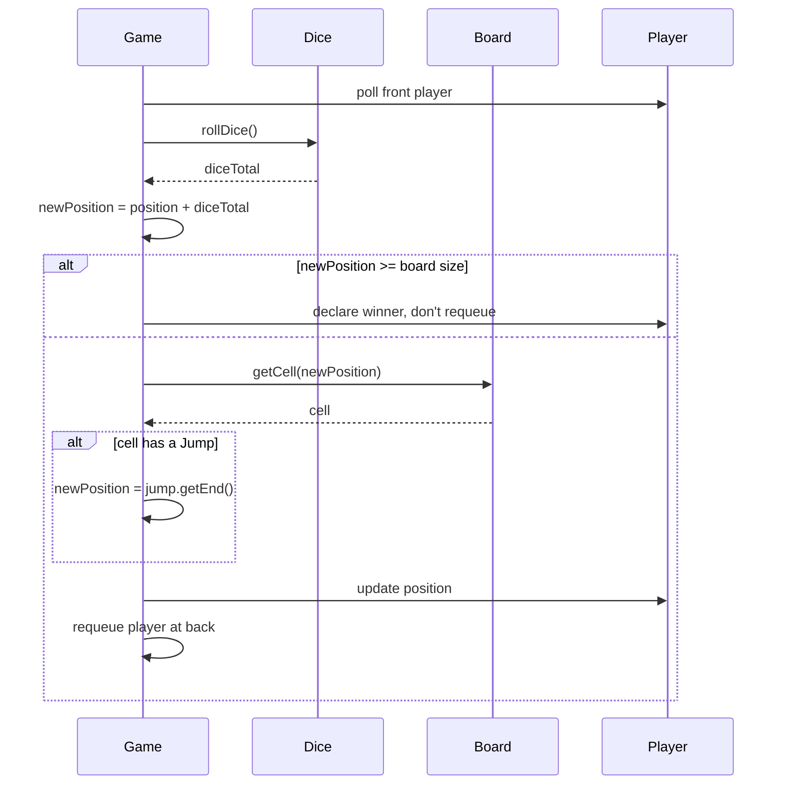
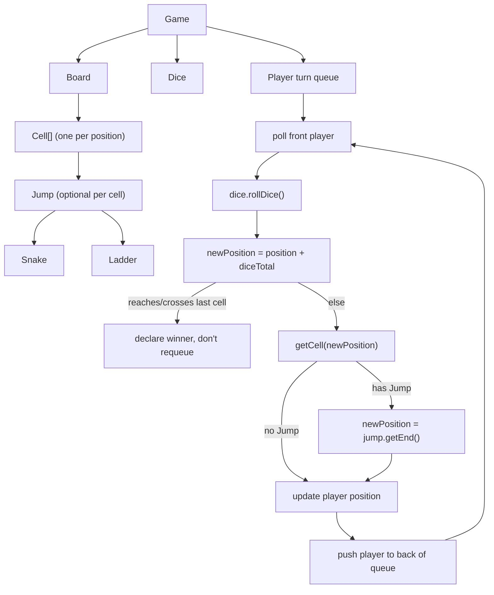

# LLD of Snake and Ladder

## Overview
- Design the classic Snake and Ladder board game — a popular LLD interview
  question, asked specifically at Amazon per this video.
- Small object set like [07. LLD of Tic-Tac-Toe](07-tic-tac-toe-lld.md), but the interview focus
  here is turn rotation, random board setup (snakes/ladders), and applying a
  "jump" (snake or ladder) after a dice roll.

## Key Concepts
### Requirements — clarify before designing
- Number of dice — configurable, not hardcoded to one (a turn's move is the
  sum of all dice rolled that turn).
- Number of snakes and ladders — configurable at setup time, placed at
  random positions rather than fixed.
- Board must support re-setup with different snake/ladder counts without
  needing a brand-new `Board` object — `setup()` (re)configures cells rather
  than the board being fixed once built.
- Game needs at least two players to keep running; this scope is treated as
  business logic the interviewer can change on request, not a hard rule.

### Jump — shared shape of Snake and Ladder
- Snake and Ladder are structurally identical: both are just "land on cell
  A, get moved to cell B" — only the direction differs.
- `Jump` is a superclass holding `start` and `end`; `Snake` and `Ladder`
  extend it and only differ in which value is bigger.
- Snake: `start` (head) is a higher position than `end` (tail) — moves the
  player down.
- Ladder: `start` (bottom) is a lower position than `end` (top) — moves the
  player up.



```java
class Jump {
    int start;
    int end;
    Jump(int start, int end) { this.start = start; this.end = end; }
    int getEnd() { return end; }
}
class Snake extends Jump {
    Snake(int head, int tail) { super(head, tail); } // head > tail
}
class Ladder extends Jump {
    Ladder(int bottom, int top) { super(bottom, top); } // bottom < top
}
```

### Cell and Board — grid holding optional jumps
- `Cell` represents one position on the board; it optionally holds a `Jump`
  if a snake or ladder starts there.
- `Board` holds an array of `Cell`s sized to the board's total positions
  (e.g. 100 for a 10x10 board).
- `Board.setup(numSnakes, numLadders)` creates all cells, then randomly
  picks distinct cells to attach a `Snake` or `Ladder` to — skipping a cell
  that already has a jump, so two jumps never overlap.



```java
class Cell {
    int position;
    Jump jump; // null if no snake/ladder starts here
    Cell(int position) { this.position = position; }
}

class Board {
    int size;
    Cell[] cells;
    Board(int size) { this.size = size; }

    void setup(int numSnakes, int numLadders) {
        cells = new Cell[size + 1];
        for (int i = 0; i <= size; i++) cells[i] = new Cell(i);

        Random rand = new Random();
        int placed = 0;
        while (placed < numSnakes) {
            int head = 1 + rand.nextInt(size);
            int tail = 1 + rand.nextInt(head);
            if (head == tail || cells[head].jump != null) continue;
            cells[head].jump = new Snake(head, tail);
            placed++;
        }
        placed = 0;
        while (placed < numLadders) {
            int bottom = 1 + rand.nextInt(size);
            int top = bottom + rand.nextInt(size - bottom + 1);
            if (bottom == top || cells[bottom].jump != null) continue;
            cells[bottom].jump = new Ladder(bottom, top);
            placed++;
        }
    }

    Cell getCell(int position) { return cells[position]; }
}
```

### Dice — configurable number of dice
- `Dice` holds `numberOfDice` (defaults to one, but configurable).
- `rollDice()` rolls each die (random 1-6) and returns the sum — with two
  dice, the same method is called twice internally and the results added.

```java
class Dice {
    int numberOfDice;
    Dice(int numberOfDice) { this.numberOfDice = numberOfDice; }
    int rollDice() {
        Random rand = new Random();
        int total = 0;
        for (int i = 0; i < numberOfDice; i++) total += rand.nextInt(6) + 1;
        return total;
    }
}
```

### Game — turn queue, dice roll, jump resolution
- `Player` — name and current `position` (starts at 0, i.e. before cell 1).
- `Game` holds the `Board`, `Dice`, and players in a queue for turn order —
  same round-robin pattern as [07. LLD of Tic-Tac-Toe](07-tic-tac-toe-lld.md): pop the front
  player, play their turn, push them to the back to continue.
- Per turn: roll the dice, add the total to the player's position; if that
  reaches or crosses the last cell, the player wins (no exact-count rule
  like Ludo, per this design); otherwise check the landed cell for a `Jump`
  and, if present, move the player straight to the jump's `end`.
- A player who wins is not requeued; the loop keeps going while more than
  one player remains.



```java
class Player {
    String name;
    int position; // starts at 0
    Player(String name) { this.name = name; this.position = 0; }
}

class Game {
    Board board;
    Dice dice;
    Queue<Player> players;

    Game(Board board, Dice dice, List<Player> playerList) {
        this.board = board;
        this.dice = dice;
        this.players = new LinkedList<>(playerList);
    }

    void play() {
        while (players.size() > 1) {
            Player current = players.poll();
            int diceTotal = dice.rollDice();
            int newPosition = current.position + diceTotal;

            if (newPosition >= board.size) {
                System.out.println(current.name + " wins!");
                continue; // winner, don't requeue
            }

            Cell landedCell = board.getCell(newPosition);
            if (landedCell.jump != null) {
                newPosition = landedCell.jump.getEnd();
            }
            current.position = newPosition;
            players.add(current); // turn done, back of the queue
        }
    }
}
```

## Trade-offs / Comparisons
| Design point | Choice made here | Alternative |
|---|---|---|
| Snake/Ladder modeling | One `Jump` superclass, `Snake`/`Ladder` only differ by which end is bigger | Two independent unrelated classes — duplicates the same start/end shape |
| Win condition | Reaching or crossing the last cell wins immediately | Ludo-style: must land on the exact last cell, overshoot wastes the turn |
| Turn rotation | Queue: poll front, requeue at back | Fixed-size array with a modulo index — queue is simpler to add/remove players mid-game |

## Example / Walkthrough
- Board is set up with a configured number of snakes and ladders placed on
  random, non-overlapping cells.
- A player's current position is printed each turn, dice is rolled, and the
  new position (before any jump) is printed too, to show the jump clearly.
- Example from the video: a player's position was 1, then after a roll the
  new position landed on a ladder — the player's position jumped ahead to
  the ladder's top instead of stopping at the rolled cell.
- Another case: landing on a snake's head sent the player back down to the
  snake's tail.
- Play continues, turn by turn, until a player's position reaches or
  crosses the final cell and is declared the winner.

## Diagram


## Interview Q&A
<details>
<summary>Why model Snake and Ladder as subclasses of a single Jump class instead of two separate classes?</summary>

Both are the same shape — land on a start cell, get moved to an end cell —
and only differ in whether start is greater or less than end. A shared
`Jump` superclass avoids duplicating that start/end structure twice.

</details>

<details>
<summary>How does the board support being reconfigured with a different number of snakes/ladders without creating a new Board object?</summary>

`setup()` is a separate method from the constructor — it (re)creates the
cells array and re-places jumps, so the same `Board` instance can be set up
again with new counts instead of needing to be rebuilt from scratch.

</details>

<details>
<summary>How do you make sure two snakes/ladders don't start on the same cell during random setup?</summary>

Before attaching a jump to a randomly picked cell, check whether that
cell already has one; if so, skip and pick again until a free cell is
found.

</details>

<details>
<summary>How does turn order work with more than two players?</summary>

Players sit in a queue. Each turn, the front player is polled, plays their
turn, and (unless they just won) is pushed back to the back of the queue —
the same round-robin pattern used in [07. LLD of Tic-Tac-Toe](07-tic-tac-toe-lld.md), which
generalizes to any number of players without hardcoding turn alternation.

</details>

<details>
<summary>How does the design support more than one die?</summary>

`Dice` holds a `numberOfDice` count; `rollDice()` loops that many times,
summing a random 1-6 value each time, so the number of dice is a
constructor parameter rather than a hardcoded single roll.

</details>

<details>
<summary>What decides the win condition, and how does it differ from Ludo?</summary>

The moment a player's position reaches or crosses the final cell, they win
immediately. This is unlike Ludo, where a piece must land on the exact
final cell — an overshoot in Ludo wastes the turn instead of winning.

</details>

<details>
<summary>Why check the landed cell for a Jump after adding the dice total, rather than before?</summary>

The dice total decides which cell the player lands on first; only after
that landing cell is known can the board be asked whether a snake or ladder
starts there, to decide the final resting position for the turn.

</details>

## Related Topics
- [07. LLD of Tic-Tac-Toe](07-tic-tac-toe-lld.md) — same turn-queue pattern (poll front, requeue
  at back) for round-robin turn order.
- [01. SOLID Principles](../concepts/01-solid-principles.md) — `Jump` → `Snake`/`Ladder` is the same
  extend-by-subclassing (OCP) shape as `Piece` → `PieceX`/`PieceO`.
- [18. LLD of Chess Game (Mock Interview)](18-chess-game-lld.md) — same abstract-superclass-per-variant shape
  applied to chess pieces (`Piece` → `Pawn`/`Bishop`/...).
