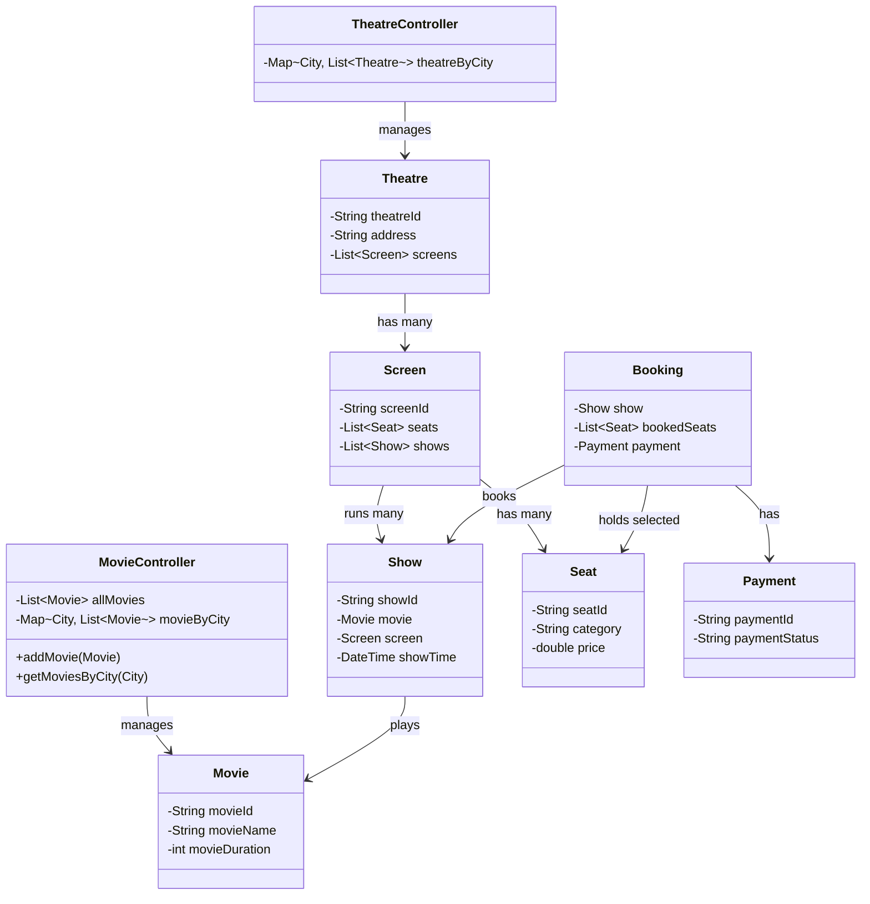
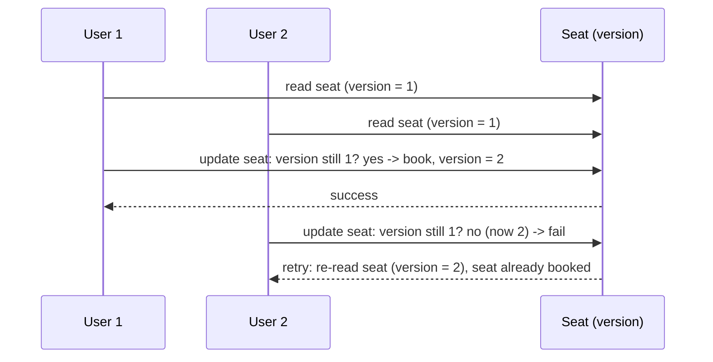
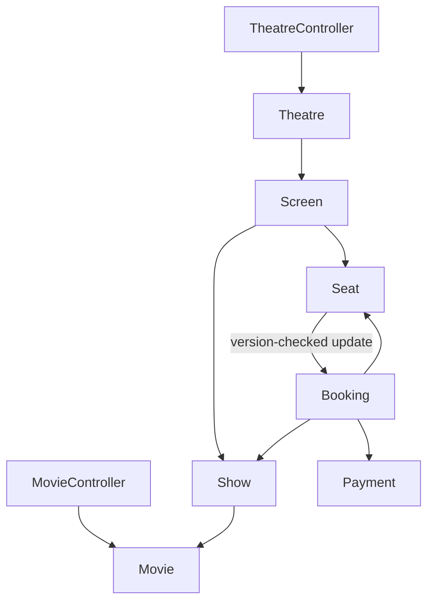

# LLD of BookMyShow (Movie Ticket Booking)

## Overview
- Design a movie-ticket-booking app (BookMyShow-style) — a major, frequently
  asked LLD interview question.
- Two parts to the interview: (1) design the class model for browsing
  movies/theatres and booking a seat, (2) handle concurrency correctly when
  two users try to book the same seat at once.
- The concurrency handling (pessimistic vs optimistic locking) is the part
  interviewers actually probe — the class design is table stakes to get
  there.

## Key Concepts
### Requirements
- Show movies playing in the user's city — movies are scoped per city.
- Flow: user picks a movie → picks a particular theatre/show → selects
  seats → books.
- Kept intentionally simple — no deep theatre/hall internals beyond what's
  needed to support this flow.

### Core entities
- `Movie` — movieId, movieName, movieDuration.
- `MovieController` — holds all movies and a city → movies mapping; exposes
  operations like add movie, get movies by city.
- `Theatre` — theatreId, address, list of `Screen`s (a theatre has multiple
  screens).
- `Screen` — owns its own `List<Seat>` (seating arrangement differs per
  screen) and the list of `Show`s running on it.
- `Show` — showId, which `Movie`, which `Screen`, show time, and per-show
  seat-booking status.
- `Seat` — seatId, category (e.g. Platinum/Gold/Silver), price.
- `Booking` — which `Show`, which seats were booked, and a `Payment`.
- `Payment` — paymentId, paymentStatus.
- `TheatreController` — analogous to `MovieController` but for theatres:
  city → theatres mapping, theatre lookups.



```java
class Movie {
    String movieId;
    String movieName;
    int movieDuration;
}

class MovieController {
    List<Movie> allMovies = new ArrayList<>();
    Map<String, List<Movie>> movieByCity = new HashMap<>(); // city -> movies

    void addMovie(Movie movie, String city) {
        allMovies.add(movie);
        movieByCity.computeIfAbsent(city, k -> new ArrayList<>()).add(movie);
    }
    List<Movie> getMoviesByCity(String city) {
        return movieByCity.getOrDefault(city, List.of());
    }
}

class Theatre {
    String theatreId;
    String address;
    List<Screen> screens = new ArrayList<>();
}

class Screen {
    String screenId;
    List<Seat> seats = new ArrayList<>();
    List<Show> shows = new ArrayList<>();
}

class Show {
    String showId;
    Movie movie;
    Screen screen;
    LocalDateTime showTime;
}

class Seat {
    String seatId;
    String category; // e.g. PLATINUM, GOLD, SILVER
    double price;
}

class Booking {
    Show show;
    List<Seat> bookedSeats;
    Payment payment;
}

class Payment {
    String paymentId;
    String paymentStatus; // SUCCESS, FAILED
}

class TheatreController {
    Map<String, List<Theatre>> theatreByCity = new HashMap<>();

    List<Theatre> getTheatresByCity(String city) {
        return theatreByCity.getOrDefault(city, List.of());
    }
}
```

### Concurrency: pessimistic vs optimistic locking
- Two general strategies for handling concurrent updates: **pessimistic**
  and **optimistic** locking.
- Pessimistic locking — acquire a lock the moment a seat is read (because
  it's about to be updated); every other reader/writer waits until the lock
  is released after the update. Simple but causes heavy blocking under
  load.
- Optimistic locking (used here) — every `Seat` carries a `version` number.
  Read the seat, remember its version. At update time, re-check the version
  still matches the current one in the DB:
  - Match → no one else touched it since the read → proceed, increment the
    version as part of the update.
  - Mismatch → someone else already updated it → this update fails, caller
    re-reads (getting the new version) and retries.
- Lock is only held briefly at the actual update step, not for the whole
  read-then-decide window — far less waiting than pessimistic locking.
- Chosen here because seat-booking is a case where conflicts are rare
  (only an issue when two users pick the *exact same* seat at the *exact
  same* time) — optimistic locking's optimism fits.



```java
class Seat {
    String seatId;
    String category;
    double price;
    boolean booked;
    int version; // optimistic locking

    boolean bookIfVersionMatches(int expectedVersion) {
        synchronized (this) { // brief lock only around the actual update
            if (this.version != expectedVersion) {
                return false; // someone else updated it since we read — caller retries
            }
            this.booked = true;
            this.version++;
            return true;
        }
    }
}

// usage
Seat seat = getSeat(seatId);          // read: seat.version == 1
boolean success = seat.bookIfVersionMatches(1); // check-then-update
if (!success) {
    seat = getSeat(seatId);           // re-read, get updated version
    // retry booking, or tell the user this seat is taken
}
```

## Trade-offs / Comparisons
| Approach | How it works | Downside |
|---|---|---|
| Pessimistic locking | Lock acquired at read time, held through the update, then released | Lots of waiting/blocking under concurrent load |
| Optimistic locking | No lock at read time; version checked and lock only held at the brief update step | Update can fail and require a retry, but far less blocking overall |

## Example / Walkthrough
- Created two movies: "Avengers" and "Baahubali".
- Assigned cities: Delhi has both movies, Bengaluru has both movies.
- Created theatres, assigned screens, assigned shows to screens (e.g. one
  screen running an Avengers show, another running Baahubali at 4pm) — no
  bookings initially on either show.
- User flow: a user in Bengaluru wants to watch Baahubali → filter movies
  by city → filter to the interested movie (Baahubali) → get theatres
  showing it in that city → pick a particular show (the 4pm Baahubali show)
  → fetch seat info for that screen/show → select seats → `Booking` created
  (holds the show + selected seats) → booking marked successful.
- A second scenario demonstrates the concurrency problem: two users try to
  select/book the same seat around the same time — resolved via the
  optimistic-locking version check above, so only one booking succeeds.

## Diagram


## Interview Q&A
<details>
<summary>How do movies get scoped to a city in this design?</summary>

`MovieController` keeps a city → list-of-movies mapping alongside the flat
list of all movies, so browsing filters by the user's city before showing
any movies.

</details>

<details>
<summary>Why does `Screen` own the seat list instead of `Theatre`?</summary>

Because seating arrangement differs per screen within the same theatre —
each screen has its own layout, so seats belong at the screen level, not
the theatre level.

</details>

<details>
<summary>What's the difference between pessimistic and optimistic locking?</summary>

Pessimistic locking takes a lock as soon as a row is read for update and
holds it through the whole update, blocking other readers/writers.
Optimistic locking takes no lock at read time — it checks a version number
right before updating, and only locks briefly during the update itself.

</details>

<details>
<summary>Why is optimistic locking preferred for seat booking specifically?</summary>

Conflicts are rare — only an issue when two users pick the exact same seat
at the exact same time — so optimistic locking's low-blocking approach fits
better than pessimistic locking's constant waiting.

</details>

<details>
<summary>Walk through what happens when two users try to book the same seat concurrently under optimistic locking.</summary>

Both read the seat at version 1. Whichever update reaches the DB first
succeeds (version check passes, version becomes 2). The second user's
update then fails its version check (expected 1, actual 2), so it doesn't
overwrite the first booking — the second user must re-read and retry,
seeing the seat is already booked.

</details>

<details>
<summary>Where exactly is the lock held in the optimistic-locking approach?</summary>

Only around the actual update step — checking the version and applying the
change — not for the entire read-then-decide window a user spends browsing
and choosing a seat.

</details>

## Related Topics
- [01. SOLID Principles](../concepts/01-solid-principles.md) — SOLID underlies clean separation between
  `MovieController`/`TheatreController` and the entities they manage.
- [02. Strategy Design Pattern](../concepts/02-strategy-design-pattern.md) — composition-over-inheritance shows up
  in how `Booking` composes `Show` + `Seat`s + `Payment` rather than
  inheriting from them.
