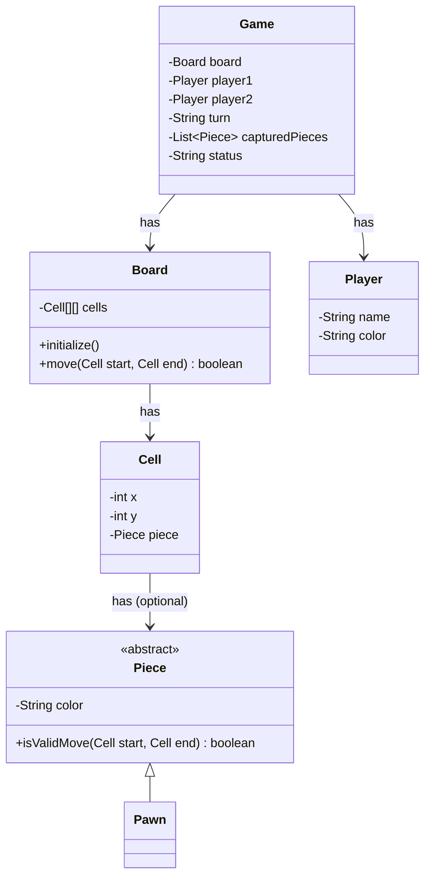
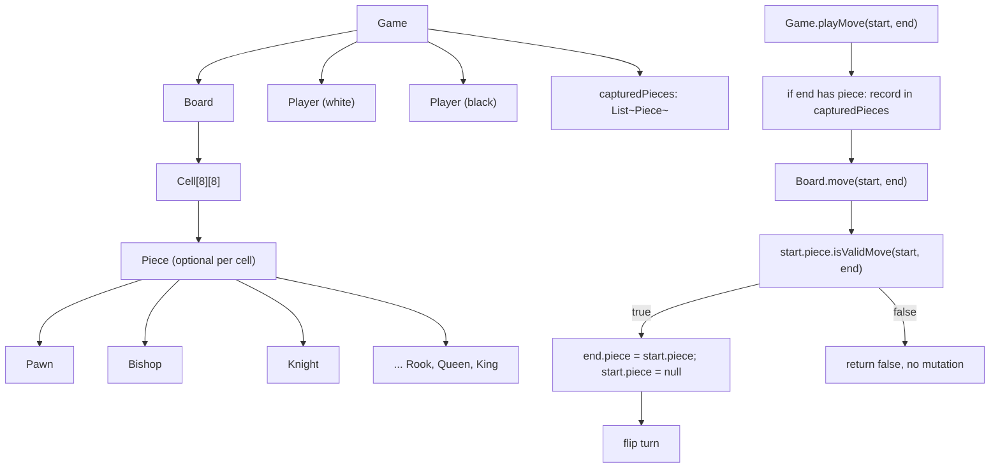
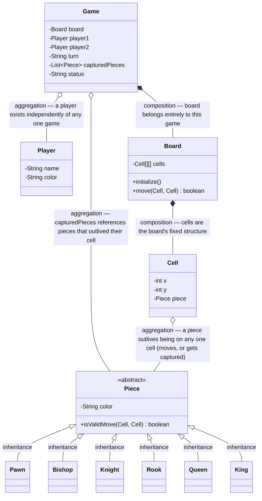

# LLD of Chess Game (Mock Interview)

## Overview
- A mock LLD interview (interviewer + candidate) designing a chess game —
  useful both for the object model itself and for the interview-process
  lessons that came out of the candidate's mistakes along the way.
- Medium-complexity LLD question: object modeling is short (Board, Cell,
  Piece, Player, Game), but the full 60-minute round expects working code
  by the end, not just a UML diagram.
- Biggest recurring theme in the interview: field placement and method
  responsibility only became clear once the interviewer forced a plain-
  English flow ("board has cells, cells have what, pieces have what")
  *before* jumping into class diagrams.

## Key Concepts
### Requirements — clarify before designing
- Board: 8x8 grid.
- Two players, one takes white, one takes black.
- Pieces: 8 pawns, 1 king, 1 queen, 2 rooks, 2 bishops, 2 knights per side —
  two full sets, one per color.
- Each piece type has its own movement rule; a move can either relocate a
  piece or capture (kill) an opposing piece on the destination cell.
- Scoped as two human players giving explicit start/end input — the ATM
  does **not** need to compute legal moves *for* a player the way a chess
  engine would; it only needs to validate a move the player already chose.
  This scope question is easy to skip and cost the candidate time later,
  since it changes how much move-rule complexity the design needs upfront.

### Object list — identify nouns before relationships
- `Board`, `Cell`, `Piece`, `Player`, `Game` (the controller/driver).
- `Move` is called out explicitly as **not** an object — it's a *behavior*
  of `Piece`, not a standalone entity. Getting this distinction right early
  avoids modeling a `Move` class that would otherwise just duplicate data
  already on `Piece`/`Cell`.

### Cell owns position, not Piece — the interview's key correction
- First draft put `position` (x, y) directly on `Piece`. The interviewer
  pushed back by asking the candidate to trace the ownership chain in
  plain English first: **Board has Cells → Cell has what? → Piece has
  what?**
- Once forced through that chain, it became clear: `Board` **has** a grid
  of `Cell`s; each `Cell` **has** a position (its own x, y) and optionally
  **has** a `Piece` sitting on it. A `Piece` itself never needs to know
  its own coordinates — asking "where is this piece?" is a question about
  the *cell*, not the piece.
- This is the same is-a/has-a discipline covered in
  [01.2. is-a vs has-a: How Each Looks in Code](../concepts/01.2-is-a-vs-has-a.md): get the ownership direction wrong and later
  operations (like updating a piece's position after a move) become
  awkward, because two places now disagree about where a piece "lives."



### Piece — abstract class per type, not a type field
- First draft gave `Piece` a `type` field ("pawn", "bishop", ...). The
  interviewer's question — "how will you write one `move()` method that
  implements every piece's different movement rule?" — is what surfaced
  the problem: a single method can't cleanly hold 6 unrelated rule sets
  behind one `if (type == ...)` ladder.
- Fix: `Piece` becomes `abstract`, holding only what's common (`color`)
  plus an abstract move-validation method; `Pawn`, `Bishop`, `Knight`, etc.
  each extend it and implement their own rule. Same is-a shape as
  [11. LLD of Snake and Ladder](11-snake-and-ladder-lld.md)'s `Jump` → `Snake`/`Ladder`.

```java
abstract class Piece {
    String color; // "black" or "white"
    Piece(String color) { this.color = color; }
    abstract boolean isValidMove(Cell start, Cell end);
}

class Pawn extends Piece {
    Pawn(String color) { super(color); }
    @Override
    boolean isValidMove(Cell start, Cell end) {
        // pawn-specific movement/capture rule goes here
        return true; // stubbed for scope of this design
    }
}
```

### Move is validation, not mutation — a second naming correction
- Candidate's first draft had `Piece.move(start, end)` returning `void`,
  which the interviewer flagged as ambiguous: does calling it *perform*
  the move, or just check whether it's *legal*?
- Resolution: `Piece` can't perform the move itself — it has no reference
  to the `Cell`s or the `Board`, so it has nothing to mutate. Renamed to
  `isValidMove(start, end)` returning `boolean`; the actual mutation
  (moving the piece reference from the start cell to the end cell) happens
  one level up, in `Board.move()`, after validation passes.
- This mirrors a common LLD trap: a method that both *checks* something
  and *does* something is a sign the responsibility sits on the wrong
  class, or two responsibilities are hiding behind one method name.

```java
class Cell {
    int x, y;
    Piece piece; // null if empty
    Cell(int x, int y, Piece piece) { this.x = x; this.y = y; this.piece = piece; }
}

class Board {
    Cell[][] cells = new Cell[8][8];

    void initialize() {
        // create all pieces, assign each to its starting cell
        cells[1][0] = new Cell(1, 0, new Pawn("black"));
        // ... remaining 7 black pawns, then white pawns at row 6, etc.
    }

    boolean move(Cell start, Cell end) {
        if (start.piece == null || !start.piece.isValidMove(start, end)) return false;
        end.piece = start.piece; // capture: silently overwrites whatever was on end
        start.piece = null;
        return true;
    }
}
```

### Game-level move call — start/end cells, not a Piece parameter
- Candidate initially had the game-level move call take a `Piece` as a
  parameter. Interviewer's catch: `Game` **has** a `Board`, but `Game`
  has no relationship to `Piece` at all — there's no path from `Game` to
  `Piece` except by first going through `Board` → `Cell`.
- A human player doesn't hand the system "this piece" anyway — they pick a
  start position and an end position. So the game-level call only needs
  two `Cell` references (or plain x/y pairs); which piece is involved is
  looked up from the start cell inside `Board.move()`, not passed in from
  outside.

### Game — turn, players, captured pieces, status
- `Game` **has** a `Board` and **has** exactly two `Player`s (not a list —
  chess is fixed at two).
- `Player` holds `name` and `color` (which side they're playing).
- `Game` tracks whose `turn` it is (by color or by player), an overall
  `status` (in progress / draw / winner), and — added after the
  interviewer asked "how do you know if a piece is still in the game?" — a
  list of captured pieces, since overwriting a `Cell`'s piece reference on
  capture otherwise loses all record of what was taken.

```java
class Player {
    String name;
    String color;
    Player(String name, String color) { this.name = name; this.color = color; }
}

class Game {
    Board board = new Board();
    Player player1;
    Player player2;
    String turn; // color of the player to move
    List<Piece> capturedPieces = new ArrayList<>();
    String status; // "in_progress", "draw", "white_wins", "black_wins"

    Game(Player player1, Player player2) {
        this.player1 = player1;
        this.player2 = player2;
        this.turn = "white";
        board.initialize();
    }

    boolean playMove(Cell start, Cell end) {
        if (end.piece != null) capturedPieces.add(end.piece); // record before it's overwritten
        boolean moved = board.move(start, end);
        if (moved) turn = turn.equals("white") ? "black" : "white";
        return moved;
    }
}
```

## Trade-offs / Comparisons
| Design point | Choice made here | Alternative |
|---|---|---|
| Piece position | Lives on `Cell`, not `Piece` | Position on `Piece` — forces two places to independently stay in sync after every move |
| Piece movement rules | Abstract method, one subclass per piece type | `type` field + `if (type == "pawn")` branching in one method |
| Move semantics | `Piece.isValidMove()` validates only; `Board.move()` performs the mutation | A single `move()` that both validates and mutates — ambiguous about what calling it actually does |
| Game-to-piece access | `Game` calls `Board.move(startCell, endCell)`; piece is looked up internally | `Game` takes a `Piece` parameter directly — requires a relationship `Game` doesn't otherwise need |
| Move computation | Player supplies explicit start/end; system only validates | System computes legal moves for a player (chess-engine scope) — a materially bigger, unscoped problem |

## Example / Walkthrough
- `Game` is constructed with two `Player`s; `board.initialize()` fills the
  8x8 grid, placing black pawns on row 1 and white pawns on row 6 (rows
  0-indexed, per the interview's board orientation).
- Player 1 (white) wants to move a piece from a start cell to an end cell.
  `Game.playMove(start, end)` is called with the two cells.
- If `end` already holds an opposing piece, it's recorded in
  `capturedPieces` before being overwritten — otherwise a capture would
  silently lose track of the captured piece.
- `Board.move()` asks `start.piece.isValidMove(start, end)`; if the
  concrete piece's rule says the move is legal, the piece reference moves
  from `start` to `end` and `start` is cleared. Turn flips to the other
  color.
- If `isValidMove()` returns false, nothing is mutated and it's still the
  same player's turn.

## Diagram


## UML Class Diagram
Full class structure with proper UML relationship types (inheritance,
realization, composition, aggregation, association, dependency) instead
of generic arrows:


## Interview Q&A
<details>
<summary>Why does Cell hold the position and piece reference instead of Piece holding its own position?</summary>

Because the ownership chain is Board → Cell → Piece: a board is made of
cells, and a cell either holds a piece or doesn't. A piece asking "where
am I?" is really asking "which cell currently holds me?" — a question
answered by the cell, not the piece. Putting position on `Piece` instead
would require keeping two independent records in sync on every move.

</details>

<details>
<summary>Why is Piece made abstract instead of using a `type` field?</summary>

Because each piece type needs a genuinely different movement/validation
rule, and cramming six different rule sets behind one method on a
concrete `Piece` class means an `if (type == ...)` ladder that grows with
every new rule. An abstract method lets each concrete subclass
(`Pawn`, `Bishop`, ...) own just its own rule.

</details>

<details>
<summary>Why is Piece.isValidMove() a validation method and not the actual move itself?</summary>

`Piece` has no reference to any `Cell` or the `Board` — it has nothing it
could mutate to "perform" a move. It can only answer "is this move
legal for a piece of my type?" The actual mutation (updating which cell
holds which piece) has to happen one level up, in `Board`, which is the
object that actually owns the cells.

</details>

<details>
<summary>Why does the game-level move call take two Cells instead of a Piece?</summary>

`Game` has a relationship to `Board`, and `Board` has a relationship to
`Cell` — but `Game` has no direct relationship to `Piece` at all. A human
player also doesn't think in terms of "move this Piece object"; they pick
a start position and an end position, and whichever piece happens to be
on the start cell is what moves.

</details>

<details>
<summary>How does the design know if a piece has been captured and is out of the game?</summary>

`Game` keeps a `capturedPieces` list. Since a capture in `Board.move()`
simply overwrites the destination cell's piece reference, that piece
would otherwise vanish with no record — so the captured piece has to be
recorded before it's overwritten, not derived after the fact.

</details>

<details>
<summary>Why didn't this design need to compute legal moves for a player automatically?</summary>

Because the interviewer scoped it as two human players, not a chess
engine — each player already knows and supplies their intended start and
end cell. The system's job is only to validate that move, not generate
the set of legal moves for a piece. This is a scope question worth asking
explicitly, since assuming engine-level move generation is a much bigger,
unscoped problem.

</details>

## Interview Process Notes
- **Trace ownership in plain English before drawing the UML.** The
  position-on-Piece mistake only got caught because the interviewer forced
  a "Board has ___, which has ___, which has ___" walk-through first —
  jumping straight from an object list to a class diagram skips the step
  that actually catches field-placement mistakes.
- **State the requirements before naming classes.** The candidate's first
  instinct was to jump straight into class creation for "design chess";
  pausing to gather scope (board size, piece set, human-vs-human, move
  input format) first is what made the rest of the session go smoothly.
- **Ask early whether move-legality computation is in scope.** The
  candidate spent significant up-front mental energy worrying about
  per-piece movement rules (e.g. knight's L-shape) before confirming the
  system only validates a player-supplied move rather than generating
  legal moves itself — asking this scope question earlier would have
  saved that effort.
- **A method that could either check or do something needs a clearer
  name.** `move()` returning `void` was ambiguous until renamed to
  `isValidMove()` returning `boolean` — the rename itself is what forced
  the mutation to move to the correct class (`Board`).
- **Budget time to actually finish the code**, not just the diagram — for
  a question scoped at "medium" and given a full hour, an interviewer
  expects working code by the end, not just a complete UML.

## Related Topics
- [01.2. is-a vs has-a: How Each Looks in Code](../concepts/01.2-is-a-vs-has-a.md) — the Cell-owns-position correction is a
  has-a ownership question; Piece-as-abstract-class is an is-a
  substitutability question.
- [11. LLD of Snake and Ladder](11-snake-and-ladder-lld.md) — same abstract-superclass-with-subclass-
  per-variant shape (`Jump` → `Snake`/`Ladder`) as `Piece` → `Pawn`/etc.
- [09. LLD of Car Rental System](09-car-rental-system-lld.md) — another note built around keeping
  interview scope exactly as wide as the interviewer actually asks for.
