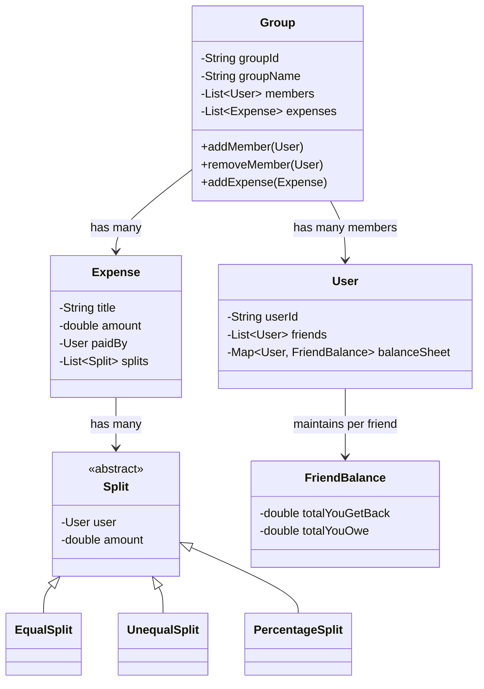
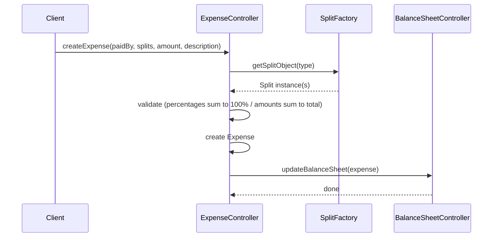
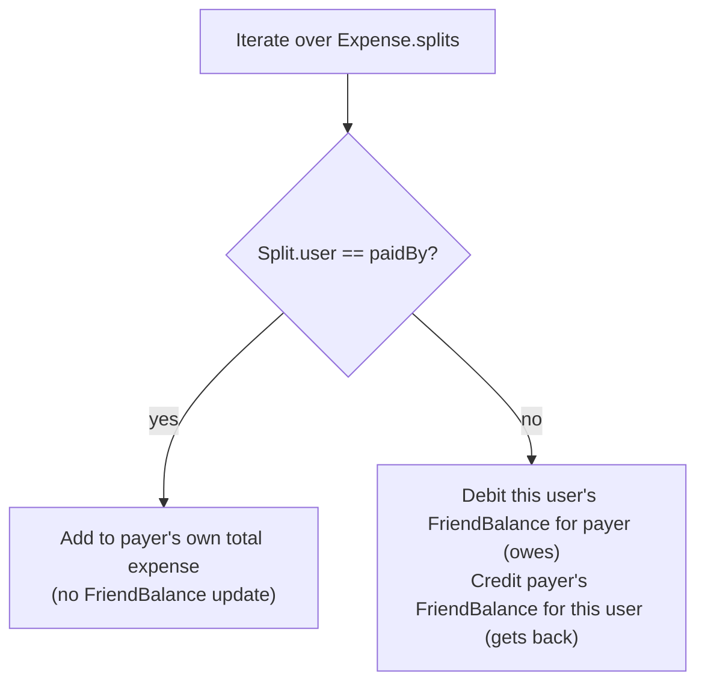
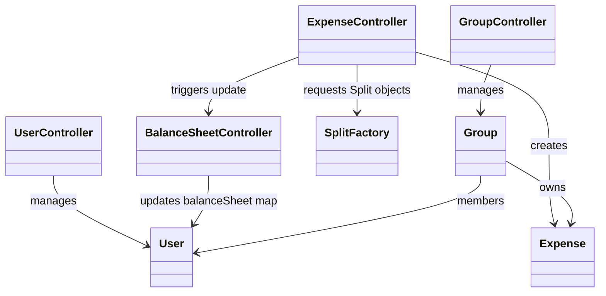
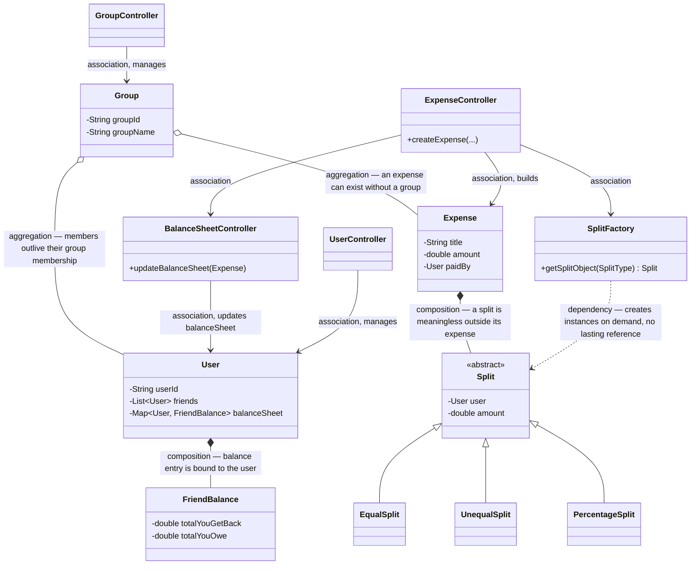
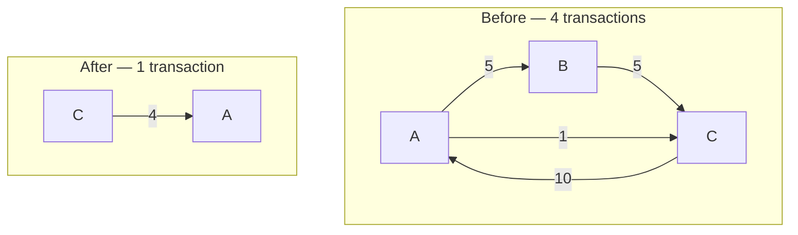
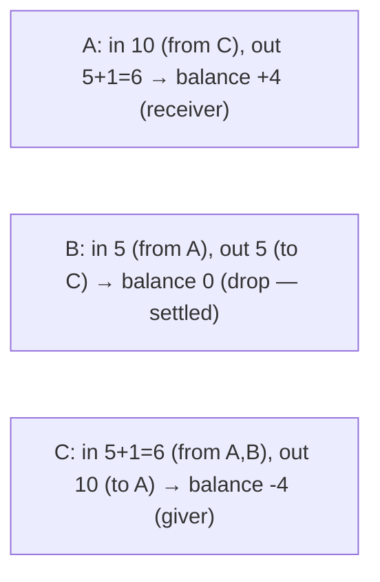
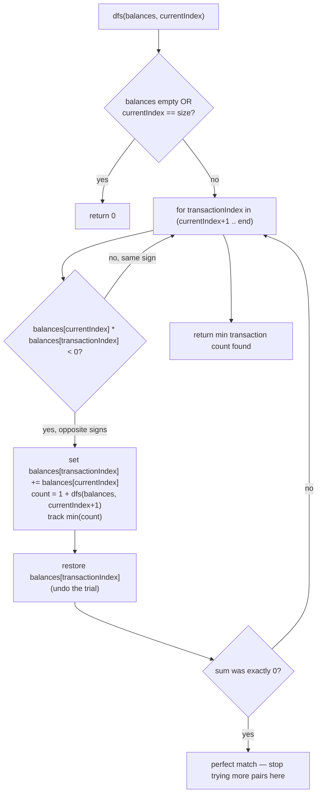

# LLD of Splitwise (Expense Sharing App)

## Overview
- Design an expense-sharing app (Splitwise-style) — a very popular,
  frequently-asked LLD interview question.
- Start from requirement gathering: use the real app's happy path (add
  friends, add a group, add an expense, split it, check balances) to derive
  the requirements instead of guessing them upfront.
- Core design challenge is the **split** abstraction (equal / unequal /
  percentage) and how one expense update correctly fans out into every
  affected user's **balance sheet**.
- Part 2 (below) covers the follow-up interview question asked on top of
  this design: the **Simplify** algorithm that collapses many pairwise
  debts into the fewest possible settlement transactions.

## Key Concepts
### Requirements (from the happy path)
- Add friends to your account.
- Create a group, and add members to that group.
- Create an expense either **inside a group** or **directly between
  friends**, not attached to any group — both flows must be supported.
- When creating an expense, split the amount between friends using one of
  three types: **Equal**, **Unequal** (exact amount per person), or
  **Percentage**.
  - Equal — total divided evenly across the chosen friends.
  - Unequal/Exact — each friend is assigned an explicit amount; all the
    amounts must sum up to the total expense amount.
  - Percentage — each friend is assigned a percentage; all percentages
    must sum up to 100%.
- View a friend's or the whole account's **balance sheet** — how much you
  owe each friend, and how much each friend owes you, with a drill-down
  per friend.
- Removing a member from a group only removes them from that group, not
  from Splitwise itself — group membership and app-wide user identity are
  separate concerns.

### Core entities
- `User` — has a list of friends and maintains its own **balance sheet**:
  a map of friend → `FriendBalance` (how much to get back from / owe that
  specific friend).
- `Group` — groupId, groupName, its own list of member `User`s (add/remove
  member), and its own list of `Expense`s (add/remove expense).
- `Expense` — title/description, total amount, the `User` who paid, and a
  list of `Split`s.
- `Split` — a user and the amount that user owes for this expense; base
  type extended by `EqualSplit`, `UnequalSplit` (exact amount), and
  `PercentageSplit`.
- `FriendBalance` — per-friend running totals: how much you get back from
  this friend, how much you owe this friend.



### Split creation — Factory pattern
- A `SplitFactory` returns the right concrete `Split` implementation
  (`EqualSplit`/`UnequalSplit`/`PercentageSplit`) based on the requested
  split type — same [05. Factory vs Abstract Factory Pattern](../concepts/05-factory-vs-abstract-factory-pattern.md) used
  elsewhere, see the full [00c. Design Patterns Catalog](../concepts/00c-design-patterns-catalog.md).
- For percentage splits, two client scenarios are both valid: the UI
  computes the rupee amount from the percentage client-side and sends the
  amount, **or** the client sends only the percentage and the server
  computes the amount — the design should support either without changing
  the `Expense`/`Split` model.
- This is naturally extensible under OCP: if the server needs to compute
  amount from percentage, that logic can be added inside the
  `PercentageSplit` class itself (a new method) without touching
  `EqualSplit`/`UnequalSplit` or any other class.

```java
enum SplitType { EQUAL, UNEQUAL, PERCENTAGE }

abstract class Split {
    User user;
    double amount;
}
class EqualSplit extends Split { }
class UnequalSplit extends Split { } // exact amount per user
class PercentageSplit extends Split {
    double percentage;
    void computeAmount(double totalAmount) { // extension point, OCP: add without touching other Split types
        this.amount = totalAmount * percentage / 100;
    }
}

class SplitFactory {
    Split getSplitObject(SplitType type) {
        switch (type) {
            case EQUAL: return new EqualSplit();
            case UNEQUAL: return new UnequalSplit();
            case PERCENTAGE: return new PercentageSplit();
        }
        throw new IllegalArgumentException();
    }
}
```

### Creating an expense — validation and flow
- Client calls `ExpenseController.createExpense(...)` with: who paid, the
  split details (which friend owes how much/what percentage), the total
  expense amount, and a description.
- `ExpenseController` asks `SplitFactory` for the right `Split` objects,
  then validates the request before creating the `Expense`:
  - Percentage split — all percentages must add up to 100%.
  - Unequal/exact split — all individual amounts must add up to the total
    expense amount.
- Validation is written as its own extensible step, so a new split type's
  validation rule can be added without touching the others.
- Once valid, `ExpenseController` builds the `Expense` object and calls
  `BalanceSheetController` to update every affected user's balance sheet.



### Updating the balance sheet
- `BalanceSheetController` holds the business logic for turning one
  `Expense` into balance-sheet updates — kept out of `ExpenseController` so
  each controller owns one responsibility.
- It iterates over the expense's `Split`s:
  - The payer's own split is just counted toward their own total spend —
    you don't owe yourself, so it doesn't touch any `FriendBalance`.
  - For every other user in the split, their `FriendBalance` entry for the
    payer is debited ("you owe this friend"), and the payer's
    `FriendBalance` entry for that user is credited ("you get back from
    this friend").
- Because each `User` keeps its own friend → `FriendBalance` map, a
  drill-down per friend (and a rolled-up total) is just a map read/iterate,
  not a fresh computation.
- Same separation-of-concerns reasoning applies to `Group`: group
  membership (`addMember`/`removeMember`) and its own expense list live
  inside `GroupController`/`Group` itself — otherwise that logic would leak
  into the top-level Splitwise app/driver class.



## Trade-offs / Comparisons
| Split type | What's validated | Who computes the amount |
|---|---|---|
| Equal | N/A — computed as total ÷ number of friends | Server |
| Unequal/Exact | Sum of amounts == total expense amount | Client sends explicit amounts |
| Percentage | Sum of percentages == 100% | Either client (UI converts % → amount) or server (extend `PercentageSplit` to compute) |

## Example / Walkthrough
- Create an expense titled "Lunch", amount 400, split between all friends
  in the group.
- Client picks a split type (equal/unequal/percentage) — e.g. percentage,
  assigning each friend a share that must sum to 100%.
- `ExpenseController.createExpense()` gets the split type's `Split` objects
  from `SplitFactory`, validates the percentages sum correctly, builds the
  `Expense`, and hands off to `BalanceSheetController`.
- `BalanceSheetController` walks each `Split`: the payer's own portion adds
  to their own total spend only; every other friend's portion updates two
  `FriendBalance` entries — that friend now owes the payer, and the payer
  now expects to get that amount back from that friend.

## Diagram


## UML Class Diagram
Full class structure with proper UML relationship types (inheritance,
composition, aggregation, association, dependency) instead of generic
arrows:


## Interview Q&A
<details>
<summary>What are the three split types Splitwise must support, and what does each validate?</summary>

Equal (total ÷ number of friends, nothing to validate), Unequal/Exact
(sum of amounts must equal the total expense amount), and Percentage (sum
of percentages must equal 100%).

</details>

<details>
<summary>Which design pattern creates the right Split object, and why use it here?</summary>

Factory — a `SplitFactory` returns the correct `EqualSplit`/`UnequalSplit`/
`PercentageSplit` based on the requested type, keeping `ExpenseController`
free of type-checking/branching logic when new split types are added.

</details>

<details>
<summary>Can an expense exist without being part of a group?</summary>

Yes — an expense can be created either inside a group or directly between
friends with no group attached; both flows must be supported.

</details>

<details>
<summary>Who is responsible for updating balances when an expense is created?</summary>

`BalanceSheetController`, not `ExpenseController` — `ExpenseController`
validates and builds the `Expense`, then calls `BalanceSheetController` to
apply the balance updates, keeping the two responsibilities separate.

</details>

<details>
<summary>How does removing a member from a group affect their Splitwise account?</summary>

It doesn't — removing a member only removes them from that group's own
member list; it has no effect on their app-wide user account or their
existing friend balances.

</details>

<details>
<summary>If a percentage split needs the server to compute the actual amount, where does that logic go?</summary>

Inside `PercentageSplit` itself, as an added method — an OCP-friendly
extension, since `EqualSplit`, `UnequalSplit`, and the rest of the system
don't need to change.

</details>

<details>
<summary>Why does the payer's own portion of an expense not touch their FriendBalance map?</summary>

Because you can't owe yourself — the payer's own split is only added to
their own total spend; only the other participants' splits create entries
in the payer's and their own FriendBalance maps.

</details>

## Part 2 — Simplify Algorithm (Optimal Account Balancing)
- Follow-up interview question on top of the base design: given the raw
  debt transactions (who owes whom, how much), **reduce the number of
  settlement transactions** needed to clear all debts.
- Asked as its own DSA-flavored round at top product-based companies — as
  much a backtracking/DFS problem as an LLD one.
- Hard constraint: the amount each member ultimately owes/receives must
  stay exactly the same — only the number and pairing of transactions
  changes, never the totals.

### The problem
- Example: 3 roommates A, B, C with 4 raw transactions — A owes B ₹5, B
  owes C ₹5, C owes A ₹10, A owes C ₹1.
- By inspection, A→B and B→C can collapse into a direct A→C of ₹5 (B is
  just a pass-through); combined with the existing C→A (₹10) and A→C (₹1),
  the net effect is a single settlement: **C pays A ₹4**.
- 4 transactions become 1 — same money owed overall, far fewer payments.



### Step 1 — net balance per member (incoming − outgoing)
- For every member, compute `balance = total incoming − total outgoing`
  across all their raw transactions.
- Positive balance → a **receiver** (net owed money). Negative balance → a
  **giver** (net owes money). Balance of exactly zero → already settled,
  and **excluded** from the rest of the algorithm — it can never help
  reduce transactions further.
- Sanity check baked into the math: the sum of every member's net balance
  is always zero — the system never creates or destroys money, it only
  reduces how many transfers move it around.



### Step 2 — never split a payoff, always pay in full
- Once reduced to a list of non-zero net balances, only the **positive vs.
  negative pairings** matter — the original transaction graph can be
  thrown away entirely.
- Key rule: when a giver pays a receiver, **always settle with the full
  remaining amount** on at least one side, never a partial/arbitrary
  amount split across many people.
- Why: paying arbitrary partial amounts to several people can actually
  *increase* the transaction count beyond what was needed — always fully
  clearing one side's balance keeps the count minimal to explore.
- Effect of a full-amount payment between a giver and a receiver: the
  smaller-magnitude side becomes exactly zero (done, drops out), and the
  other side's balance is reduced by that amount (it may become the
  opposite sign, flipping receiver ↔ giver, or hit zero too — a **perfect
  match**).

### Step 3 — DFS/backtracking over the balance list
- Reframe as: given the list of non-zero net balances, repeatedly pick a
  positive/negative pair and settle it fully, trying every possible
  pairing (backtracking), and keep the settlement path with the fewest
  transactions.
- At each recursion step, the *current* index is matched in turn against
  every later index; a pair can transact only when their **product is
  negative** (opposite signs). After a match, the later index absorbs the
  combined value (`current + next`) and the current index is considered
  settled (recursion simply advances past it — it's never revisited).
- Backtrack after each trial: restore the array before trying the next
  candidate pairing, since a different pairing at this same step may lead
  to fewer total transactions.
- Optimization: if a pairing sums to exactly zero (**perfect match**, both
  sides fully cleared), stop trying further pairings from this index right
  away — a perfect match can't be beaten from this branch.
- Classified as an **NP-hard** problem — the instructor estimates the
  brute-force backtracking as roughly `O(n!)` in the number of non-zero
  balances, since every member effectively gets tried against every other
  in every order.



```java
Map<Integer, Integer> netBalance = new HashMap<>();
for (int[] transaction : transactions) {
    int from = transaction[0], to = transaction[1], amount = transaction[2];
    netBalance.put(from, netBalance.getOrDefault(from, 0) - amount); // outgoing
    netBalance.put(to, netBalance.getOrDefault(to, 0) + amount);     // incoming
}

List<Integer> balances = new ArrayList<>();
for (int amount : netBalance.values()) {
    if (amount != 0) balances.add(amount); // zero-balance members don't help — drop them
}

int minTransactions = dfs(balances, 0);

int dfs(List<Integer> balances, int currentIndex) {
    if (balances.size() == 0 || currentIndex == balances.size()) return 0;
    if (balances.get(currentIndex) == 0) return dfs(balances, currentIndex + 1); // safety check

    int currentVal = balances.get(currentIndex);
    int minCount = Integer.MAX_VALUE;
    for (int i = currentIndex + 1; i < balances.size(); i++) {
        int nextVal = balances.get(i);
        if (currentVal * nextVal < 0) { // opposite signs -> a settlement can happen
            balances.set(i, currentVal + nextVal);
            minCount = Math.min(minCount, 1 + dfs(balances, currentIndex + 1));
            balances.set(i, nextVal); // backtrack

            if (currentVal + nextVal == 0) break; // perfect match, can't do better from here
        }
    }
    return minCount;
}
```

## Example / Walkthrough — Simplify
- Larger balance list (after dropping zero-balance members): `[70, 300,
  -40, -100, -30, -200]` — receivers `70, 300`, givers `-40, -100, -30,
  -200`. Sum is 0, as expected.
- One branch: settle `70` fully against `-200` → `70` is done (index
  advances past it), `-200` becomes `-200 + 70 = -130`. One transaction
  used so far; recursion continues on the remaining balances.
- A different branch from the same starting point: settle `70` fully
  against `-40` instead → `-40` becomes `70 + (-40) = 30`. Also one
  transaction, but leads down a different remaining state.
- Backtracking tries both (and every other valid opposite-sign pairing)
  and keeps whichever path bottoms out with the fewest total transactions.

### Interview Q&A — Simplify
<details>
<summary>What is the goal of the Splitwise Simplify algorithm?</summary>

Reduce the number of settlement transactions needed to clear all debts in
the group — the amount each member ultimately owes or receives stays
exactly the same, only how many payments it takes changes.

</details>

<details>
<summary>Why can the original transaction graph be discarded once you start simplifying?</summary>

Because only each member's **net balance** (incoming − outgoing) matters
for settlement — two different transaction histories that produce the
same net balances need the exact same simplified settlement.

</details>

<details>
<summary>Why are members with a net balance of zero dropped before the algorithm runs?</summary>

A zero balance means they neither owe nor are owed anything net — they
can't take part in reducing any further transaction, so keeping them only
adds wasted work.

</details>

<details>
<summary>Why must a settlement always transfer the full remaining amount rather than a partial one?</summary>

Because letting a giver split a payment across many receivers (or vice
versa) can increase the total transaction count beyond the minimum —
always fully clearing one side keeps the search space minimal.

</details>

<details>
<summary>What algorithmic technique solves Simplify, and what's its complexity class?</summary>

DFS with backtracking over the list of non-zero balances, trying every
valid opposite-sign pairing and keeping the minimum transaction count; the
problem is NP-hard, with the brute-force search roughly `O(n!)`.

</details>

<details>
<summary>What's the early-exit optimization in the backtracking search?</summary>

If a pairing sums to exactly zero (both sides land at zero — a perfect
match), stop trying other pairings from that index immediately, since a
perfect match can't be improved on from that branch.

</details>

## Related Topics
- [05. Factory vs Abstract Factory Pattern](../concepts/05-factory-vs-abstract-factory-pattern.md) — the Factory pattern used to
  create the correct `Split` implementation.
- [00c. Design Patterns Catalog](../concepts/00c-design-patterns-catalog.md) — full checklist of covered patterns,
  including Factory.
- [14. LLD of BookMyShow](14-bookmyshow-lld.md) — another controller-per-entity case-study LLD with
  the same separation-of-concerns shape.
