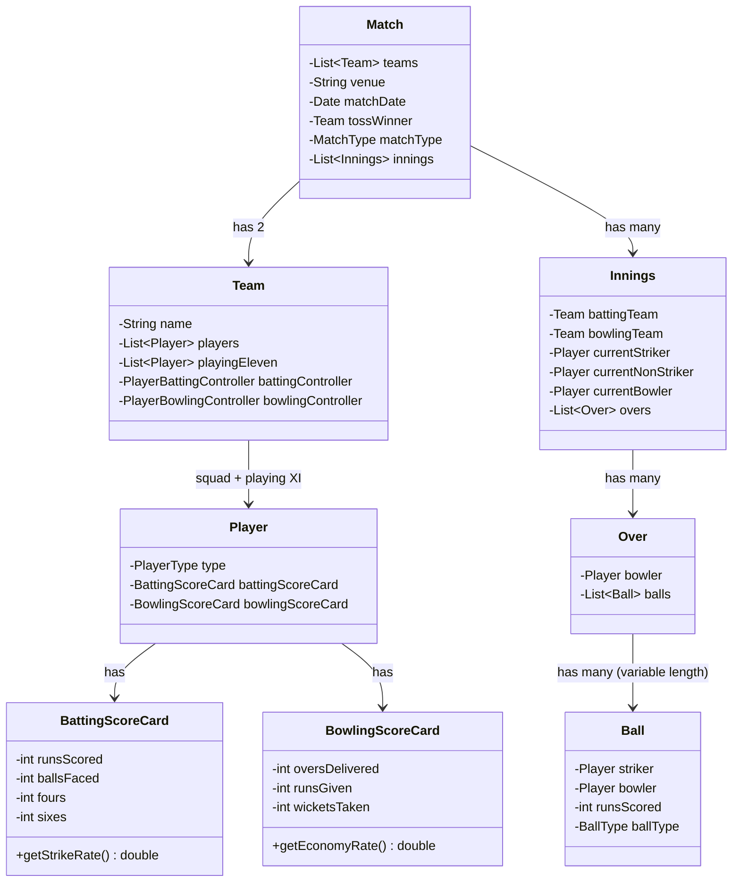
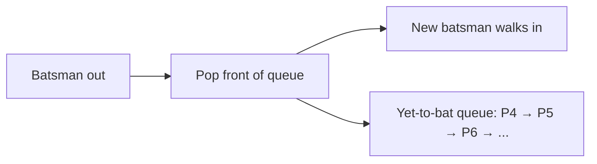
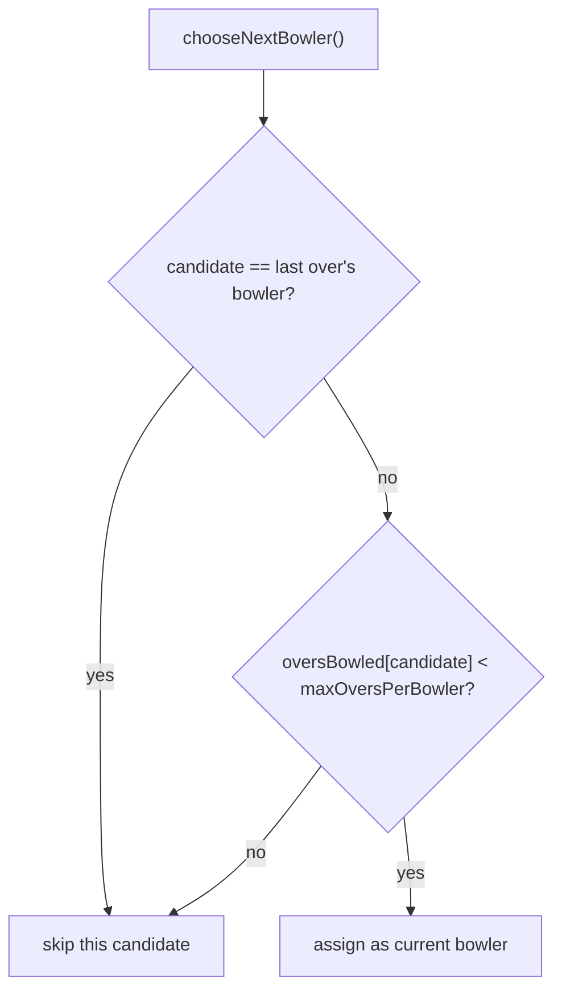
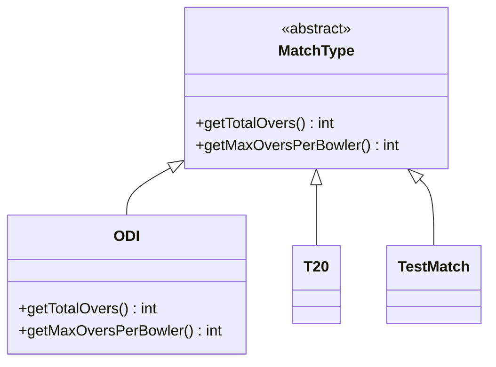
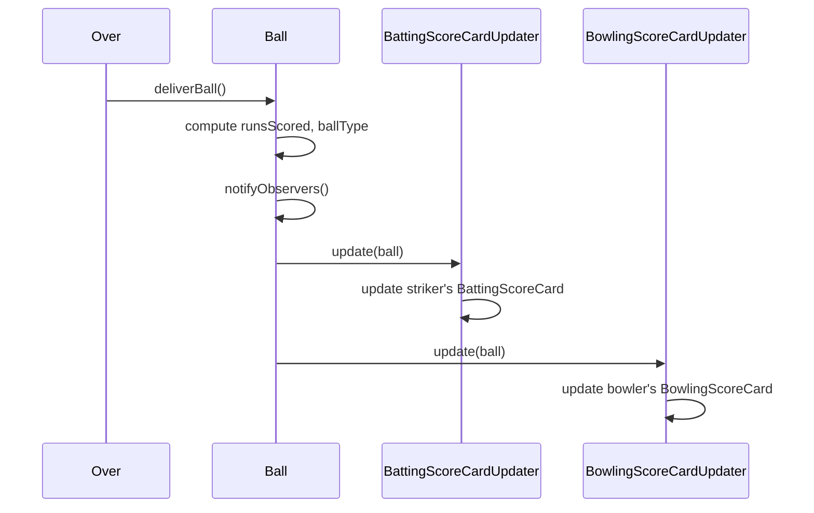
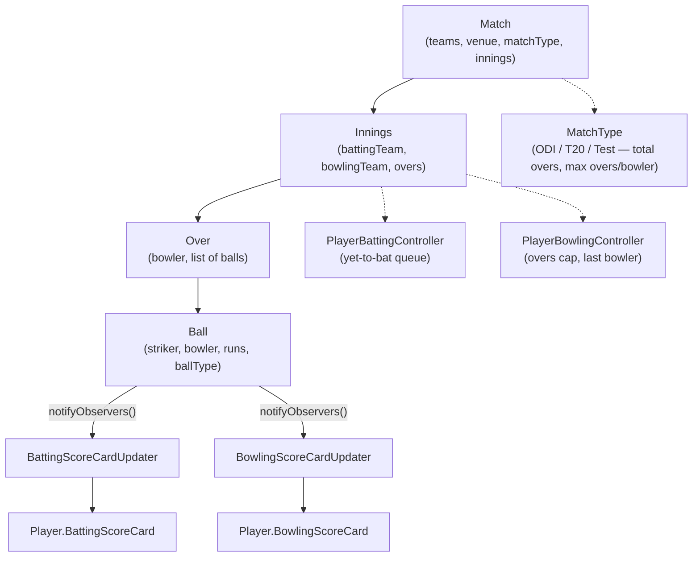

# LLD of Cricbuzz / CricInfo

## Overview
- Design a live cricket scoring app (Cricbuzz/CricInfo-style) — a very
  important, frequently-asked LLD interview question.
- Happy path from the real app: a list of ongoing matches → click into one
  → see its scorecard, which updates **ball by ball** in near real time.
- Core design challenge: modeling the Match → Innings → Over → Ball
  hierarchy so that a single ball event can fan out and update every
  affected player's scorecard without the ball itself knowing about all
  its consumers — solved with the Observer pattern.

## Key Concepts
### Requirements (from the happy path)
- Show a list of ongoing matches; clicking one opens its scorecard.
- The scorecard must reflect the latest state after every single ball
  bowled — batting figures (runs, balls faced, strike rate) and bowling
  figures (overs, runs given, wickets, economy rate) both update live.

### Core entities
- `Match` — the two `Team`s, venue, match date/time, the toss-winning
  team, a `MatchType`, and its list of `Innings`.
- `Team` — name, full squad of `Player`s, the **Playing XI** for this
  match, plus its own `PlayerBattingController` and
  `PlayerBowlingController`.
- `Player` — extends `Person` (name, address, personal details), plus a
  `PlayerType`; every player carries both a `BattingScoreCard` and a
  `BowlingScoreCard`, since any player can potentially bat or bowl (an
  all-rounder does both).
- `BattingScoreCard` — runs scored, balls faced, fours, sixes, and a
  computed strike rate.
- `BowlingScoreCard` — overs delivered, runs given, wickets taken, and a
  computed economy rate.
- `Innings` — the batting/bowling `Team` for this innings (they swap
  between innings), current striker/non-striker, current bowler, and its
  list of `Over`s.
- `Over` — the bowler for this over and its list of `Ball`s. The list
  length isn't fixed at 6 — wides and no-balls add extra deliveries that
  don't count toward the over's legal-ball limit.
- `Ball` — the striker, the bowler, runs scored on this delivery, and the
  delivery type (normal, wide, no-ball, etc.).



### PlayerBattingController — who bats next
- Maintains a **queue** of the Playing XI's yet-to-bat players, in batting
  order.
- Every time a batsman gets out, the controller pops the player from the
  **front** of the queue to send in next.
- The queue only shrinks as players get out — once it's empty, the
  innings ends (all out).



```java
class PlayerBattingController {
    Queue<Player> yetToBat = new LinkedList<>(); // batting order for the Playing XI

    Player getNextBatsman() {
        return yetToBat.poll(); // front of the queue; queue shrinks as players get out
    }
}
```

### PlayerBowlingController — who bowls next
- Enforces two rules from real cricket: a bowler can only bowl up to a
  match-type-specific maximum number of overs, and the **same bowler
  can't bowl two overs in a row**.
- Tracks overs bowled so far per player, and remembers who bowled the
  immediately preceding over.



```java
class PlayerBowlingController {
    Map<Player, Integer> oversBowledByPlayer = new HashMap<>();
    Player lastOverBowler;

    Player chooseNextBowler(MatchType matchType, List<Player> eligibleBowlers) {
        int maxOvers = matchType.getMaxOversPerBowler();
        for (Player p : eligibleBowlers) {
            if (p.equals(lastOverBowler)) continue; // can't repeat the previous over's bowler
            if (oversBowledByPlayer.getOrDefault(p, 0) < maxOvers) {
                lastOverBowler = p;
                return p;
            }
        }
        throw new IllegalStateException("No eligible bowler available");
    }
}
```

### MatchType — format-specific rules via polymorphism
- Different formats (ODI, T20, Test) have different total-overs and
  max-overs-per-bowler limits — modeled as an abstract `MatchType` with
  one subclass per format, each overriding the same two methods.
- The video states ODI's numbers clearly: 50 total overs, 10 max overs
  per bowler. T20's total overs is stated as 20; its exact max-per-bowler
  figure was unclear/inconsistent in the source audio, so it's left as a
  placeholder below rather than asserted with false confidence (real-world
  T20 rule is 4 overs per bowler).
- `Innings`/`PlayerBowlingController` call into `matchType` for these
  limits instead of hardcoding numbers — a new format is just a new
  subclass, no existing code changes (OCP).



```java
abstract class MatchType {
    abstract int getTotalOvers();
    abstract int getMaxOversPerBowler();
}
class ODI extends MatchType {
    int getTotalOvers() { return 50; }
    int getMaxOversPerBowler() { return 10; }
}
class T20 extends MatchType {
    int getTotalOvers() { return 20; }
    int getMaxOversPerBowler() { return 4; } // exact figure was unclear in the source video; 4 is the real-world T20 rule
}
class TestMatch extends MatchType {
    int getTotalOvers() { return Integer.MAX_VALUE; } // no over cap per innings
    int getMaxOversPerBowler() { return Integer.MAX_VALUE; } // no per-bowler cap
}
```

### Ball delivery — Observer pattern for scorecard updates
- Each `Ball` doesn't update the batting/bowling scorecards directly —
  it holds a list of `ScoreCardUpdater` observers and calls `notify()`
  after the delivery, same shape as [03. Observer Design Pattern](../concepts/03-observer-design-pattern.md).
- Two concrete observers: `BattingScoreCardUpdater` (updates the
  striker's `BattingScoreCard`) and `BowlingScoreCardUpdater` (updates the
  bowler's `BowlingScoreCard`) — both subscribe to every ball.
- Because it's Observer, a new consumer (e.g. a live commentary feed, a
  push-notification service) can subscribe to ball events without
  `Ball`/`Over` ever changing.



```java
interface ScoreCardUpdater {
    void update(Ball ball);
}
class BattingScoreCardUpdater implements ScoreCardUpdater {
    public void update(Ball ball) {
        ball.striker.battingScoreCard.ballsFaced++;
        ball.striker.battingScoreCard.runsScored += ball.runsScored;
    }
}
class BowlingScoreCardUpdater implements ScoreCardUpdater {
    public void update(Ball ball) {
        ball.bowler.bowlingScoreCard.runsGiven += ball.runsScored;
    }
}

class Ball {
    Player striker, bowler;
    int runsScored;
    BallType ballType;
    List<ScoreCardUpdater> observers = new ArrayList<>();

    void deliverBall() {
        // ... compute runsScored, ballType ...
        notifyObservers();
    }
    void notifyObservers() {
        for (ScoreCardUpdater observer : observers) observer.update(this);
    }
}
```

## Trade-offs / Comparisons
- **Without Observer** — `Ball`/`Over` would need to know about, and
  directly call, every kind of scorecard/consumer that cares about a
  delivery; adding a new consumer means editing `Ball` itself.
- **With Observer** — `Ball` only knows about the generic
  `ScoreCardUpdater` interface; adding commentary, notifications, or any
  other ball-driven feature is a new observer class, zero changes to
  `Ball`/`Over`.

## Example / Walkthrough
- Setup: two teams are created; the toss winner is assumed (per the demo)
  to choose to bat first, so that team becomes the batting team for
  Innings 1 and the other becomes the bowling team.
- `PlayerBattingController` supplies the opening striker and non-striker
  from the front of the yet-to-bat queue before the innings starts.
- Each over: `PlayerBowlingController.chooseNextBowler()` picks a bowler
  who isn't the previous over's bowler and hasn't hit their overs cap
  (from `MatchType`), then the over runs ball by ball.
- Each ball: a delivery is simulated (the demo used a random run generator
  — 0/1/2/3/4/6 — purely to demonstrate the flow, not real match logic),
  then `Ball.notifyObservers()` fires, updating both the striker's batting
  scorecard and the bowler's bowling scorecard for that delivery.
- When a batsman gets out, `PlayerBattingController` pops the next
  player from the queue to keep the innings going.

## Diagram


## Interview Q&A
<details>
<summary>What's the core object hierarchy for modeling a live cricket match?</summary>

Match → Innings → Over → Ball, with Match holding two Teams (each with a
squad, a Playing XI, and its own batting/bowling controllers), and every
Player carrying both a BattingScoreCard and a BowlingScoreCard.

</details>

<details>
<summary>Why is an Over's list of balls not fixed at exactly 6?</summary>

Wides and no-balls add extra deliveries to the over without counting as
one of its legal balls, so the list length is dynamic per over.

</details>

<details>
<summary>Why does PlayerBattingController use a queue for yet-to-bat players?</summary>

Batting order is a strict front-to-back sequence — when a batsman gets
out, the next one in line comes from the front of the queue, and the
queue only ever shrinks as players get out.

</details>

<details>
<summary>What two rules does PlayerBowlingController enforce when picking the next bowler?</summary>

A bowler can't exceed the match-type's max-overs-per-bowler limit, and the
same bowler can't bowl two overs in a row — enforced via a
per-player overs-bowled count plus tracking the last over's bowler.

</details>

<details>
<summary>How does the design handle different match formats (ODI/T20/Test) having different over limits?</summary>

An abstract `MatchType` with one subclass per format, each overriding
`getTotalOvers()` and `getMaxOversPerBowler()` — adding a new format is a
new subclass, no existing code changes.

</details>

<details>
<summary>Which design pattern updates scorecards after each ball, and why use it here?</summary>

Observer — `Ball` holds a list of `ScoreCardUpdater` observers and calls
`notify()` after each delivery, so `BattingScoreCardUpdater` and
`BowlingScoreCardUpdater` (or any future consumer, like live commentary)
can react without `Ball` itself knowing about them.

</details>

<details>
<summary>Why does every Player carry both a BattingScoreCard and a BowlingScoreCard, even non-bowlers?</summary>

Because any player can potentially do either job during a match (an
all-rounder does both), so both scorecards live on `Player` rather than
being split across separate batsman/bowler subtypes.

</details>

## Related Topics
- [03. Observer Design Pattern](../concepts/03-observer-design-pattern.md) — the pattern used to fan out ball events to scorecard updaters.
- [14. LLD of BookMyShow](14-bookmyshow-lld.md) — another controller-driven case-study LLD with the same requirements-first approach.
- [21. LLD of Splitwise](21-splitwise-lld.md) — another case study using polymorphic per-type behavior (Split types there, MatchType here).
