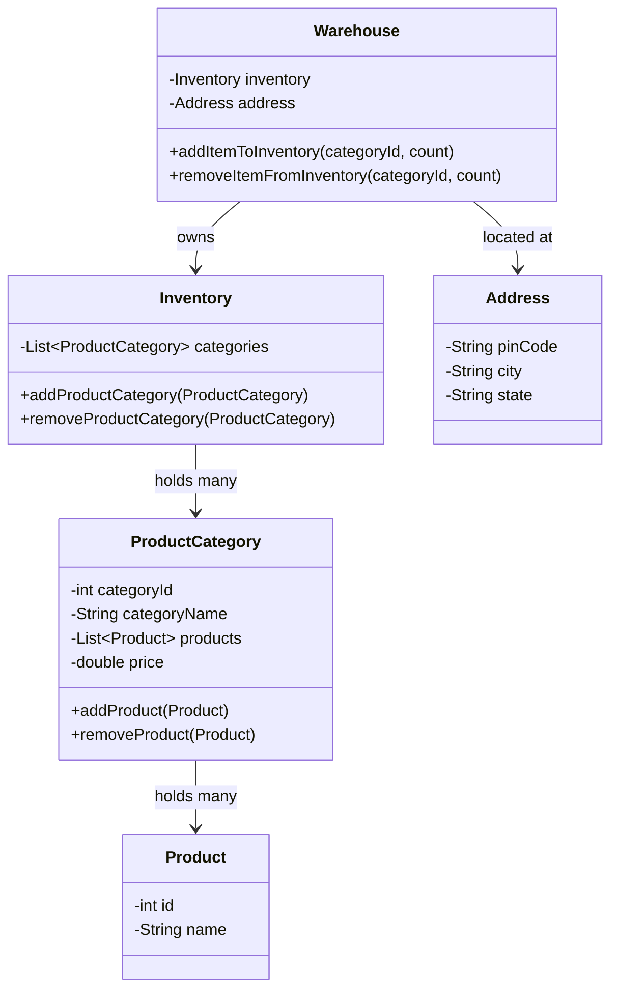
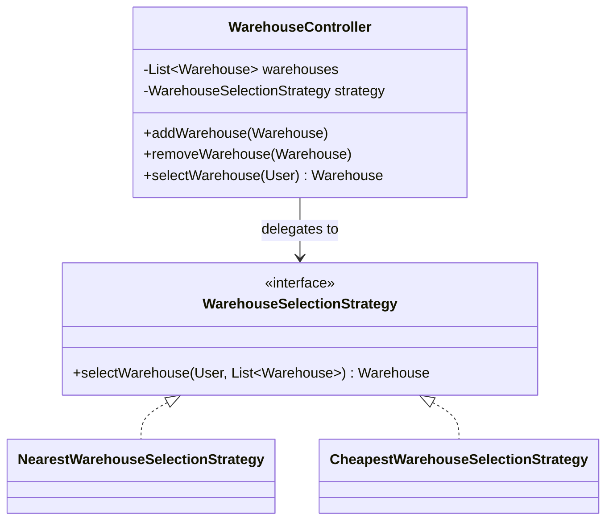
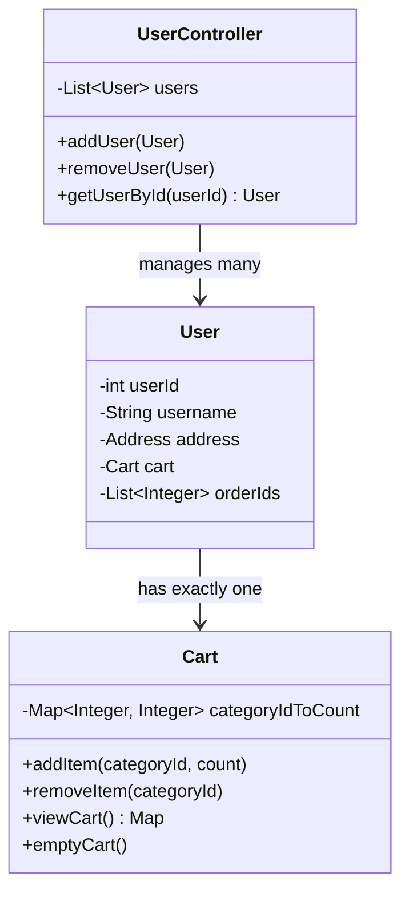
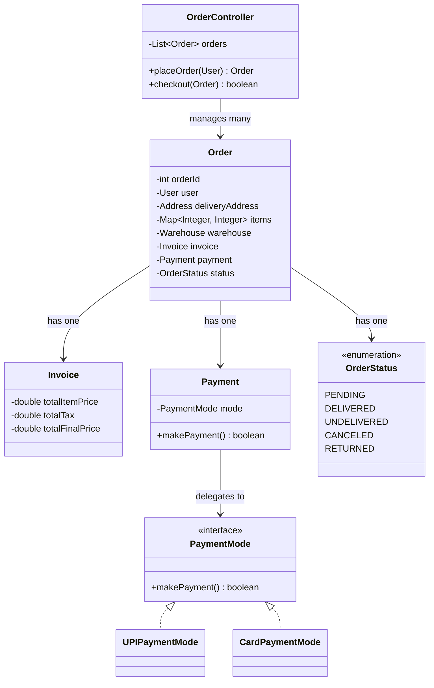
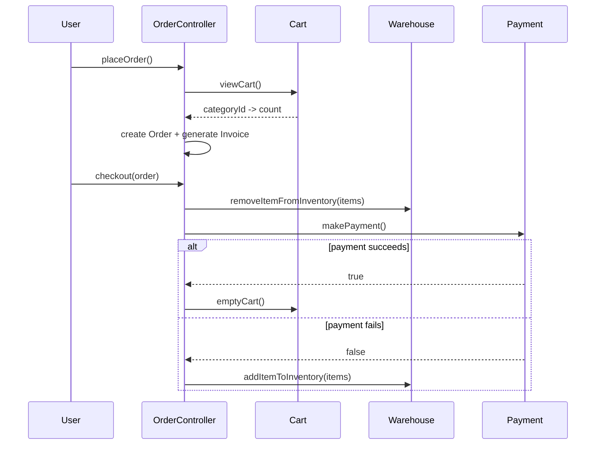
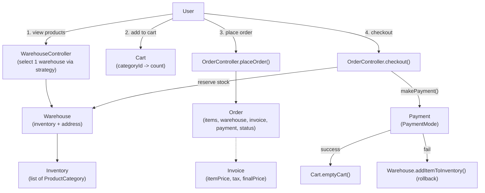
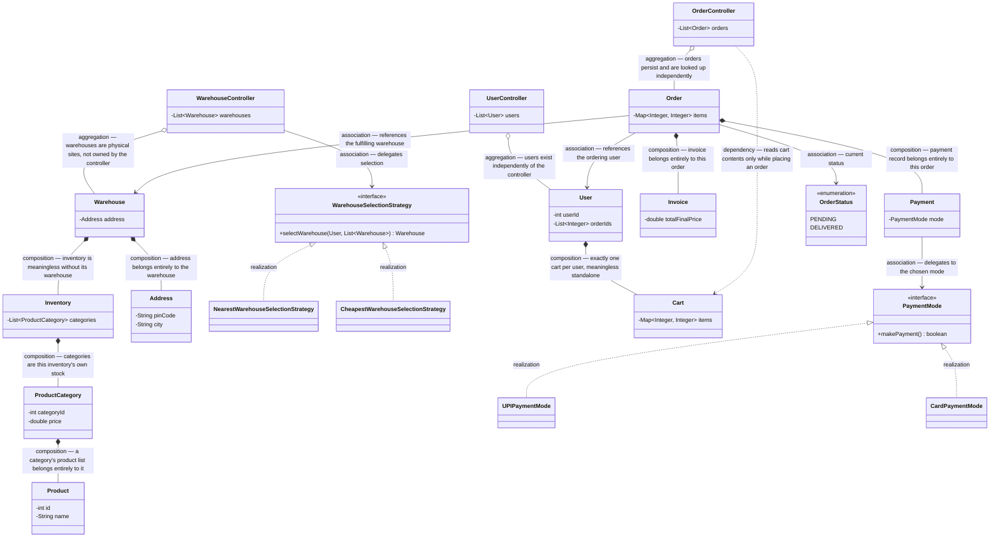

# LLD of Order Management System / Inventory Management System

## Overview
- Design an e-commerce-style ordering flow (Zepto-like) — the question is
  really two tightly coupled questions: **Order Management** (cart →
  place order → invoice → payment) and **Inventory Management** (products,
  categories, warehouses, stock).
- Happy path: user views products → adds products to cart → places order
  (generates an invoice: tax + final amount + delivery address) → pays
  (checkout).
- Core design challenge beyond the happy path: an inventory is spread
  across **multiple warehouses at different locations**, and a single
  order must be fulfilled entirely from **one** warehouse — items can't be
  split across warehouses.

## Key Concepts
### Product, category, and inventory
- `Product` — id, name (no price on the product itself).
- `ProductCategory` — id, name, list of `Product`s, and **one shared
  price for the whole category**. Real apps never show a customer
  thousands of near-identical items to pick from one by one — they show
  one category (e.g. "Brand X Cola") and let the user pick a count. Price
  only needs to live once, at category level.
- `Inventory` — a warehouse's stock: a list of `ProductCategory`, with
  add/remove-category methods.
- `Warehouse` — owns one `Inventory` and an `Address`; exposes
  add-item-to-inventory / remove-item-from-inventory.
- `Address` — pinCode, city, state.



### Warehouse selection — Strategy pattern
- A system runs many warehouses across cities; whichever warehouse gets
  picked for a user must fulfill the **entire** order, so selection
  happens once, before showing inventory — not per product.
- `WarehouseController` holds the list of all `Warehouse`s plus a
  pluggable `WarehouseSelectionStrategy` — same shape as
  [02. Strategy Design Pattern](../concepts/02-strategy-design-pattern.md).
- Concrete strategies: `NearestWarehouseSelectionStrategy`,
  `CheapestWarehouseSelectionStrategy` — which one runs could depend on
  user preference, swapped without touching `WarehouseController`.



```java
interface WarehouseSelectionStrategy {
    Warehouse selectWarehouse(User user, List<Warehouse> warehouses);
}
class NearestWarehouseSelectionStrategy implements WarehouseSelectionStrategy {
    public Warehouse selectWarehouse(User user, List<Warehouse> warehouses) {
        // pick warehouse whose Address is nearest to user.address
        return warehouses.get(0); // simplified in the demo
    }
}
class WarehouseController {
    List<Warehouse> warehouses = new ArrayList<>();
    WarehouseSelectionStrategy strategy;

    Warehouse selectWarehouse(User user) {
        return strategy.selectWarehouse(user, warehouses);
    }
}
```

### User and cart
- `User` — id, username, `Address`, **one** `Cart` (1:1 — every user gets
  exactly one active cart, never many), and a list of order **ids** (not
  full `Order` objects — order detail lives in `OrderController`, the
  user just needs a handle to look it up).
- `Cart` — `Map<categoryId, count>`, mirroring the category-level
  browsing: the cart doesn't store individual products, just "this
  category, this many." Exposes addItem / removeItem / viewCart /
  emptyCart.
- `UserController` — list of `User`s; add/remove/getUserById.



```java
class Cart {
    Map<Integer, Integer> categoryIdToCount = new HashMap<>(); // categoryId -> count

    void addItem(int categoryId, int count) {
        categoryIdToCount.merge(categoryId, count, Integer::sum);
    }
    void removeItem(int categoryId) {
        categoryIdToCount.remove(categoryId);
    }
    void emptyCart() {
        categoryIdToCount.clear();
    }
}
```

### Order, invoice, and payment
- `Order` — the user it belongs to, delivery `Address`, the same
  `Map<categoryId, count>` copied over from the cart, the `Warehouse`
  fulfilling it, an `Invoice`, a `Payment`, and an `OrderStatus`.
- `Invoice` — totalItemPrice, totalTax, totalFinalPrice — generated the
  moment an order is created from the cart contents.
- `Payment` — a `PaymentMode` (`UPIPaymentMode`, `CardPaymentMode`, ...)
  and `makePayment()`.
- `OrderStatus` — enum: `PENDING`, `DELIVERED`, `UNDELIVERED`, `CANCELED`,
  `RETURNED`.
- `OrderController` — list of all `Order`s; exposes `placeOrder()` and
  `checkout()`, plus lookups like get-order-by-id / get-orders-by-user.



### Place order → checkout flow
- `placeOrder()`: read the user's `Cart`, copy its category→count map
  into a new `Order`, attach the selected `Warehouse` and delivery
  address, generate the `Invoice` — cart is **not** cleared yet.
- `checkout()`, in order: (1) remove the ordered items from the
  warehouse's `Inventory`, (2) attempt `makePayment()`, (3a) on success,
  empty the cart, (3b) on failure (or timeout), add the items **back**
  to the inventory — inventory is reserved optimistically at checkout
  time, not at place-order time.



```java
class OrderController {
    List<Order> orders = new ArrayList<>();

    Order placeOrder(User user, Warehouse warehouse) {
        Order order = new Order();
        order.user = user;
        order.deliveryAddress = user.address;
        order.items = new HashMap<>(user.cart.categoryIdToCount); // copy cart -> order
        order.warehouse = warehouse;
        order.invoice = generateInvoice(order.items, warehouse);
        orders.add(order);
        return order;
    }

    boolean checkout(Order order) {
        order.warehouse.removeItemFromInventory(order.items);
        boolean paymentSuccess = order.payment.makePayment();
        if (paymentSuccess) {
            order.user.cart.emptyCart();
        } else {
            order.warehouse.addItemToInventory(order.items); // roll back reservation
        }
        return paymentSuccess;
    }
}
```

## Trade-offs / Comparisons
- **Category-level cart (`Map<categoryId, count>`) vs. per-product
  cart** — category-level matches how the UI actually works (pick one
  card, bump a counter) and keeps price lookups to one place (the
  category); a per-product cart would need per-product pricing and would
  force showing every near-duplicate SKU to the user.
- **Nearest vs. cheapest warehouse selection** — both are just
  `WarehouseSelectionStrategy` implementations; nearest optimizes
  delivery time, cheapest optimizes cost, and either can be swapped in
  per user preference without touching `WarehouseController`.
- **Reserve inventory at place-order vs. at checkout** — this design
  reserves (removes from inventory) only at `checkout()`, right before
  payment, so an order that's created but never paid for doesn't lock up
  stock indefinitely.

## Example / Walkthrough
- Setup: create a `Warehouse`, add two `ProductCategory`s to its
  `Inventory` (e.g. a cold-drink category and a soap category, each with
  its own price), add a couple of `Product`s into the cold-drink
  category, and register the warehouse with `WarehouseController`.
  Create a `User` and register it with `UserController`.
- User arrives → `UserController.getUserById()` fetches the `User` →
  `WarehouseController.selectWarehouse()` runs the nearest-warehouse
  strategy and assigns one `Warehouse` to this session.
- Inventory is shown from `warehouse.inventory` (the selected warehouse's
  categories only — never mixed with another warehouse's stock).
- User adds 2 units of a category to cart → `Cart.addItem(categoryId,
  2)`.
- User places the order → `OrderController.placeOrder()` builds an
  `Order` from the cart contents, attaches the warehouse, and generates
  an `Invoice`.
- User checks out → `OrderController.checkout()` removes the items from
  the warehouse's inventory, then calls `makePayment()` on the chosen
  `PaymentMode` (UPI in the demo, returned `true`) → cart is emptied on
  success.

## Diagram


## UML Class Diagram


## Interview Q&A
<details>
<summary>Why does price live on ProductCategory instead of on Product?</summary>

All products within one category share the same price in this design, and
the UI only ever shows the user one category with a count selector — never
a list of individual near-duplicate products — so price only needs to be
looked up once per category.

</details>

<details>
<summary>Why must an entire order be fulfilled from a single warehouse?</summary>

Splitting one order's items across multiple warehouses would mean
multiple separate deliveries for what the user experiences as one order —
not how real fulfillment works — so warehouse selection happens once,
before inventory is even shown, via `WarehouseController`.

</details>

<details>
<summary>Which design pattern picks which warehouse serves a user, and why?</summary>

Strategy — `WarehouseController` holds a swappable
`WarehouseSelectionStrategy` (e.g. nearest, cheapest) so the selection
algorithm can change per user preference without any change to
`WarehouseController` itself.

</details>

<details>
<summary>Why does Cart store Map&lt;categoryId, count&gt; instead of a list of Products?</summary>

The user picks a category and a quantity, not individual product
instances — so the cart's shape matches the browsing shape, and price for
the whole line item comes from one category lookup.

</details>

<details>
<summary>Why does User hold a list of order IDs instead of a list of Order objects?</summary>

Order detail (items, invoice, payment, status) is owned and looked up
through `OrderController`; the user only needs a handle to find its past
orders, so duplicating full `Order` objects on `User` would be redundant
state to keep in sync.

</details>

<details>
<summary>What happens to inventory if payment fails during checkout?</summary>

Items were optimistically removed from the warehouse's inventory at the
start of `checkout()`; on payment failure (or timeout), they're added
back via `Warehouse.addItemToInventory()` to roll back the reservation.

</details>

<details>
<summary>Why is inventory reserved at checkout rather than at place-order time?</summary>

An order can be created (with an invoice) without ever being paid for; if
stock were reserved at place-order time instead, an abandoned order would
lock up inventory indefinitely, so reservation is deferred to the
checkout step right before payment.

</details>

## Related Topics
- [02. Strategy Design Pattern](../concepts/02-strategy-design-pattern.md) — the pattern behind swappable warehouse-selection algorithms.
- [24. LLD of Cricbuzz / CricInfo](24-cricbuzz-lld.md) — another controller-driven case study (`XController` owns a list + orchestrates), same overall shape as `WarehouseController`/`UserController`/`OrderController` here.
- [21. LLD of Splitwise](21-splitwise-lld.md) — another case study with a small pluggable-mode interface (Split types there, PaymentMode here).
