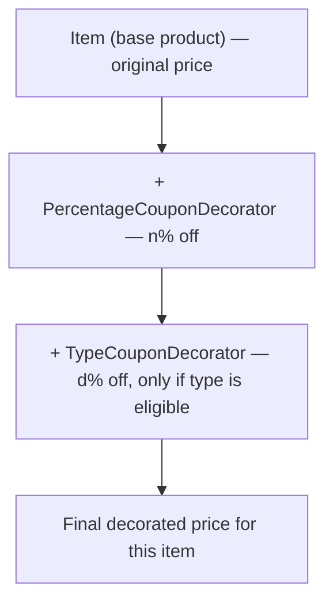
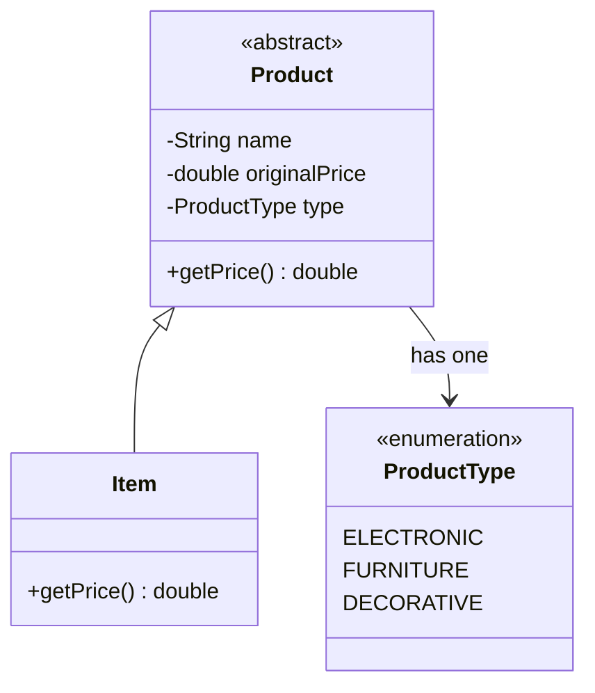
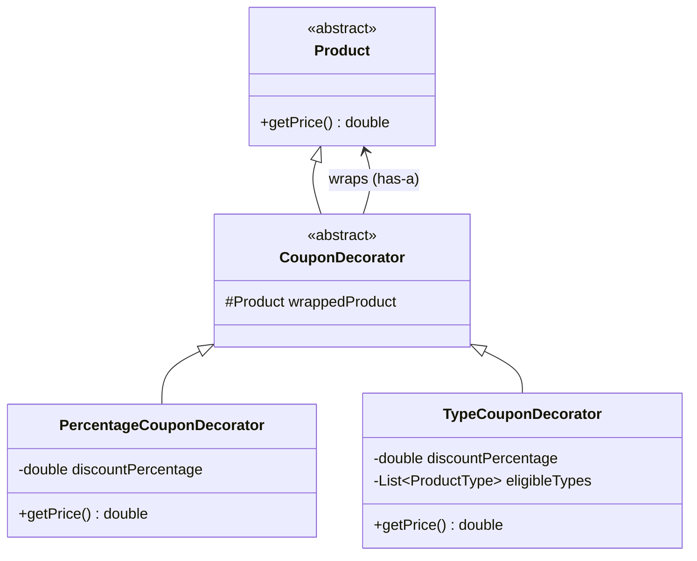
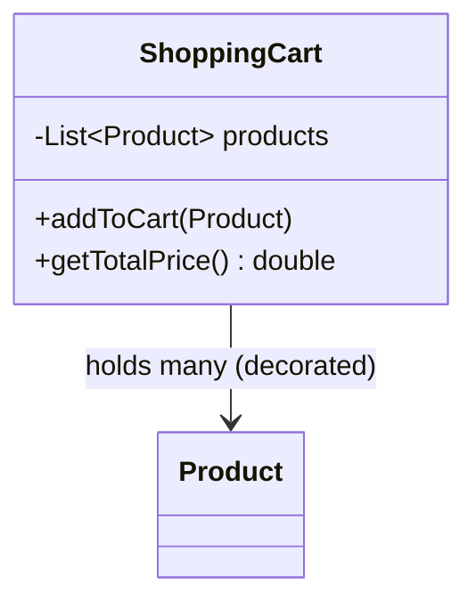
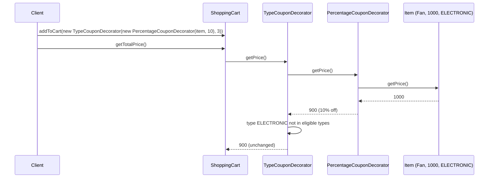
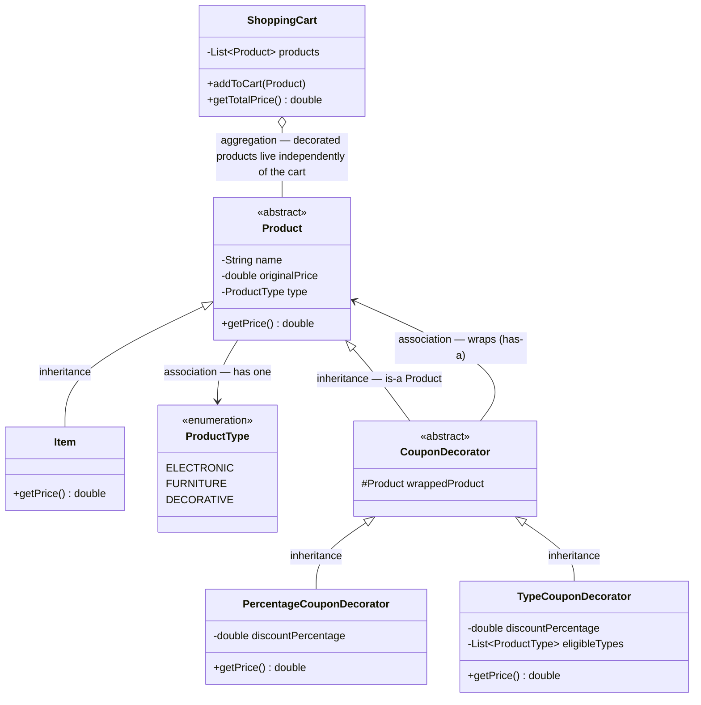

# LLD: Apply Coupons on Shopping Cart Products

## Overview
- Real interview question (shared by a community member after their actual
  interview): given a shopping cart of products and a set of coupons,
  compute the net price after applying coupons to each product.
- Coupons can be different types with different conditions, e.g. **n% off**
  on every individual product, **p% off** on the next item, **d% off** on
  n items of a given type — and more coupon types can be added later.
- Each product can be eligible for **more than one** coupon at once, applied
  in sequence, and the final answer is the total cart price after all
  applicable coupons are applied to every product.
- Deliberately scoped narrow — no `User`, `Payment`, `Invoice`, or full
  inventory management; the question is specifically about composable
  coupon application on cart items, not a full e-commerce system (compare
  [29. LLD of Order/Inventory Management System](29-inventory-management-system-lld.md),
  which does cover that broader scope).

## Key Concepts
### Recognizing this as a Decorator problem
- A product can pass through coupon 1, then coupon 2, then coupon 3 — each
  coupon takes the price coming out of the previous step and further
  discounts it, without the original product object ever being modified.
- That's exactly the shape of [04. Decorator Design Pattern](../concepts/04-decorator-design-pattern.md):
  start from a base component, wrap it in layers, each layer adds behavior
  (here, a further discount) on top of what it wraps, and every layer is
  still usable wherever the base type is expected.
- Any number of coupons can be layered onto a product, and new coupon types
  can be added later as new decorator classes — no change needed to
  `Product` or `ShoppingCart` itself.



### Product hierarchy
- `Product` — abstract class: `name`, `originalPrice`, `type`
  (`ProductType` enum, e.g. `ELECTRONIC`, `FURNITURE`, `DECORATIVE`);
  declares an abstract `getPrice()`.
- Concrete items (`Item1`, `Item2`, ...) extend `Product` — their
  `getPrice()` simply returns `originalPrice` (no discount applied yet).



```java
enum ProductType { ELECTRONIC, FURNITURE, DECORATIVE }

abstract class Product {
    protected String name;
    protected double originalPrice;
    protected ProductType type;

    Product(String name, double originalPrice, ProductType type) {
        this.name = name;
        this.originalPrice = originalPrice;
        this.type = type;
    }

    abstract double getPrice();
}

class Item extends Product {
    Item(String name, double originalPrice, ProductType type) {
        super(name, originalPrice, type);
    }
    double getPrice() { return originalPrice; } // no discount yet — base case
}
```

### CouponDecorator hierarchy
- `CouponDecorator` — abstract class, **extends `Product`** (is-a
  `Product`) — this is what lets decorated products be stacked and passed
  around wherever a plain `Product` is expected.
- `PercentageCouponDecorator` — wraps a `Product` (has-a) plus a
  `discountPercentage`; `getPrice()` = `wrapped.getPrice() * (1 -
  discountPercentage)` — a flat percentage off whatever price it receives.
- `TypeCouponDecorator` — wraps a `Product` plus a `discountPercentage` and
  a static list of eligible `ProductType`s (e.g. `FURNITURE`,
  `DECORATIVE`); `getPrice()` first gets `wrapped.getPrice()`, then applies
  its own discount **only if** the underlying product's type is in the
  eligible list — otherwise passes the price through unchanged.
- Both is-a (`Product`) and has-a (wraps a `Product`) apply here — same
  dual relationship as [04. Decorator Design Pattern](../concepts/04-decorator-design-pattern.md)
  and [13. Proxy Design Pattern](../concepts/13-proxy-design-pattern.md).



```java
abstract class CouponDecorator extends Product {
    protected Product wrappedProduct;

    CouponDecorator(Product wrappedProduct) {
        super(wrappedProduct.name, wrappedProduct.originalPrice, wrappedProduct.type);
        this.wrappedProduct = wrappedProduct;
    }
}

class PercentageCouponDecorator extends CouponDecorator {
    private final double discountPercentage;

    PercentageCouponDecorator(Product wrappedProduct, double discountPercentage) {
        super(wrappedProduct);
        this.discountPercentage = discountPercentage;
    }

    double getPrice() {
        double price = wrappedProduct.getPrice();
        return price - (price * discountPercentage / 100); // flat % off, always applies
    }
}

class TypeCouponDecorator extends CouponDecorator {
    private static final List<ProductType> ELIGIBLE_TYPES =
        List.of(ProductType.FURNITURE, ProductType.DECORATIVE);
    private final double discountPercentage;

    TypeCouponDecorator(Product wrappedProduct, double discountPercentage) {
        super(wrappedProduct);
        this.discountPercentage = discountPercentage;
    }

    double getPrice() {
        double price = wrappedProduct.getPrice();
        if (!ELIGIBLE_TYPES.contains(this.type)) {
            return price; // not eligible — pass through unchanged
        }
        return price - (price * discountPercentage / 100);
    }
}
```

### ShoppingCart
- `ShoppingCart` — holds `List<Product>`; note the list stores the
  **decorated** product (the outermost decorator), not the raw `Item` —
  every decorator is still a `Product`, so this is transparent to the cart.
- `addToCart(product)` — the caller wraps a raw `Item` in whichever coupon
  decorators apply (business logic decides which coupons to stack, and in
  what order) before adding it to the list.
- `getTotalPrice()` — iterates the list and sums `product.getPrice()` for
  each entry; each call transparently walks that item's whole decorator
  chain.



```java
class ShoppingCart {
    private final List<Product> products = new ArrayList<>();

    void addToCart(Product product) {
        products.add(product); // already decorated with applicable coupons
    }

    double getTotalPrice() {
        double total = 0;
        for (Product product : products) {
            total += product.getPrice(); // walks the whole decorator chain
        }
        return total;
    }
}
```

## Trade-offs / Comparisons
- **Decorator vs. hardcoded discount logic in Product** — hardcoding every
  possible coupon combination into `Product.getPrice()` would violate
  Open/Closed: every new coupon type would require editing that method.
  Decorator lets each coupon be its own class, stacked at the call site.
- **Storing the decorated product vs. storing raw item + coupon list** —
  this design stores the already-wrapped product directly in the cart, so
  `getTotalPrice()` stays a simple sum; the alternative (cart holds raw
  items plus a separate list of which coupons apply to each) would push
  the "which coupons, in what order" logic into the total-price
  calculation instead of into `addToCart()`.
- **Order of wrapping matters** — a percentage-then-type wrap computes a
  different final price than type-then-percentage would, since each
  decorator discounts whatever price it receives from the one it wraps.

## Example / Walkthrough
- `Item1`: "Fan", ₹1000, `ELECTRONIC`. `Item2`: "Sofa", ₹2000, `FURNITURE`.
- Both are wrapped the same way before being added to the cart:
  `new TypeCouponDecorator(new PercentageCouponDecorator(item, 10), 3)` —
  percentage coupon (10% off) applied first, type coupon (3% off, only for
  `FURNITURE`/`DECORATIVE`) applied on top of that result.
- **Item1 (Fan, electronic)**: `PercentageCouponDecorator.getPrice()` →
  `1000 - 10% = 900`. `TypeCouponDecorator.getPrice()` → gets `900` from
  the wrapped percentage decorator, checks type `ELECTRONIC` against the
  eligible list (`FURNITURE`, `DECORATIVE`) → **not eligible**, passes
  `900` through unchanged.
- **Item2 (Sofa, furniture)**: `PercentageCouponDecorator.getPrice()` →
  `2000 - 10% = 1800`. `TypeCouponDecorator.getPrice()` → gets `1800`,
  type `FURNITURE` **is** eligible → `1800 - 3% = 1746`.
- `shoppingCart.getTotalPrice()` → `900 + 1746 = 2646` — matches the demo's
  printed output ("Total price after discounts is 2646").

## Diagram


## UML Class Diagram


## Interview Q&A
<details>
<summary>Why does this problem map to the Decorator pattern rather than, say, Strategy?</summary>

Strategy swaps out *one* algorithm for computing a value; here, multiple
coupons need to layer on top of each other in sequence on the same
product, each further discounting the price the previous one produced —
that stacking/wrapping shape is exactly what Decorator is for.

</details>

<details>
<summary>Why does CouponDecorator extend Product instead of just holding a Product reference?</summary>

Extending `Product` (is-a) is what lets a decorated product be passed
anywhere a plain `Product` is expected — including being wrapped by
*another* decorator, or stored directly in `ShoppingCart`'s
`List<Product>` — while the has-a reference to the wrapped product is what
lets it actually delegate and get the price to discount further.

</details>

<details>
<summary>Why does TypeCouponDecorator still call wrappedProduct.getPrice() even when the type isn't eligible?</summary>

It has to know the current price to decide what to return — it just
chooses to return that price unchanged instead of discounting it further,
rather than skipping the call to the wrapped product altogether.

</details>

<details>
<summary>What happens if two decorators are stacked in a different order?</summary>

The result can differ — each decorator discounts whatever price it
receives from the one it wraps, so percentage-then-type vs. type-then-
percentage compute different intermediate values before the final
discount is applied. Order is a deliberate choice made at `addToCart()`
time, not something the decorators themselves enforce.

</details>

<details>
<summary>How would you add a new coupon type, e.g. "p% off on the next item"?</summary>

Add a new class extending `CouponDecorator` (e.g.
`NextItemCouponDecorator`) implementing its own `getPrice()` logic — no
change needed to `Product`, `Item`, `ShoppingCart`, or any existing
decorator class.

</details>

<details>
<summary>Why does ShoppingCart store the decorated product instead of the raw item plus a list of coupon codes?</summary>

Storing the already-wrapped product keeps `getTotalPrice()` a simple sum
over `getPrice()` calls — the decision of which coupons apply and in what
order is made once, at `addToCart()` time, rather than being re-evaluated
every time the total is computed.

</details>

## Related Topics
- [04. Decorator Design Pattern](../concepts/04-decorator-design-pattern.md) — the pattern this
  question directly applies; same is-a + has-a shape, same "wrap without
  modifying the original" idea.
- [13. Proxy Design Pattern](../concepts/13-proxy-design-pattern.md) — same is-a-plus-has-a
  structural shape as Decorator, but controls access rather than adding
  behavior.
- [29. LLD of Order/Inventory Management System](29-inventory-management-system-lld.md) — the
  broader e-commerce system this question deliberately scopes away from
  (no user, payment, or inventory here).
