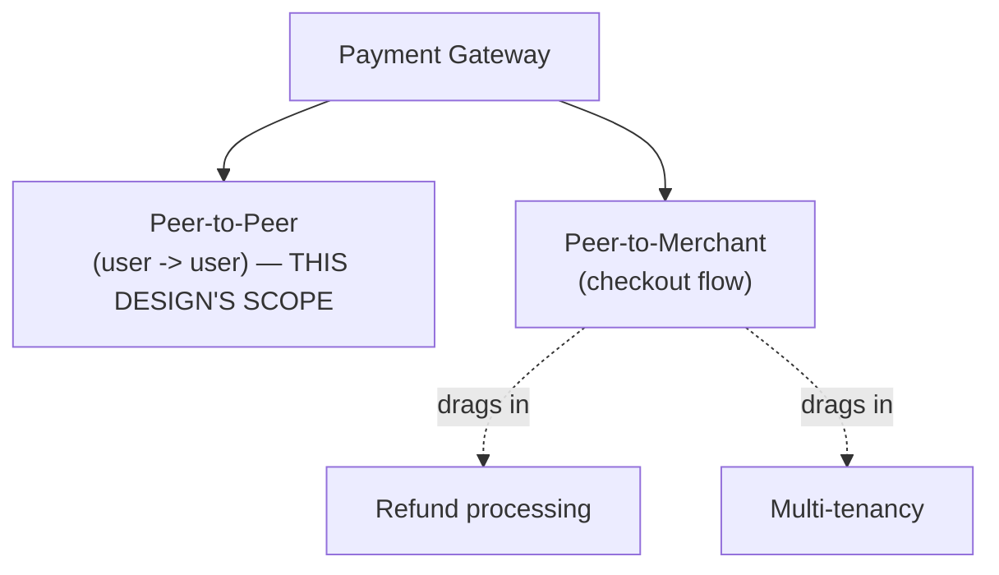
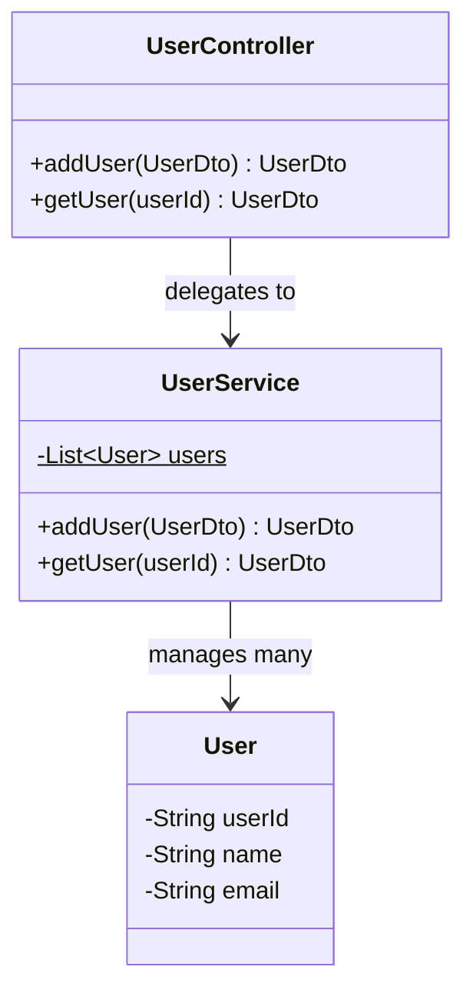
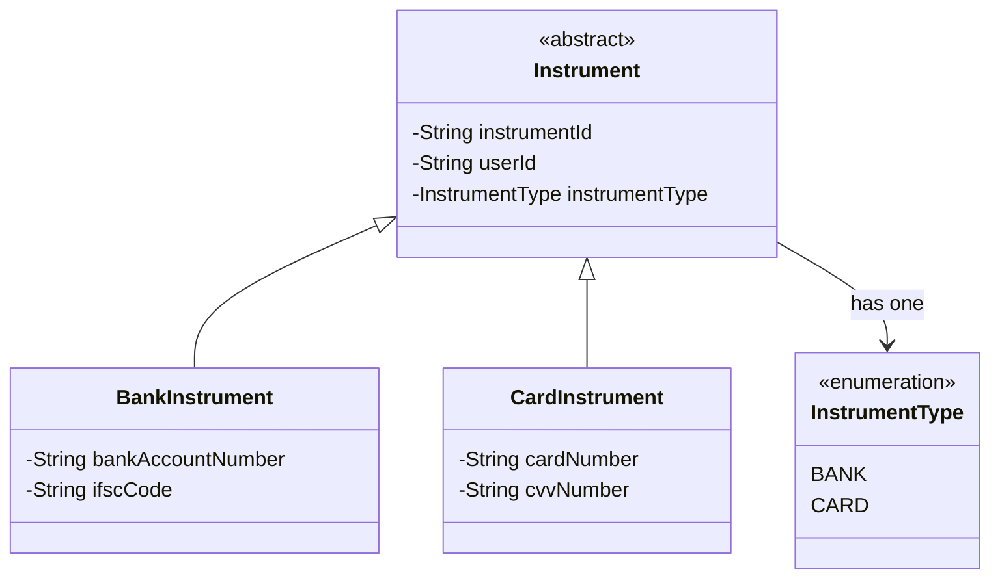
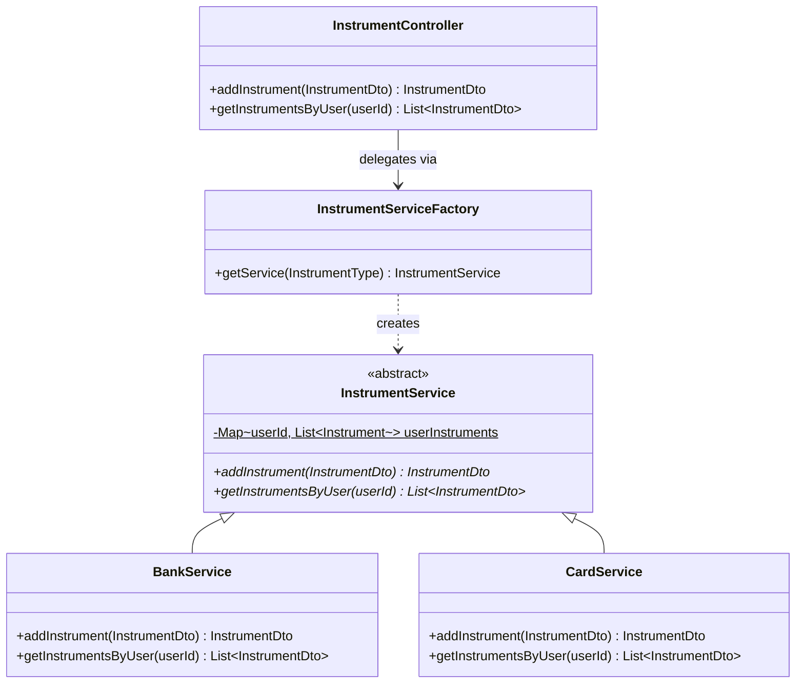
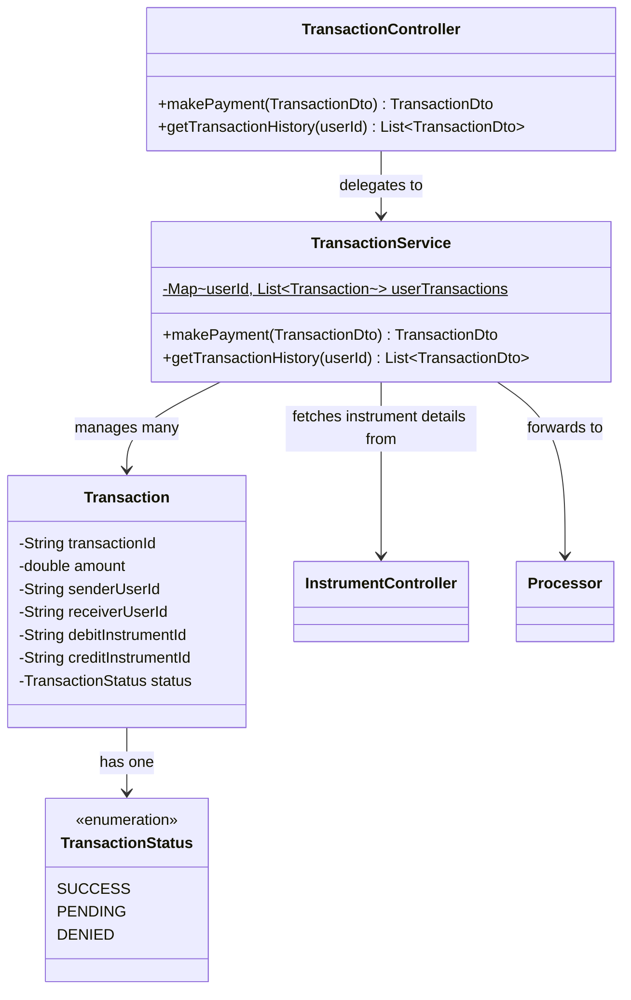
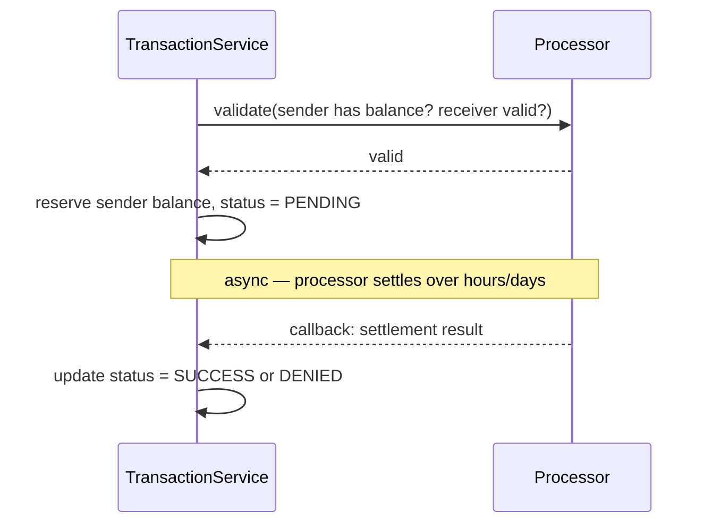
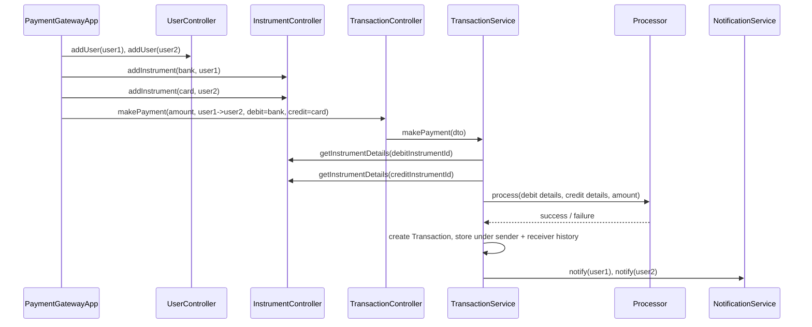
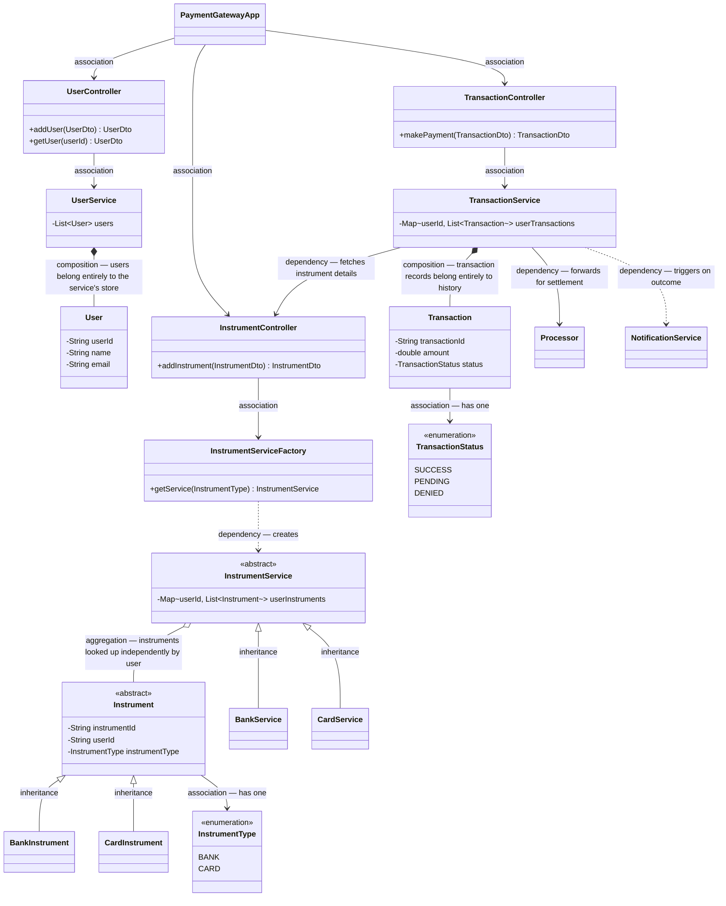

# LLD of Payment Gateway

## Overview
- A payment gateway acts as a **mediator between the user and financial
  institutions**, helping transfer money — but the full scope (peer-to-peer
  transfers, peer-to-merchant checkout, refunds, multi-tenancy, ...) is far
  too large for one interview, so **scoping the problem is itself the
  first deliverable**.
- This design deliberately scopes to **peer-to-peer** payments only (user
  → user) — explicitly excluding peer-to-merchant flows, which would drag
  in refund processing and multi-tenancy as separate large sub-problems.
- Requirements gathered for this scope: users can be added/updated/
  deleted; users can add/update/remove **instruments** (a bank account or
  card — anything that can fund or receive a transaction); a user can
  search another user (by email/phone), pick an amount and a funding
  instrument, and make a payment; notifications fire on
  user/instrument/transaction changes; users can view transaction history.
- Main entities identified straight from the requirements: `User`,
  `Instrument`, `Transaction` (a payment is a transaction, transaction
  history follows from it), `Notification`, `Processor` (the thing a
  payment gateway ultimately hands off to — card networks / banks sit
  behind it).



## Key Concepts
### User
- `User` — `userId`, `name`, `email`.
- `UserService` — maintains an in-memory `List<User>` (no DB in this LLD);
  `addUser()` and `getUser()`.
- `UserController` — thin front door exposing `addUser()`/`getUser()` to
  the rest of the app; delegates all logic to `UserService`.
- `PaymentGatewayApp` (the orchestrator/client) depends on
  `UserController` — never talks to `UserService` directly.



### DTOs — why the entity never leaves the service layer
- Every controller method takes and returns a **DTO** (e.g. `UserDto`,
  `InstrumentDto`, `TransactionDto`), not the raw entity — a plain object
  mirroring roughly the same fields, but shaped for what the client
  actually needs to see.
- Purpose: entities represent internal/DB-shaped state; if a column or
  internal field changes, clients depending on the DTO shape don't break —
  only the mapping between entity and DTO needs updating.
- Every service method's real job is: accept a DTO → build/update the
  internal entity → map back to a DTO before returning.

```java
class UserDto { // client-facing shape
    String userId;
    String name;
    String email;
}

class User { // internal entity — never returned directly to a client
    String userId;
    String name;
    String email;
}
```

### Instrument hierarchy — extensible by design
- `Instrument` (abstract) — `instrumentId`, `userId` (which user owns it —
  not the full `User` object, just the id), `instrumentType`
  (`InstrumentType` enum: `BANK`, `CARD`, extensible to `BALANCE` etc.
  later).
- `BankInstrument extends Instrument` — adds `bankAccountNumber`,
  `ifscCode`.
- `CardInstrument extends Instrument` — adds `cardNumber`, `cvvNumber`
  (expiry date, etc. could be added).
- New instrument types (e.g. wallet balance) just mean a new subclass —
  `Instrument` and every existing subclass stay untouched.



### InstrumentService split — Single Responsibility over one giant method
- A single `addInstrument()` handling bank-specific *and* card-specific
  validation/logic in one method would keep growing and violate SRP —
  every new instrument type would mean editing that same shared method.
- `InstrumentService` (abstract) declares `addInstrument()` /
  `getInstrumentsByUser()`; maintains the shared in-memory
  `Map<userId, List<Instrument>>` (static, since there's no DB).
- `BankService extends InstrumentService` and
  `CardService extends InstrumentService` — each implements
  `addInstrument()` with logic and validation specific to its own
  instrument type only.
- `InstrumentServiceFactory` — given an `InstrumentType`, returns the
  right concrete service (`BankService` for `BANK`, `CardService` for
  `CARD`) — same shape as [05. Factory vs Abstract Factory Pattern](../concepts/05-factory-vs-abstract-factory-pattern.md).
- `InstrumentController` — depends only on the factory; its
  `addInstrument(dto)` reads `dto.instrumentType`, asks the factory for
  the matching service, and delegates — the controller itself stays
  completely generic, with zero bank- or card-specific logic.



```java
enum InstrumentType { BANK, CARD }

abstract class InstrumentService {
    static Map<String, List<Instrument>> userInstruments = new HashMap<>();

    abstract InstrumentDto addInstrument(InstrumentDto dto);
    abstract List<InstrumentDto> getInstrumentsByUser(String userId);
}

class BankService extends InstrumentService {
    InstrumentDto addInstrument(InstrumentDto dto) {
        // bank-specific validation (account number format, IFSC, ...)
        BankInstrument bank = new BankInstrument(/* fields from dto */);
        userInstruments.computeIfAbsent(dto.userId, k -> new ArrayList<>()).add(bank);
        return toDto(bank);
    }
    List<InstrumentDto> getInstrumentsByUser(String userId) {
        // filter userInstruments.get(userId) for BankInstrument, map to DTOs
        return new ArrayList<>();
    }
}

class CardService extends InstrumentService {
    InstrumentDto addInstrument(InstrumentDto dto) {
        // card-specific validation (card number, CVV, expiry, ...)
        CardInstrument card = new CardInstrument(/* fields from dto */);
        userInstruments.computeIfAbsent(dto.userId, k -> new ArrayList<>()).add(card);
        return toDto(card);
    }
    List<InstrumentDto> getInstrumentsByUser(String userId) { return new ArrayList<>(); }
}

class InstrumentServiceFactory {
    InstrumentService getService(InstrumentType type) {
        return switch (type) {
            case BANK -> new BankService();
            case CARD -> new CardService();
        };
    }
}

class InstrumentController {
    private final InstrumentServiceFactory factory;

    InstrumentController(InstrumentServiceFactory factory) { this.factory = factory; }

    InstrumentDto addInstrument(InstrumentDto dto) {
        InstrumentService service = factory.getService(dto.instrumentType);
        return service.addInstrument(dto); // controller stays generic
    }
}
```

### Transaction, and how the credit instrument gets resolved
- `Transaction` — `transactionId`, `amount`, `senderUserId`,
  `receiverUserId`, `debitInstrumentId`, `creditInstrumentId`,
  `TransactionStatus` (`SUCCESS`, `PENDING`, `DENIED`).
- Key insight: the sender explicitly picks **which instrument to debit**
  (e.g. "fund this from Bank 2"), but never explicitly picks the
  receiver's credit instrument — the receiver's **preferred** instrument
  (if set) is used, falling back to a default, the most-recently-added
  instrument, or any instrument, depending on the gateway's policy.
- `TransactionService.makePayment(dto)`: validates required fields, calls
  `InstrumentController` to fetch full instrument details (IFSC/account
  number, or card details) for both the debit and credit instrument IDs —
  the processor needs those full details, not just an id — forwards this
  to `Processor`, builds a `Transaction` from the response, and stores it
  in **both** the sender's and receiver's transaction history (the same
  transaction should show up either way it's looked up).
- `TransactionService` maintains `Map<userId, List<Transaction>>` for
  history, same in-memory-map shape as `InstrumentService`.
- `TransactionController` — thin layer exposing `makePayment()` and
  `getTransactionHistory(userId)`, delegating to `TransactionService`.



## Trade-offs / Comparisons
- **Synchronous vs. asynchronous settlement** — modeling `TransactionService
  → Processor` as a real-time call is the simplest version for an
  interview, but real banks can take 3–5 days to settle. A likely
  follow-up: validate in real time (does the sender have sufficient
  balance? is the receiver's account valid/not blocked?), reserve the
  sender's balance, mark the transaction `PENDING`, then process the
  actual debit/credit **asynchronously** — the processor calls back later
  to flip the status to `SUCCESS` or `DENIED`.



- **Single instrument method vs. BankService/CardService split** — one
  shared `addInstrument()` handling every instrument type inline is
  simpler at first but grows unboundedly and violates SRP; splitting by
  type (with a factory to route) keeps each instrument type's logic
  isolated and independently extensible — this is exactly the shape
  flagged in the video as the part interviewers most often probe.
- **Entity vs. DTO** — returning entities directly is simpler short-term,
  but couples every client to internal/DB field names; DTOs cost an extra
  mapping step in exchange for that isolation.

## Example / Walkthrough
- Setup: add `User` "one" and `User` "two" via `UserController.addUser()`
  — each gets a generated `userId`.
- Add a `BankInstrument` to user one (`instrumentType = BANK`, account
  number, IFSC) via `InstrumentController.addInstrument()` — the
  controller routes through the factory to `BankService`, which creates
  and stores it, returning a generated `instrumentId`.
- Add a `CardInstrument` to user two (`instrumentType = CARD`, card
  number, CVV) the same way — routed to `CardService` this time.
- Make a payment: build a `TransactionDto` with `amount = 10`,
  `senderUserId` = user one, `receiverUserId` = user two,
  `debitInstrumentId` = user one's bank instrument,
  `creditInstrumentId` = user two's card instrument → call
  `TransactionController.makePayment()` → `TransactionService` fetches
  both instruments' full details via `InstrumentController`, forwards to
  `Processor`, and (in the demo, hardcoded to succeed) creates a
  `Transaction` with `status = SUCCESS`, storing it under **both** users'
  transaction history.
- Verify: `InstrumentController.getInstrumentsByUser(userOneId)` returns
  exactly the one bank instrument; the same call for user two returns
  exactly the one card instrument.
- Verify: `TransactionController.getTransactionHistory(userOneId)` and
  `...(userTwoId)` both return the same transaction (same transaction id,
  amount, sender, receiver) — confirming it was stored against both
  parties, not just the sender.

## Diagram


## UML Class Diagram


## Interview Q&A
<details>
<summary>Why is defining scope the first step for this question specifically?</summary>

"Payment gateway" spans peer-to-peer transfers, peer-to-merchant checkout,
refund processing, and multi-tenancy — each of which is itself a large
sub-problem. Without explicitly narrowing scope (here, to peer-to-peer
only), the design either balloons unmanageably or silently leaves out
requirements the interviewer assumed were in scope.

</details>

<details>
<summary>What is an "instrument" in this design, and why is it modeled as an abstract class?</summary>

An instrument is anything that can fund or receive a transaction — a bank
account or a card today, potentially a wallet balance later. It's abstract
so new instrument types can be added as new subclasses without touching
existing ones — same open-for-extension shape as
[05. Factory vs Abstract Factory Pattern](../concepts/05-factory-vs-abstract-factory-pattern.md).

</details>

<details>
<summary>Why split InstrumentService into BankService and CardService instead of one shared addInstrument()?</summary>

A single method branching on instrument type would keep absorbing more
type-specific validation and logic as instrument types are added,
violating Single Responsibility — this is called out as a common place
interviewers probe. Splitting by type keeps each instrument's logic
isolated, and a factory routes to the right one so the controller itself
stays generic.

</details>

<details>
<summary>Why doesn't the sender ever explicitly choose the receiver's credit instrument?</summary>

The sender only picks which of their own instruments to debit from — the
receiving side's credit instrument is resolved by the receiver's own
settings: their preferred instrument if one is set, else a default, else
(e.g.) the most recently added instrument.

</details>

<details>
<summary>Why does TransactionService call InstrumentController before calling the Processor?</summary>

The processor needs full instrument details (e.g. IFSC code and bank
account number, or card details) to actually process a transfer — a bare
instrument id isn't enough, so `TransactionService` fetches the full
details for both the debit and credit instrument first.

</details>

<details>
<summary>Why would a real system make the Processor call asynchronous instead of synchronous?</summary>

Real bank settlement can take 3–5 days — modeling it as a blocking
real-time call doesn't match reality. The more realistic design validates
balance/receiver-validity synchronously, marks the transaction `PENDING`,
and lets the processor call back later (possibly much later) to update
the status to `SUCCESS` or `DENIED`.

</details>

<details>
<summary>Why is the same Transaction stored under both the sender's and receiver's history?</summary>

So that either party can query their own transaction history and see the
same transaction — storing it only under the sender would mean the
receiver's `getTransactionHistory()` wouldn't reflect payments they
received.

</details>

<details>
<summary>Why does every controller method take/return a DTO instead of the entity?</summary>

DTOs decouple what the client sees from the internal/DB-shaped entity —
if an internal field or column changes, only the entity-to-DTO mapping
needs updating, not every client depending on the shape.

</details>

## Related Topics
- [05. Factory vs Abstract Factory Pattern](../concepts/05-factory-vs-abstract-factory-pattern.md) — the pattern behind
  `InstrumentServiceFactory` routing to `BankService`/`CardService`.
- [01. SOLID Principles](../concepts/01-solid-principles.md) — the Single Responsibility violation this
  design specifically avoids by splitting instrument logic by type.
- [21. LLD of Splitwise](21-splitwise-lld.md) — another case study using a Factory to route to
  type-specific logic (split types there, instrument types here).
- [29. LLD of Order/Inventory Management System](29-inventory-management-system-lld.md) — another
  case study with controller → service in-memory-map storage, same overall
  layering shape as User/Instrument/Transaction here.
